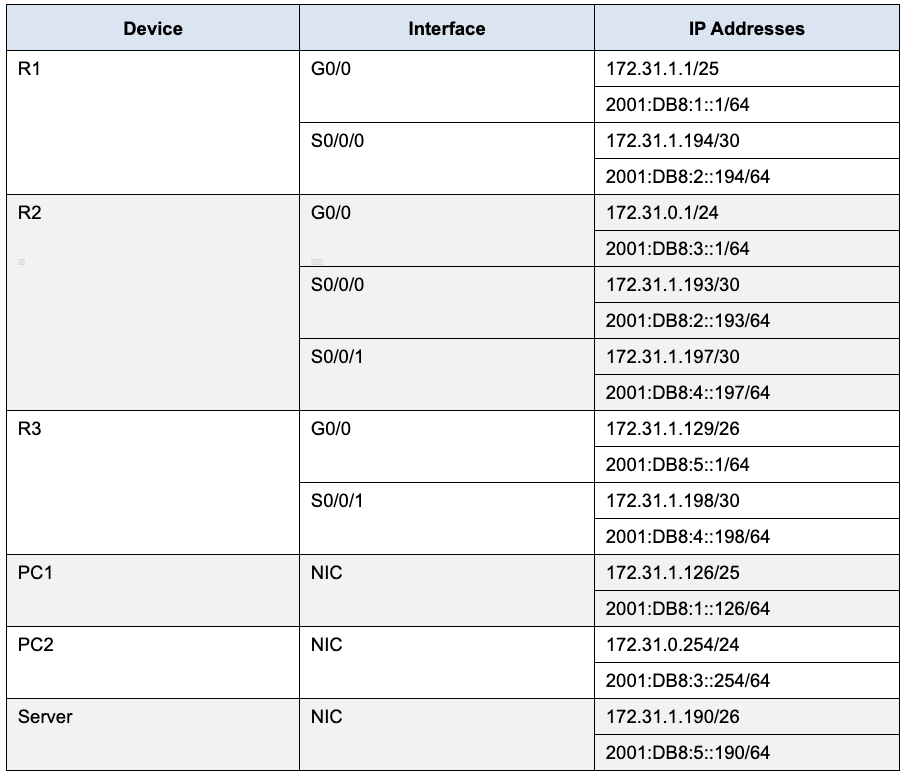
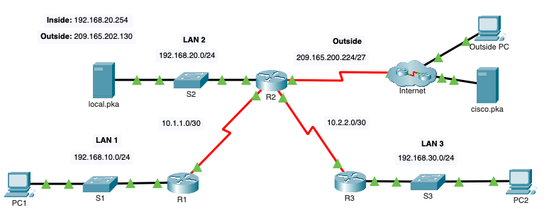

 
# Table of Contents

<!-- TOC -->

- [Table of Contents](#table-of-contents)
- [4.4.8 Troublehoot Inter-VLAN routing](#448-troublehoot-inter-vlan-routing)
- [4.5.1 Inter-VLAN routing Challenge](#451-inter-vlan-routing-challenge)
- [Case Study : CCNA Level 1](#case-study--ccna-level-1)
  - [Host Side Configuration](#host-side-configuration)
  - [Router Side Configuration](#router-side-configuration)
  - [Switch Side Configuration](#switch-side-configuration)
  - [Other Commands](#other-commands)
- [Activity : Configure Layer 3 Switching and Inter-VLAN Routing](#activity--configure-layer-3-switching-and-inter-vlan-routing)
  - [Objectives:](#objectives)
  - [Part 1 : Configure Layer 3 Switching](#part-1--configure-layer-3-switching)
  - [Part 2 : Configure Inter-VLAN Routing](#part-2--configure-inter-vlan-routing)
  - [Part 3 : Configure IPv6 Inter-VLAN Routing](#part-3--configure-ipv6-inter-vlan-routing)
  - [Summary of Commands](#summary-of-commands)
- [Configure EtherChannel](#configure-etherchannel)
  - [Objectives](#objectives-1)
  - [Scenario](#scenario)
  - [Part 1 : Basic router setup](#part-1--basic-router-setup)
  - [Part 2 : Configure an EtherChannel with Cisco PAgP](#part-2--configure-an-etherchannel-with-cisco-pagp)
  - [Part 3 : Configure an 802.3ad LACP EtherChannel](#part-3--configure-an-8023ad-lacp-etherchannel)
  - [Part 4 : Configure a Redundant EtherChannel Link](#part-4--configure-a-redundant-etherchannel-link)
  - [Command Summary](#command-summary)
- [7.2.10 Configure DHCP](#7210-configure-dhcp)
  - [Configure a Router as a DHCP Server](#configure-a-router-as-a-dhcp-server)
  - [Configure a DHCP Relay](#configure-a-dhcp-relay)
  - [Configure a Router as a DHCP Client](#configure-a-router-as-a-dhcp-client)
  - [Verify configuration](#verify-configuration)
- [HSRP Configuration : Configure HSRP on two routers](#hsrp-configuration--configure-hsrp-on-two-routers)
- [11.1.10 : Port Security](#11110--port-security)
  - [Limit Mac address on port](#limit-mac-address-on-port)
  - [Block unsed port](#block-unsed-port)
  - [Verify Port Security](#verify-port-security)
- [11.6.1 : Switch Security](#1161--switch-security)
  - [Create a secure Trunk](#create-a-secure-trunk)
  - [Secure Unused switchports](#secure-unused-switchports)
  - [Implement Port Security](#implement-port-security)
  - [Configure DHCP Snooping](#configure-dhcp-snooping)
  - [Configure Rapid PVST PortFast and BPDU Guard](#configure-rapid-pvst-portfast-and-bpdu-guard)
  - [Command Summary](#command-summary-1)
- [Basic Router Configuration](#basic-router-configuration)
  - [Background / Scenario](#background--scenario)
  - [Objectives](#objectives-2)
    - [Part 1: Configure Devices and Verify Connecttivity](#part-1-configure-devices-and-verify-connecttivity)
- [IPv4 and IPv6 Static and Default routes](#ipv4-and-ipv6-static-and-default-routes)
  - [Part 1 : COnfigure IPv4 Static and FLoating Static Default Routes](#part-1--configure-ipv4-static-and-floating-static-default-routes)
  - [Part 2 : Configure an IPv6 floating Static Default Routes](#part-2--configure-an-ipv6-floating-static-default-routes)
  - [Part 3: Configure IPv4 Static and Floating Static Routes to the Internal LANS](#part-3-configure-ipv4-static-and-floating-static-routes-to-the-internal-lans)
  - [Part 4: Configure IPv6 Static and Floating Static Routes to the Internal LANs.](#part-4-configure-ipv6-static-and-floating-static-routes-to-the-internal-lans)
  - [Part 5: Configure Host](#part-5-configure-host)
- [16.3.1 Troubleshooting Routes](#1631-troubleshooting-routes)
  - [IPv4](#ipv4)
  - [IPv6](#ipv6)
- [CCNA 3 : CCNAv7: Enterprise Networking, Security, and Automation](#ccna-3--ccnav7-enterprise-networking-security-and-automation)
  - [2.2.13 Packet Tracer : Point-to-Point single area OSPF configuration](#2213-packet-tracer--point-to-point-single-area-ospf-configuration)
  - [2.7.1 OSPF Configuration](#271-ospf-configuration)
  - [5.1.8 Configure **Numbered** Standard IPv4 ACLs](#518-configure-numbered-standard-ipv4-acls)
    - [Objectives](#objectives-3)
    - [Configure and Apply a numbered standard ACL on R2](#configure-and-apply-a-numbered-standard-acl-on-r2)
    - [Configure and apply a numbered standard ACL on R3](#configure-and-apply-a-numbered-standard-acl-on-r3)
    - [Verify](#verify)
  - [5.1.9 Configure **Named** Standard IPv4 ACLs](#519-configure-named-standard-ipv4-acls)
    - [Objectives](#objectives-4)
    - [Configure a named standard ACL.](#configure-a-named-standard-acl)
  - [5.2.7 Configure and Modify Standard IPv4 ACLs](#527-configure-and-modify-standard-ipv4-acls)
    - [Objectives](#objectives-5)
    - [Verify Connectivity](#verify-connectivity)
    - [Configure and Verify Standard Numbered and Named ACLs](#configure-and-verify-standard-numbered-and-named-acls)
      - [Standard ACL](#standard-acl)
      - [Configured a **Numbered** standard ACL](#configured-a-numbered-standard-acl)
      - [Configured a **Named** standard ACL](#configured-a-named-standard-acl)
      - [Modify a Standard ACL](#modify-a-standard-acl)
  - [5.4.13 Packet Tracer - Configure Extended IPv4 ACLs - Scenario 2](#5413-packet-tracer---configure-extended-ipv4-acls---scenario-2)
    - [Objectives](#objectives-6)
    - [Configure a Named Extended ACL](#configure-a-named-extended-acl)
      - [Deny PC1 access to HTTP and HTTPS services on Server1 and Server2](#deny-pc1-access-to-http-and-https-services-on-server1-and-server2)
      - [Deny PC2 to access FTP services on Server1 and Server2](#deny-pc2-to-access-ftp-services-on-server1-and-server2)
      - [Deny PC3 to ping Server1 and Server2](#deny-pc3-to-ping-server1-and-server2)
      - [Permit all other IP traffic.](#permit-all-other-ip-traffic)
      - [Apply the ACL to the Interface](#apply-the-acl-to-the-interface)
      - [Verify Consifiguration](#verify-consifiguration)
      - [Command Summary](#command-summary-2)
  - [5.5.1 Packet Tracer - IPv4 ACL Implementation Challenge](#551-packet-tracer---ipv4-acl-implementation-challenge)
    - [Objectives](#objectives-7)
    - [Step 1: Verify Connectivity in the New Company Network](#step-1-verify-connectivity-in-the-new-company-network)
    - [Step 2: Configure Standard and Extended ACLs per Requirements.](#step-2-configure-standard-and-extended-acls-per-requirements)
      - [ACL 1 Requirements](#acl-1-requirements)
      - [ACL 2 Requirements](#acl-2-requirements)
      - [ACL 3: Requirements](#acl-3-requirements)
      - [ACL 4: Requirements](#acl-4-requirements)
  - [6.5.6 Packet Tracer - Configure Dynamic NAT](#656-packet-tracer---configure-dynamic-nat)
  - [6.6.7 Packet Tracer - Configure PAT](#667-packet-tracer---configure-pat)
    - [Configure Dynamic NAT with Overload](#configure-dynamic-nat-with-overload)
    - [Configure PAT using an Interface](#configure-pat-using-an-interface)
  - [6.8.1 Packet Tracer - Configure NAT for IPv4](#681-packet-tracer---configure-nat-for-ipv4)
  - [Configure and Verify a site-to-site IPSec VPN using CLI](#configure-and-verify-a-site-to-site-ipsec-vpn-using-cli)
    - [Part 1: Configure IPSec Parameters on R1](#part-1-configure-ipsec-parameters-on-r1)
      - [Step 1: Test connectivity.](#step-1-test-connectivity)
      - [Step 2: Enable the Security Technology package.](#step-2-enable-the-security-technology-package)
      - [Step 3: Identify interesting traffic on R1.](#step-3-identify-interesting-traffic-on-r1)
      - [Step 4: Configure the IKE Phase 1 ISAKMP policy on R1.](#step-4-configure-the-ike-phase-1-isakmp-policy-on-r1)
      - [Step 5: Configure the IKE Phase 2 IPsec policy on R1.](#step-5-configure-the-ike-phase-2-ipsec-policy-on-r1)
      - [Step 6: Configure the crypto map on the outgoing interface.](#step-6-configure-the-crypto-map-on-the-outgoing-interface)
    - [Part 2: Configure IPsec Parameters on R3](#part-2-configure-ipsec-parameters-on-r3)
      - [Step 1: Enable the Security Technology package.](#step-1-enable-the-security-technology-package)
      - [Step 2: Configure router R3 to support a site-to-site VPN with R1.](#step-2-configure-router-r3-to-support-a-site-to-site-vpn-with-r1)
      - [Step 3: Configure the IKE Phase 1 ISAKMP properties on R3.](#step-3-configure-the-ike-phase-1-isakmp-properties-on-r3)
      - [Step 4: Configure the IKE Phase 2 IPsec policy on R3.](#step-4-configure-the-ike-phase-2-ipsec-policy-on-r3)
      - [Step 5: Configure the crypto map on the outgoing interface.](#step-5-configure-the-crypto-map-on-the-outgoing-interface)
    - [Part 3: Verify the IPsec VPN](#part-3-verify-the-ipsec-vpn)
      - [Step 1: Verify the tunnel prior to interesting traffic.](#step-1-verify-the-tunnel-prior-to-interesting-traffic)
      - [Step 2: Create interesting traffic.](#step-2-create-interesting-traffic)
      - [Step 3: Verify the tunnel after interesting traffic.](#step-3-verify-the-tunnel-after-interesting-traffic)
      - [Step 4: Create uninteresting traffic.](#step-4-create-uninteresting-traffic)
      - [Step 5: Verify the tunnel.](#step-5-verify-the-tunnel)
      - [Step 6: Check results.](#step-6-check-results)
  - [Configuring GRE](#configuring-gre)
    - [Part 1:     Verify Router Connectivity](#part-1-----verify-router-connectivity)
      - [Step 1:     Ping RA from RB.](#step-1-----ping-ra-from-rb)
      - [Step 2:     Ping PCA from PCB.](#step-2-----ping-pca-from-pcb)
    - [Part 2:     Configure GRE Tunnels](#part-2-----configure-gre-tunnels)
      - [Step 1:     Configure the Tunnel 0 interface of RA.](#step-1-----configure-the-tunnel-0-interface-of-ra)
      - [Step 2:     Configure the Tunnel 0 interface of RB.](#step-2-----configure-the-tunnel-0-interface-of-rb)
      - [Step 3:     Configure a route for private IP traffic.](#step-3-----configure-a-route-for-private-ip-traffic)
    - [Part 3:     Verify Router Connectivity](#part-3-----verify-router-connectivity)
      - [Step 1:     Ping PCA from PCB.](#step-1-----ping-pca-from-pcb)
      - [Step 2:     Trace the path from PCA to PCB.](#step-2-----trace-the-path-from-pca-to-pcb)
- [Assignments](#assignments)

<!-- /TOC -->

<br><br>
<h1> Assignments, Case studies and Activities</h1>
<br><br>

# 4.4.8 Troublehoot Inter-VLAN routing
1. PC-3 Gateway needs update
2. Enable trunking on S1
    ```bash
    S1(config)# int g0/1
    S1(config-if)# switchport mode trunk
    ```
3. Enable interface R1 - G0/1.10
    ```bash
    R1(config)# int g0/1.10
    R1(config-if)# no shut
    R1(config)# int g0/1.10
    R1(config-if)# no encapsulation dot1Q 
    R1(config)# int g0/1.30
    R1(config-if)# no encapsulation dot1Q 
    R1(config)# int g0/1.10
    R1(config-if)# encapsulation dot1Q 10
    R1(config-if)# ip address 172.17.10.1 255.255.255.0
    R1(config)# int g0/1.30
    R1(config-if)# encapsulation dot1Q 30
    R1(config-if)# ip address 172.17.30.1 255.255.255.0
    ```
[Back to Top](#table-of-contents)

<br><br>

# 4.5.1 Inter-VLAN routing Challenge
Configure the devices to meet the following requirements.
* Assign IP addressing to R1 and S1 based on the Addressing Table.
  * S1
    ```bash
    S1(config)# int vlan 99
    S1(config-if)# ip address 172.17.99.10 255.255.255.0
    ```
  * R1
    ```bash
    R1(config)# int g0/1.10
    R1(config)# encapsulation dot1Q 10
    R1(config-if)# ip address 172.17.10.1 255.255.255.0

    R1(config)# int g0/1.20
    R1(config)# encapsulation dot1Q 20
    R1(config-if)# ip address 172.17.20.1 255.255.255.0

    R1(config)# int g0/1.30
    R1(config)# encapsulation dot1Q 30
    R1(config-if)# ip address 172.17.30.1 255.255.255.0

    R1(config)# int g0/1.88
    R1(config)# encapsulation dot1Q 88 native
    R1(config-if)# ip address 172.17.88.1 255.255.255.0

    R1(config)# int g0/1.99
    R1(config)# encapsulation dot1Q 99
    R1(config-if)# ip address 172.17.99.1 255.255.255.0
    ```

* Configure the default gateway on S1.
    ```bash
    S1(config-if)# ip default-gateway 172.17.99.1
    ```  

* Create, name, and assign VLANs on S1 based on the VLAN and Port Assignments Table. Ports should be in access mode. Your VLAN names should match the names in the table exactly.

    ```bash
    S1(config)# vlan 10
    S1(config-if)# name Faculty/Staff
    S1(config-if)# vlan 20
    S1(config-if)# name Students
    S1(config-if)# vlan 30
    S1(config-if)# name Guest(Default)
    S1(config-if)# vlan 88
    S1(config-if)# name Native
    S1(config-if)# vlan 99
    S1(config-if)# name Management
    ```  

    ```bash
    S1(config)# int range f0/11-17
    S1(config-if)# switchport mode access
    S1(config-if)# switchport access vlan 10

    S1(config)# int range f0/18-24
    S1(config-if)# switchport mode access
    S1(config-if)# switchport access vlan 20

    S1(config)# int range f0/11-17
    S1(config-if)# switchport mode access
    S1(config-if)# switchport access vlan 10

    S1(config)# int range f0/11-17
    S1(config-if)# switchport mode access
    S1(config-if)# switchport access vlan 10
    ```  

* Configure G0/1 of S1 as a static trunk and assign the native VLAN.
    ```bash
    S1(config)# int g0/1
    S1(config-if)# switchport mode trunk
    S1(config-if)# switchport trunk native vlan 88
    ``` 

 
* All ports that are not assigned to a VLAN should be disabled.
    ```bash
    S1(config)# int range f02 - 5
    S1(config-if-range)# shut
    S1(config)# int f0/1
    S1(config-if)# shut
    S1(config)# int g0/2
    S1(config-if)# shut
    ```  
    ```bash
    R1(config)# int g0/1
    R1(config-if)# no shut
    ```  
    

* Configure inter-VLAN routing on R1 based on the Addressing Table.

* Verify connectivity. R1, S1, and all PCs should be able to ping each other and the server.

[Back to Top](#table-of-contents)

<br><br>

# Case Study : CCNA Level 1

**Topology**<br/>

**Scenario** <br/>
In this Case Study, you will configure the devices in a small network. You must configure a router, switch, and PCs to support both IPv4 and IPv6 connectivity. You will configure security, including SSH, on the router. In addition, you will test and document the network using common CLI commands. 
  
Given an IP address and mask of (address / mask), **172.16.16.0 mask 255.255.254.0** design an IP addressing scheme that satisfies the following requirements. Network address/mask and the number of hosts for Subnets A and B will be provided below.

| Subnet      | Number of Hosts |
| ----------- | ----------- |
| Subnet A      | 100       |
| Subnet B      | 200       |

**Answer**: **Subnet A**:

| Specification                     | Student Input         | 
| -----------                       | -----------           |
| New IP mask (CIDR format)	        | ```/25```             |
| New IP mask (dotted decimal)      | ```255.255.255.128``` |
| Number of usable hosts            | ```126```             |
| Network Address (Network IP)      | ```172.16.17.0```     |
| First IP Host address(usable)     | ```172.16.17.1```     |
| Last IP Host address(usable)      | ```172.16.17.126```   |
| Broadcast Address (Broadcast IP)  | ```172.16.17.127```   |

**Answer**: **Subnet B**:

| Specification                     | Student Input         | 
| -----------                       | -----------           |
| New IP mask (CIDR format)	        | ```\24```             |
| New IP mask (dotted decimal)      | ```255.255.255.0```   |
| Number of usable hosts            | ```254```             |
| Network Address (Network IP)      | ```172.16.16.0```     |
| First IP Host address(usable)     | ```172.16.16.1```     |
| Last IP Host address(usable)      | ```172.16.16.254```   |
| Broadcast Address (Broadcast IP)  | ```172.16.16.255```   |

Host **computers** will use the **FIRST usable IP address in the subnet** while the network **router** will use the **LAST usable address in the subnet**. The **switch** will use the **SECOND from the last usable address in the subnet**.

Write down the IP address information for each device:

| Device    | IP Addess     | Subnet Mask       | Gateway       |
| -------   | ----------    | -----------       | --------      |
| PC-A      | ```172.16.17.1```     | ```255.255.255.128```   | ```172.16.17.126``` |
| R1-G0/0   |``` 172.16.17.126``` |``` 255.255.255.128```   | NA            |  
| R1-G0/1   | ```172.16.16.254 ```| ```255.255.255.0 ```    | NA            |
| S1        | ```172.16.16.253 ```  |``` 255.255.255.0```     | ```172.16.16.254``` |
| PC-B      | ```172.16.16.1```   | ```255.255.255.0```     | ```172.16.16.254 ```|


## Host Side Configuration
**IPv4**

| Device    | IP Addess     | Subnet Mask       | Gateway       |
| -------   | ----------    | -----------       | --------      |
| PC-A      | ```172.16.17.1```     | ```255.255.255.128```   | ```172.16.17.126``` |
| PC-B      | ```172.16.16.1```   | ```255.255.255.0```     | ```172.16.16.254 ```|

**IPv6**

Given an IPv6 network address of **2001:DB8:BEEF::/64**, configure IPv6 addresses for the Gigabit interfaces on R1. Use **FE80::1** as the link-local address on both interfaces.

| Device  | Interface   |  IPv6                                  | Gateway       |
| ------- | ----------  |  -----------                           | -----------   |
| R1      | g0/0        |  ```2001:db8:beef:a::1/64  ```               |  |
| R1      | g0/1        |  ```2001:db8:beef:b::1/64 ```                |  |
| PC-A    |             |  ```2001:DB8:BEEF:A:240:BFF:FEB2:6B7D/64```  | ```fe80::1``` |
| PC-B    |             |  ```2001:DB8:BEEF:B:290:21FF:FE91:5D96/64``` | ```fe80::1``` |

## Router Side Configuration 

| Command                       | Specification     | Task          | 
| -------                       | ----------        | ----------    |
| ```erase startup-config```    |                   | Erase the startup-config file on the Router.  |   
| ```reload```                  |                   | Reload the Router.                            |
| ```enable``` <br> ```config t``` <br> ```no ip domain-lookup ```|                 | Disable DNS lookup|
| ```hostname R1```| R1              | Router name (case sensitive)|
| ```ip domain-name casestudy.com``` | casestudy.com   | Domain name (case sensitive)|
| ```enable secret ciscoenpass``` | ciscoenpass | Encrypted privileged exec password|
| ```line console 0``` <br> ```password ciscoconpass``` <br> ```login``` <br> ```exit``` | ciscoconpass | Console access password|
| ```security password min-length 8``` | 8 characters| Set the minimum length for passwords|
| ```username admin secret adminpass``` | Username: admin <br> Password: adminpass | Create a user with an encrypted password in the local database |
| ```line vty 0 4``` <br>  ```login local``` | | Set login on VTY 0 to 4 lines to use local database |
| ```transport input all``` | | Set VTY lines to accept all connections.|
| ```service password-encryption``` | | Encrypt the clear text passwords|
| ```banner motd #Warning! Unauthorized Access is Prohibited.# ```| Warning! Unauthorized Access is Prohibited. | MOTD Banner (case sensitive)|
| ```interface g0/0``` <br> ```description to LAN A```<br>```ip address 172.16.17.126 255.255.255.128``` <br> ```no shut``` | Set the description to LAN A <br> Set the Layer 3 IPv4 address <br> Activate Interface | Interface G0/0|
| ```interface g0/1``` <br> ```description to LAN B```<br>```ip address 172.16.16.254 255.255.255.0``` <br> ```no shut```| Set the description to LAN B <br> Set the Layer 3 IPv4 address <br> Activate Interface | Interface G0/1|
| ```crypto key generate rsa``` <br> ```1024``` | 1024 bits modulus | Generate a RSA crypto key|
| ```interface g0/0``` <br> ```ipv6 address 2001:DB8:BEEF:A::1/64``` <br> ```ipv6 address fe80::1 link-local```| Configure G0/0 to use the first address in subnet A. 2001:DB8:BEEF:A::/64 | Assign the IPv6 Global Unicast Address <br> Assign the IPv6 link-local address |
| ```interface g0/1 ``` <br>```ipv6 address 2001:DB8:BEEF:B::/64``` <br> ```ipv6 address fe80::1 link-local``` | Configure G0/0 to use the first address in subnet B. 2001:DB8:BEEF:B::/64 |  Assign the IPv6 Global Unicast Address <br> Assign the IPv6 link-local address |
| ```ipv6 unicast-routing ```|  |Enable IPv6 unicast routing.|

## Switch Side Configuration 

| Command                       | Specification     | Task          | 
| -------                       | ----------        | ----------    | 
| ```erase startup-config```    |                   | Erase the startup-config file on the Switch.   |   
| ```delete flash:vlan.dat```   |                   | Delete the vlan.dat file on the Switch   | 
| ```reload```                  |                   | Reload the Switch.                              |
| ```enable``` <br> ```config t``` <br> ```hostname S1```| S1              | Router name (case sensitive)|
| ```interface vlan1```<br>```ip address 172.16.16.253 255.255.255.0```<br>```no shutdown``` | Set the Layer 3 IPv4 address <br> Activate Interface | Configure Management Interface (SVI)|
| ```exit```<br> ```ip default-gateway 172.16.16.254```|               | Set the default gateway|
| ```enable secret ciscoenpass```| ciscoenpass              | Encrypted privileged exec password(case sensitive)|
| ```line console 0``` <br> ```password ciscoconpass``` <br> ```login``` <br> ```exit```| ciscoconpass              | Console access password(case sensitive)|
| ```line vty 0 15```<br>```transport input telnet```<br>```password ciscovtypass```<br>```login local```| ciscovtypass              | Telnet access password ( vty line 0 to 15) – allow only telnet(case sensitive)|

## Other Commands
| Command                                   | Description       | 
| -------                                   | ----------        | 
| ```show ip interface brief```             | Display a summary of important information about the interfaces on R1.|
| ```show ip route```                       | Display the IPv4 routing table.|
| ```show arp```                            | Display the Layer 2 to Layer 3 mapping of addresses on R1.|
| ```show ip interface G0/0```              | Display detailed IPv4 information about interface G0/0 on R1.|
| ```show ipv6 route```                     | Display the IPv6 routing table.|
| ```show ipv6 interface brief```           | Display a summary of IPv6 interface addresses and status.|
| ```show cdp neighbors```                  | Display information about the devices connected to R1. Information should include Device ID, Local Interface, Hold time, Capability, Platform, and Port ID.|
| ```copy running-config startup-config```  | Save the current configuration so it will be used the next time the router is started.|

<br><br>

[Back to Top](#table-of-contents)

<br><br>

# Activity : Configure Layer 3 Switching and Inter-VLAN Routing

## Objectives:
* Part 1 : [Configure Layer 3 Switching](#part-1--configure-layer-3-switching)
* Part 2 : [Configure Inter-VLAN Routing](#part-2--configure-inter-vlan-routing)
* Part 3 : [Configure IPv6 Inter-VLAN Routing](#part-3--configure-ipv6-inter-vlan-routing)
<br><br>
* **Scenario** :  A multilayer switch like the Cisco Catalyst 3650 is capable of both Layer 2 switching and Layer 3 routing. One of the advantages of using a multilayer switch is this dual functionality. A benefit for a small to medium-sized company would be the ability to purchase a single multilayer switch instead of separate switching and routing network devices. Capabilities of a multilayer switch include the ability to route from one VLAN to another using multiple switched virtual interfaces (SVIs), as well as the ability to convert a Layer 2 switchport to a Layer 3 interface. <br><br>

## Part 1 : Configure Layer 3 Switching
* Configure the GigabitEthernet 0/2 port on switch MLS as a routed port and verify that you can ping another Layer 3 address.
  - On MLS, configure G0/2 as a routed port and assign an IP address according to the Addressing Table.
    ```bash
    MLS(config)# interface g0/2
    MLS(config-if)# no switchport
    MLS(config-if)# ip address 209.165.200.225 255.255.255.252
    ```
  - Verify connectivity to Cloud by pinging 209.165.200.226.
    ```bash
    MLS# ping 209.165.200.226

    Type escape sequence to abort.
    Sending 5, 100-byte ICMP Echos to 209.165.200.226, timeout is 2 seconds:
    !!!!!
    Success rate is 100 percent (5/5), round-trip min/avg/max = 0/0/0 ms
    ```

## Part 2 : Configure Inter-VLAN Routing
- **Step 1: Add VLANs** : Add VLANs to MLS according to the table below. Packet Tracer scoring is case-sensitive, so type the names exactly as shown.

    | VLAN Number   | VLAN Name     | 
    | -------       | ----------    |
    | 10            | Staff         |
    | 20            | Student       |
    | 30            | Faculty       |
    
    ```bash
    MLS(config)# vlan 10
    MLS(config)# name Staff
    MLS(config)# vlan 20
    MLS(config)# name Student
    MLS(config)# vlan 30
    MLS(config)# name Faculty
    ```
- **Step 2: Configure SVI on MLS** : Configure and activate the SVI interfaces for **VLANs 10, 20, 30, and 99** according to the Addressing Table. The configuration for VLAN 10 is shown below as an example.
    ```bash
    MLS(config)# interface vlan 10
    MLS(config-if)# ip address 192.168.10.254 255.255.255.0
    MLS(config)# interface vlan 20
    MLS(config-if)# ip address 192.168.20.254 255.255.255.0
    MLS(config)# interface vlan 30
    MLS(config-if)# ip address 192.168.30.254 255.255.255.0
    MLS(config)# interface vlan 99
    MLS(config-if)# ip address 192.168.99.254 255.255.255.0   
    ```
- **Step 3: Configure Trunking on MLS** : Trunk configuration differs slightly on a Layer 3 switch. On the Layer 3 switch, the trunking interface needs to be encapsulated with the dot1q protocol, however it is not necessary to specify VLAN numbers as it is when working with a router and subinterfaces.
  * On MLS, configure interface g0/1.
      ```bash
      MLS(config)# interface g0/1
      ```  
  * Make the interface a static trunk port.
      ```bash
      MLS(config-if)# switchport mode trunk
      ```
  * Specify the native VLAN as 99.
      ```bash
      MLS(config-if)# switchport trunk native vlan 99
      ```
  * Encapsulate the link with the dot1q protocol.
      ```bash
      MLS(config-if)# switchport trunk encapsulation dot1q
      ```
  Note: Packet Tracer may not score the trunk encapsulation.

- **Step 4: Configure Trunking on S1** :
  * Configure interface g0/1 of S1 as a static trunk.
    ```bash
    S1(config)# int g0/1
    S1(config-if)# switchport mode trunk
    ```
  * Configure the native VLAN on the trunk.
    ```bash
    S1(config-if)# switchport trunk native vlan 99
    ```

- **Step 5: Enable routing** :
  * Use the ```show ip route``` command. Are there any active routes?

  * Enter the ip routing command to enable routing in global configuration mode.
    ```bash
    MLS(config)# ip routing
    ```
  * Use the ```show ip route``` command to verify routing is enabled.
    ```bash
    MLS# show ip route
    Codes: C - connected, S - static, I - IGRP, R - RIP, M - mobile, B - BGP
    D - EIGRP, EX - EIGRP external, O - OSPF, IA - OSPF inter area
    N1 - OSPF NSSA external type 1, N2 - OSPF NSSA external type 2
    E1 - OSPF external type 1, E2 - OSPF external type 2, E - EGP
    i - IS-IS, L1 - IS-IS level-1, L2 - IS-IS level-2, ia - IS-IS inter area
    * - candidate default, U - per-user static route, o - ODR
    P - periodic downloaded static route

    Gateway of last resort is not set

    C 192.168.10.0/24 is directly connected, Vlan10
    C 192.168.20.0/24 is directly connected, Vlan20
    C 192.168.30.0/24 is directly connected, Vlan30
    C 192.168.99.0/24 is directly connected, Vlan99
    209.165.200.0/30 is subnetted, 1 subnets
    C 209.165.200.224 is directly connected, GigabitEthernet0/2
    ```
- **Step 6: Verify end-to-end connectivity** :
  * From PC0, ping PC3 or MLS to verify connectivity within VLAN 10.
  * From PC1, ping PC4 or MLS to verify connectivity within VLAN 20.
  * From PC2, ping PC5 or MLS to verify connectivity within VLAN 30.
  * From S1, ping S2, S3, or MLS to verify connectivity with VLAN 99.
  * To verify inter-VLAN routing, ping devices outside the sender’s VLAN.
  * From any device, ping this address inside Cloud, 209.165.200.226.
  The Layer 3 switch is now routing between VLANs and providing routed connectivity to the cloud.

## Part 3 : Configure IPv6 Inter-VLAN Routing
Layer 3 switches also route between IPv6 networks.
- **Step 1: Enable IPv6 routing** : Enter the ipv6 unicast-routing command to enable IPv6 routing in global configuration mode.
  ```bash
  MLS(config)# ipv6 unicast-routing
  ```
- **Step 2: Configure SVI for IPv6 on MLS** : Configure IPv6 addressing on SVI for **VLANs 10, 20, and 30** according to the Addressing Table. The configuration for VLAN 10 is shown below.
    ```bash
    MLS(config)# interface vlan 10
    MLS(config-if)# ipv6 address 2001:db8:acad:10::1/64
    MLS(config)# interface vlan 20
    MLS(config-if)# ipv6 address 2001:db8:acad:20::1/64
    MLS(config)# interface vlan 30
    MLS(config-if)# ipv6 address 2001:db8:acad:30::1/64

    ```
- **Step 3: Configure G0/2 with IPv6 on MLS**
  * Configure IPv6 addressing on G0/2.
    ```bash
    MLS(config)# interface G0/2
    MLS(config-if)# ipv6 address 2001:db8:acad:a::1/64
    ```
  * Use the show ipv6 route command to verify IPv6 connected networks.
    ```bash
    MLS# show ipv6 route
    IPv6 Routing Table - 10 entries
    Codes: C - Connected, L - Local, S - Static, R - RIP, B - BGP
    U - Per-user Static route, M - MIPv6
    I1 - ISIS L1, I2 - ISIS L2, IA - ISIS interarea, IS - ISIS summary
    O - OSPF intra, OI - OSPF inter, OE1 - OSPF ext 1, OE2 - OSPF ext 2
    ON1 - OSPF NSSA ext 1, ON2 - OSPF NSSA ext 2
    D - EIGRP, EX - EIGRP external
    S ::/0 [1/0]
    via 2001:DB8:ACAD:A::2, GigabitEthernet0/2
    C 2001:DB8:ACAD:A::/64 [0/0]
    via ::, GigabitEthernet0/2
    L 2001:DB8:ACAD:A::1/128 [0/0]
    via ::, GigabitEthernet0/2
    C 2001:DB8:ACAD:10::/64 [0/0]
    via ::, Vlan10
    L 2001:DB8:ACAD:10::1/128 [0/0]
    via ::, Vlan10
    C 2001:DB8:ACAD:20::/64 [0/0]
    via ::, Vlan20
    L 2001:DB8:ACAD:20::1/128 [0/0]
    via ::, Vlan20
    C 2001:DB8:ACAD:30::/64 [0/0]
    via ::, Vlan30
    L 2001:DB8:ACAD:30::1/128 [0/0]
    via ::, Vlan30
    L FF00::/8 [0/0]
    via ::, Null0
    ```

- **Step 4: Verify IPv6 connectivity** : Devices PC3, PC4, and PC5 have been configured with IPv6 addresses. Verify IPv6 inter-VLAN routing and connectivity to Cloud.
  * From PC3, ping MLS to verify connectivity within VLAN 10.
  * From PC4, ping MLS to verify connectivity within VLAN 20.
  * From PC5, ping MLS to verify connectivity within VLAN 30.
  * To verify inter-VLAN routing, ping between devices PC3, PC4, and PC5.
  * From PC3 ping the address inside Cloud, 2001:db8:acad:a::2.

## Summary of Commands
* Router
    ```bash
    MLS(config)# interface g0/2
    MLS(config-if)# no switchport
    MLS(config-if)# ip address 209.165.200.225 255.255.255.252

    MLS(config)# vlan 10
    MLS(config)# name Staff
    MLS(config)# vlan 20
    MLS(config)# name Student
    MLS(config)# vlan 30
    MLS(config)# name Faculty

    MLS(config)# interface vlan 10
    MLS(config-if)# ip address 192.168.10.254 255.255.255.0

    MLS(config)# interface vlan 20
    MLS(config-if)# ip address 192.168.20.254 255.255.255.0

    MLS(config)# interface vlan 30
    MLS(config-if)# ip address 192.168.30.254 255.255.255.0

    MLS(config)# interface vlan 99
    MLS(config-if)# ip address 192.168.99.254 255.255.255.0 

    MLS(config)# interface g0/1
    MLS(config-if)# switchport mode trunk
    MLS(config-if)# switchport trunk native vlan 99
    MLS(config-if)# switchport trunk encapsulation dot1q

    MLS(config)# ip routing
    MLS(config)# ipv6 unicast-routing

    MLS(config)# interface vlan 10
    MLS(config-if)# ipv6 address 2001:db8:acad:10::1/64

    MLS(config)# interface vlan 20
    MLS(config-if)# ipv6 address 2001:db8:acad:20::1/64

    MLS(config)# interface vlan 30
    MLS(config-if)# ipv6 address 2001:db8:acad:30::1/64

    MLS(config)# interface G0/2
    MLS(config-if)# ipv6 address 2001:db8:acad:a::1/64
    ```
* Switch
    ```bash
    S1(config)# int g0/1
    S1(config-if)# switchport mode trunk
    S1(config-if)# switchport trunk native vlan 99
    ```

<br><br>

[Back to Top](#table-of-contents)

<br><br>

# Configure EtherChannel
## Objectives
* Part 1: [Configure Basic Switch Settings]()
* Part 2: [Configure an EtherChannel with Cisco PAgP]()
* Part 3: [Configure an 802.3ad LACP EtherChannel]()
* Part 4: [Configure a Redundant EtherChannel Link]()

## Scenario
* Three switches have just been installed. There are redundant uplinks between the switches. As configured, only one of these links can be used; otherwise, a bridging loop might occur. However, using only one link utilizes only half of the available bandwidth. EtherChannel allows up to eight redundant links to be bundled together into one logical link. In this lab, you will configure Port Aggregation Protocol (PAgP), a Cisco EtherChannel protocol, and Link Aggregation Control Protocol (LACP), an IEEE 802.3ad open standard version of EtherChannel. <br> <br> Before beginning the configuration, review the EtherChannel Configuration Guidelines and Restrictions listed at the end of this activity. <br/>

| Channel Group | Ports                                 | Protocol          | 
| -------       | ----                                  | ----              | 
| 1             | S1 F0/21. F0/22 <br> S3 F0/21, F0/22  | PAgP              | 
| 2             | S1 G0/1, G0/2 <br> S2 G0/1, G0/2      | LACP              | 
| 3             | S2 F0/23, F0/24 <br> S3 F0/23, F0/24  | Negotiated LACP   | 


## Part 1 : Basic router setup
* Assign each switch a hostname according to the topology diagram.
    ```bash
    Switch(config)# hostname S1
    S1(config)#
    ```
    ```bash
    Switch(config)# hostname S2
    S2(config)#
    ```
    ```bash
    Switch(config)# hostname S3
    S3(config)#
    ```

* Before beginning the link aggregation between switches, verify the existing configuration of the ports that connect the switches to ensure that the ports will successfully join the EtherChannels. Commands that provide information about the state of the switch ports include:

    ```bash
    S1# show interfaces | include Ethernet
    S1# show interface status
    S1# show interfaces trunk
    ```

* Configure all ports that are required for the EtherChannels as static trunk ports.
    ```bash
    S1(config)# int range f0/21-22 
    S1(config-if-range)# switchport mode trunk
    S1(config-if-range)# int range g0/1-2
    S1(config-if-range)# switchport mode trunk
    ```
    ```bash
    S2(config)# int range g0/1-2
    S2(config-if-range)# switchport mode trunk
    S2(config-if-range)# int range f0/23-24
    S2(config-if-range)# switchport mode trunk
    ```
    ```bash
    S3(config)# int range f0/21-24
    S3(config-if-range)# switchport mode trunk
    ```

    Note: If the ports are configured with DTP dynamic auto mode, and you do not set the mode of the ports to trunk, the links do not form trunks and remain access ports. The default mode on a 2960 switch is for DTP to be enabled and set to dynamic auto. DTP can be disabled on interfaces with the switchport nonegotiate command.

## Part 2 : Configure an EtherChannel with Cisco PAgP
    Note: When configuring EtherChannels, it is recommended to shut down the physical ports being grouped on both devices before configuring them into channel groups. Otherwise, EtherChannel Misconfig Guard may place these ports into err-disabled state. The ports and port channels can be re-enabled after EtherChannel is configured.

* Step 1 : Configure Port Channel 1
  * The first EtherChannel that is created for this activity aggregates ports **F0/21 and F0/22 between S1 and S3**. Configure the ports on both switches as static trunk ports.
  * Use the show interfaces trunk command to ensure that you have an active trunk link for those two links, and the native VLAN on both links is the same.
    ```bash
    S1(config)# show interfaces trunk
    ```
  * On **S1 and S3**, add ports F0/21 and F0/22 to Port Channel 1 with the **channel-group 1 mode desirable** command. The mode desirable option enables the switch to actively negotiate to form a PAgP link. Note: Interfaces must be shutdown before adding them to the channel group.
    ```bash
    S1(config)# int range f0/21-22 
    S1(config-if-range)# shutdown
    S1(config-if-range)# channel-group 1 mode desirable
    S1(config-if-range)# no shutdown
    ```
    ```bash
    S3(config)# int range f0/21-22 
    S3(config-if-range)# shutdown
    S3(config-if-range)# channel-group 1 mode desirable
    S3(config-if-range)# no shutdown
    ```
    The message ```Creating a port-channel interface Port-channel 1``` should appear on both switches when the channel-group is configured. This interface designation will appear as Po1 in command output.
  * Configure the logical interface to become a trunk by first entering the interface port-channel number command and then the switchport mode trunk command. Add this configuration to both switches.
    ```bash
    S1(config)# int port-channel 1
    S1(config-if-range)# switchport mode trunk
    ```
    ```bash
    S3(config)# int port-channel 1
    S3(config-if-range)# switchport mode trunk
    ```

* Step 2 : Verify port Status
  * **Issue the show etherchannel summary command on S1 and S3 to verify that EtherChannel is working on both switches.** This command displays the type of EtherChannel, the ports utilized, and the port states. Command output is shown for S1.
    ```bash
    S1# show etherchannel summary
    Flags: D - down P - in port-channel
    I - stand-alone s - suspended
    H - Hot-standby (LACP only)
    R - Layer3 S - Layer2
    U - in use f - failed to allocate aggregator
    u - unsuitable for bundling
    w - waiting to be aggregated
    d - default port

    Number of channel-groups in use: 1
    Number of aggregators: 1

    

    Group Port-channel Protocol Ports
    ------+-------------+-----------+----------------------------------------
    1 Po1(SU) PAgP F0/21(P) F0/22(P)
    ```
  * If the EtherChannel does not come up, shut down the physical interfaces on both ends of the EtherChannel and then bring them back up again. The show interfaces trunk and show spanning-tree commands should show the port channel as one logical link.

## Part 3 : Configure an 802.3ad LACP EtherChannel
* Step 1 : Configure POrt Channel 2
  * In 2000, the IEEE released 802.3ad, which is an open standard version of EtherChannel. It is commonly referred to as LACP. Using the previous commands, configure the link between S1 and S2, using ports G0/1 and G0/2, as an LACP EtherChannel. You must use a different port channel number on S1 than 1, because you already used that in the previous step. To configure port channel 2 as LACP, use the interface configuration mode channel-group 2 mode active command. Active mode indicates that the switch actively tries to negotiate that link as LACP, as opposed to PAgP. The configuration of S1 is shown below.
    ```bash
    S1(config)# int range g0/1-2 
    S1(config-if-range)# shutdown
    S1(config-if-range)# channel-group 2 mode active
    S1(config-if-range)# no shutdown
    S1(config-if-range)# interface port-channel 2
    S1(config-if-range)# switchport mode trunk
    ```
    ```bash
    S2(config)# int range g0/1-2 
    S2(config-if-range)# shutdown
    S2(config-if-range)# channel-group 2 mode active
    S2(config-if-range)# no shutdown
    S2(config-if-range)# interface port-channel 2
    S2(config-if-range)# switchport mode trunk
    ```

* Step 2 : Verify port Channel 2 status using ```show etherchannel summary```.

## Part 4 : Configure a Redundant EtherChannel Link
* There are various options for the channel-group number mode command:
    ```bash
    S2(config)# interface range f0/23 - 24
    S2(config-if-range)# channel-group 3 mode ?
    active Enable LACP unconditionally
    auto Enable PAgP only if a PAgP device is detected
    desirable Enable PAgP unconditionally
    on Enable Etherchannel only
    passive Enable LACP only if a LACP device is detected
    ```

* Step 1 : Configure Port Channel 3
  * On switch S2, add ports F0/23 and F0/24 to Port Channel 3 with the channel-group 3 mode passive command. The passive option indicates that you want the switch to use LACP only if another LACP device is detected. Statically configure Port Channel 3 as a trunk interface.
    ```bash
    S2(config)# interface range f0/23 - 24
    S2(config-if-range)# shutdown
    S2(config-if-range)# channel-group 3 mode passive
    S2(config-if-range)# no shutdown
    S2(config-if-range)# interface port-channel 3
    S2(config-if)# switchport mode trunk
    ```
  * On S3, add ports F0/23 and F0/24 to Port Channel 3 with the channel-group 3 mode active command. The active option indicates that you want the switch to use LACP unconditionally. Statically configure Port Channel 3 as a trunk interface.
    ```bash
    S3(config)# interface range f0/23 - 24
    S3(config-if-range)# shutdown
    S3(config-if-range)# channel-group 3 mode active
    S3(config-if-range)# no shutdown
    S3(config-if-range)# interface port-channel 3
    S3(config-if)# switchport mode trunk
    ```

* Step 2 : Verify Port Channel 3 status
  * Use the show commands from Part 1 Step 2 to verify the status of Port Channel 3. Look for the protocol used by each port.
  *  Creating EtherChannel links does not prevent Spanning Tree from detecting switching loops. View the spanning tree status of the active ports on **S1**.
  
        ```bash
        S1# show spanning-tree active
        VLAN0001
        Spanning tree enabled protocol ieee
        Root ID Priority 32769
        Address 0001.436E.8494
        Cost 9
        Port 27(Port-channel1)
        Hello Time 2 sec Max Age 20 sec Forward Delay 15 sec

        Bridge ID Priority 32769 (priority 32768 sys-id-ext 1)
        Address 000A.F313.2395
        Hello Time 2 sec Max Age 20 sec Forward Delay 15 sec
        Aging Time 20
        
        Interface Role Sts Cost Prio.Nbr Type
        ---------------- ---- --- --------- -------- --------------------------------
        Po1 Root FWD 9 128.27 Shr
        Po2 Altn BLK 3 128.28 Shr
        ```

    Port Channel 2 is not operative because Spanning Tree Protocol placed some ports into blocking mode. Unfortunately, those ports were the Gigabit ports. In this topology, you can restore these ports by configuring S1 to be primary root for VLAN 1. You could also set the priority to 24576.
    ```bash
    S1(config)# spanning-tree vlan 1 root primary
    ```
    or
    ```bash
    S1(config)# spanning-tree vlan 1 priority 24576
    ```

    You may have to wait for STP to recalculate the tree topology. Press fast-forward if necessary. Use the show spanning-tree active command to verify that the Gigabit ports are now in the forwarding state.

    Check out [EtherChannel Configuration Guidelines and Restrictions](./randomNotes.md#configuration-guidelines-and-restrictions-for-etherchannel)


## Command Summary
* S1
    ```bash
    Switch(config)# hostname S1
    S1(config)# int range f0/21-22 
    S1(config-if-range)# switchport mode trunk
    S1(config-if-range)# int range g0/1-2
    S1(config-if-range)# switchport mode trunk

    S1(config)# int range f0/21-22 
    S1(config-if-range)# shutdown
    S1(config-if-range)# channel-group 1 mode desirable
    S1(config-if-range)# no shutdown

    S1(config)# int port-channel 1
    S1(config-if-range)# switchport mode trunk

    S1(config)# int range g0/1-2 
    S1(config-if-range)# shutdown
    S1(config-if-range)# channel-group 2 mode active
    S1(config-if-range)# no shutdown
    S1(config-if-range)# interface port-channel 2
    S1(config-if-range)# switchport mode trunk

    S1(config)# spanning-tree vlan 1 root primary
    ```

* S2
    ```bash
    Switch(config)# hostname S2
    S2(config)# int range g0/1-2
    S2(config-if-range)# switchport mode trunk
    S2(config-if-range)# int range f0/23-24
    S2(config-if-range)# switchport mode trunk

    S2(config)# int range g0/1-2 
    S2(config-if-range)# shutdown
    S2(config-if-range)# channel-group 2 mode active
    S2(config-if-range)# no shutdown
    S2(config-if-range)# interface port-channel 2
    S2(config-if-range)# switchport mode trunk

    S2(config)# interface range f0/23 - 24
    S2(config-if-range)# shutdown
    S2(config-if-range)# channel-group 3 mode passive
    S2(config-if-range)# no shutdown
    S2(config-if-range)# interface port-channel 3
    S2(config-if)# switchport mode trunk
    ```

* S3
    ```bash
    Switch(config)# hostname S3
    S3(config)# int range f0/21-24
    S3(config-if-range)# switchport mode trunk

    S3(config)# int range f0/21-22 
    S3(config-if-range)# shutdown
    S3(config-if-range)# channel-group 1 mode desirable
    S3(config-if-range)# no shutdown

    S3(config)# int port-channel 1
    S3(config-if-range)# switchport mode trunk

    S3(config)# interface range f0/23 - 24
    S3(config-if-range)# shutdown
    S3(config-if-range)# channel-group 3 mode active
    S3(config-if-range)# no shutdown
    S3(config-if-range)# interface port-channel 3
    S3(config-if)# switchport mode trunk
    ```
[Back to Top](#table-of-contents)

<br><br>

# 7.2.10 Configure DHCP

* Addressing Table <br><br>

## Configure a Router as a DHCP Server
* Enable / Disable
    ```bash 
    R2(config)# service dhcp
    R2(config)# no service dhcp
    ```
* Configure R2 as DHCP server
    ```bash 
    R2(config)# ip dhcp excluded-address 192.168.10.1 192.168.10.10
    R2(config)# ip dhcp excluded-address 192.168.30.1 192.168.30.10

    R2(config)# ip dhcp pool R1-LAN
    R2(dhcp-config)# network 192.168.10.0 255.255.255.0
    R2(dhcp-config)# default-router 192.168.10.1
    R2(dhcp-config)# dns-server 192.168.20.254

    R2(config)# ip dhcp pool R3-LAN
    R2(dhcp-config)# network 192.168.30.0 255.255.255.0
    R2(dhcp-config)# default-router 192.168.30.1
    R2(dhcp-config)# dns-server 192.168.20.254
    ```

## Configure a DHCP Relay
* Configure R1 and R3 as DHCP relay agent
    ```bash
    R1(config)# interface g0/0
    R1(config)# ip helper-address 10.1.1.2
    ```

    ```bash
    R3(config)# interface g0/0
    R3(config)# ip helper-address 10.2.2.1
    ```

## Configure a Router as a DHCP Client
* Configure Router R2 as DHCP client from ISP
    ```bash
    R2(config)# interface g0/1
    R2(config-if)# ip address dhcp
    R2(config-if)# no shutdown
    R2(config-if)# show ip interface brief
    ```

* **Verify Connectivity**
    ```bash
    R2# show ip shcp binding
    ```

## Verify configuration
```bash
R2# show runing-config | section dhcp
R2# show ip dhcp binding
R2# ip dhcp servers statistics
```

[Back to Top](#table-of-contents)

<br><br>

# HSRP Configuration : Configure HSRP on two routers
* HSRP - Hot Standby Router Protocol 
* Configure HSRP to provide redundant default gateway devices to host LANs.
* IP 192.168.1.254 will be a floating ip for both routers R1 and R3 <br/>

    ```bash
    R1(config)# interface g0/1
    R1(config-if)# standby version 2
    R1(config-if)# standby 1 ip 192.168.1.254
    R1(config-if)# standby 1 priority 150
    R1(config-if)# standby 1 preempt
    ```
    ```bash
    R3(config)# interface g0/0
    R3(config-if)# standby version 2
    R3(config-if)# standby 1 ip 192.168.1.254
    R3(config-if)# standby 1 priority 150
    R3(config-if)# standby 1 preempt
    ```
[Back to Top](#table-of-contents)

<br><br>

# 11.1.10 : Port Security
In this activity, you will configure and verify oirt security on a switch. Port security allows you to restrict a port's ingress traffic bu limmiting the MAC addresses that are allowed to send traffic into the port.

## Limit Mac address on port
  * From a switch
    ```bash
    S1(config)# interface range f0/1-2
    S1(config-if-range)# switchport port-security
    S1(config-if-range)# switchport port-security maximum 1
    S1(config-if-range)# switchport port-security mac-address sticky
    S1(config-if-range)# switchport port-security violation restrict
    ```
## Block unsed port
  * block the remaining unused ports
    ```bash
    S1(config-if-range)# interface range f0/3-24, g0/1-2
    S1(config-if-range)# shutdown
    ```
## Verify Port Security
  * Verify commands
    ```bash
    S1# show port-security
    S1# show port security address
    S1# show port-security interface f0/2
    ```

[Back to Top](#table-of-contents)

<br><br>

# 11.6.1 : Switch Security

## Create a secure Trunk
  * Connect the G0/2 ports of the two access layer switches.
  * Configure ports G0/1 and G0/2 as static trunks on both switches.
  * Disable DTP negotiation on both sides of the link.
  * Create VLAN 100 and give it the name Native on both switches.
  * Configure all trunk ports on both switches to use VLAN 100 as the native VLAN.

    ```bash
    SW-1(config)# int range g0/1 - 2
    SW-1(config-if-range)# switchport mode trunk
    SW-1(config-if-range)# switchport nonegotiate

    SW-1(config-if-range)# vlan 100
    SW-1(config-vlan)# name Native

    SW-1(config-vlan)# int range GigabitEthernet0/1 - 2
    SW-1(config-if-range)# switchport trunk native vlan 100
    ```

    ```bash
    SW-2(config)# int range g0/1 - 2
    SW-2(config-if-range)# switchport mode trunk
    SW-2(config-if-range)# switchport nonegotiate

    SW-2(config-if-range)# vlan 100
    SW-2(config-vlan)# name Native

    SW-2(config-vlan)# int range GigabitEthernet0/1 - 2
    SW-2(config-if-range)# switchport trunk native vlan 100
    ```

## Secure Unused switchports
  * Shutdown all unused switch ports on SW-1.
  * On SW-1, create a VLAN 999 and name it BlackHole. The configured name must match the requirement exactly.
  * Move all unused switch ports to the BlackHole VLAN.
  
    ```bash
    SW-1# show ip interface brief 

    SW-1(config)# int range f0/3-9, f0/11-23
    SW-1(config-if-range)# shut
    SW-1(config-if-range)# exit

    SW-1(config)# vlan 999
    SW-1(config-vlan)# name BlackHole
    SW-1(config-vlan)# exit

    SW-1(config)# int range f0/3-9, f0/11-23
    SW-1(config-if-range)# switchport access vlan 999
    ```

## Implement Port Security
  * Activate port security on all the active access ports on switch SW-1.
    ```bash
    SW-1(config-if-range)#int range f0/1-2, f0/10,f0/24
    SW-1(config-if-range)#switchport mode access 
    SW-1(config-if-range)#switchport port-security 
    ```
  * Configure the active ports to allow a maximum of 4 MAC addresses to be learned on the ports.
    ```bash
    SW-1(config-if-range)#switchport port-security maximum 4
    ```
  * For ports F0/1 on SW-1, statically configure the MAC address of the PC using port security.
    ```bash
    SW-1(config-if-range)#int f0/1
    SW-1(config-if)#switchport port-security mac-address 0010.11E8.3CBB
    ```
  * Configure each active access port so that it will automatically add the MAC addresses learned on the port to the running configuration.
    ```bash
    SW-1(config-if-range)#int range f0/1-2, f0/10, f0/24
    SW-1(config-if-range)#switchport port-security mac-address sticky
    ```
  * Configure the port security violation mode to drop packets from MAC addresses that exceed the maximum, generate a Syslog entry, but not disable the ports.
    ```bash
    SW-1(config-if-range)#int range f0/1-2, f0/10, f0/24
    SW-1(config-if-range)#switchport port-security violation restrict
    ```

## Configure DHCP Snooping

  * Configure the trunk ports on SW-1 as trusted ports.
    ```bash
    SW-1(config-if)#int range g0/1-2
    SW-1(config-if-range)#ip dhcp snooping trust 
    ```
  * Limit the untrusted ports on SW-1 to five DHCP packets per second.
    ```bash
    SW-1(config-if-range)#int range f0/2, f0/10, f0/24
    SW-1(config-if-range)#ip dhcp snooping limit rate 5
    ```

  * On SW-2, enable DHCP snooping globally and for VLANs 10, 20 and 99.
    ```bash
    SW-2(config)#ip dhcp snooping
    SW-2(config)#ip dhcp snooping vlan 10,20,99
    ```

## Configure Rapid PVST PortFast and BPDU Guard
  * Enable PortFast on all the access ports that are in use on SW-1.
  * Enable BPDU Guard on all the access ports that are in use on SW-1.
    ```bash
    SW-1(config-if-range)#int range f0/2, f0/10, f0/24
    SW-1(config-if-range)#spanning-tree portfast 
    SW-1(config-if-range)#spanning-tree bpduguard enable
    ```
  * Configure SW-2 so that all access ports will use PortFast by default.
    ```bash
    SW-2(config)#spanning-tree portfast default
    ```

## Command Summary
  * SW-1
    ```bash
    SW-1(config-if-range)# vlan 100
    SW-1(config-vlan)# name Native
    SW-1(config-vlan)# exit

    SW-1(config)# vlan 999
    SW-1(config-vlan)# name BlackHole
    SW-1(config-vlan)# exit

    SW-1(config)# int range g0/1 - 2
    SW-1(config-if-range)# switchport mode trunk
    SW-1(config-if-range)# switchport nonegotiate
    SW-1(config-if-range)# switchport trunk native vlan 100
    SW-1(config-if-range)# exit

    SW-1# show ip interface brief 

    SW-1(config)# int range f0/3-9, f0/11-23
    SW-1(config-if-range)# shut
    SW-1(config-if-range)# switchport access vlan 999
    SW-1(config-if-range)# exit

    SW-1(config-if-range)#int range f0/1-2, f0/10,f0/24
    SW-1(config-if-range)#switchport mode access 
    SW-1(config-if-range)#switchport port-security 
    SW-1(config-if-range)#switchport port-security maximum 4
    SW-1(config-if-range)#switchport port-security mac-address sticky
    SW-1(config-if-range)#switchport port-security violation restrict
    SW-1(config-if-range)#ip dhcp snooping limit rate 5
    SW-1(config-if-range)#spanning-tree portfast 
    SW-1(config-if-range)#spanning-tree bpduguard enable

    SW-1(config-if-range)#int f0/1
    SW-1(config-if)#switchport port-security mac-address 0010.11E8.3CBB

    SW-1(config-if)#int range g0/1-2
    SW-1(config-if-range)#ip dhcp snooping trust 
    ```
  * SW-2
    ```bash
    SW-2(config-if-range)# vlan 100
    SW-2(config-vlan)# name Native
    SW-2(config)# exit

    SW-2(config)# int range g0/1 - 2
    SW-2(config-if-range)# switchport mode trunk
    SW-2(config-if-range)# switchport nonegotiate
    SW-2(config-if-range)# switchport trunk native vlan 100
    SW-2(config)# exit
    
    SW-2(config)#spanning-tree portfast default

    SW-2(config)#ip dhcp snooping
    SW-2(config)#ip dhcp snooping vlan 10,20,99
    ```

[Back to Top](#table-of-contents)

<br><br>

# Basic Router Configuration
## Background / Scenario
  * This activity requires you to configure the R2 router using the settings from the Addressing Table and the specifications listed. The R1 router and the devices connected to it have been configured. This is a comprehensive review of previously covered IOS router commands. In Part 1, you will complete basic configurations and interface settings on the router. In Part 2, you will use SSH to connect to the router remotely and utilize the IOS commands to retrieve information from the device to answer questions about the router. For review purposes, this lab provides the commands necessary for specific router configurations. <br/><br/>
  
## Objectives
* **Part 1** : Configure Devices and Verify Connectivity
  * Assign static IPv4 and IPv6 addresses to the PC interfaces.
  * Configure basic router settings.
  * Configure the router for SSH.
  * Verify network connectivity.

* **Part 2** : Display Router Information
  * Retrieve hardware and software information from the router.
  * Interpret the startup configuration.
  * Interpret the routing table.
  * Verify the status of the interfaces.

Note : **Part 2 solution is not here!**

### Part 1: Configure Devices and Verify Connecttivity
  * Step 1: Configure the PC interfaces.
    * Configure the IPv4 and IPv6 addresses on PC3 as listed in the Addressing Table.
    * Configure the IPv4 and IPv6 addresses on PC4 as listed in the Addressing Table.
  * Step 2: Configure the router.
    1. On the R2 router, open a terminal. Move to privileged EXEC mode.
        ```bash
        Router> en
        Router# 
        ```
    2. Enter configuration mode.
        ```bash
        Router# config t
        Enter configuration commands, one per line.  End with CNTL/Z.
        Router(config)#
        ```
    3. Assign a device name of R2 to the router.
        ```bash
        Router(config)# hostname R2
        R2(config)#
        ```
    4. Configure c1sco1234 as the encrypted privileged EXEC mode password. 
        ```bash
        R2(config)# enable secret c1sco1234
        R2(config)# enable password c1sco1234
        ```
    5. Set the domain name of the router to ccna-lab.com.
        ```bash
        R2(config)# ip domain-name ccna-lab.com
        ```
    6.  Disable DNS lookup to prevent the router from attempting to translate incorrectly entered commands as though they were host names.
        ```bash
        R2(config)# no ip domain-lookup
        ```
    7. Encrypt the plaintext passwords. 
        ```bash
        R2(config)# service password-encryption
        ```
    8. Configure the username SSHadmin with an encrypted password of 55Hadm!n.
        ```bash
        R2(config)# username SSHadmin secret 0 55Hadm!n
        ```
    9.  Generate a set of crypto keys with a 1024 bit modulus.
        ```bash
        R2(config)# crypto key generate rsa
        ```
    10.  Assign cisco as the console password, configure sessions to disconnect after six minutes of inactivity, and enable login. To prevent console messages from interrupting commands, use the logging synchronous command.
        ```bash
        R2(config)# line console 0
        R2(config-line)# exec-timeout 6
        R2(config-line)# logging synchronous
        R2(config-line)# password cisco
        R2(config-line)# login
        R2(config-line)# exit
        ```
    11. Assign cisco as the vty password, configure the vty lines to accept SSH connections only, configure sessions to disconnect after six minutes of inactivity, and enable login using the local database.
        ```bash
        R2(config)# line vty 0
        R2(config-line)# exec-timeout 6
        R2(config-line)# transport input ssh
        R2(config-line)# password cisco
        R2(config-line)# login local
        R2(config-line)# exit
        ```
    12. Create a banner that warns anyone accessing the device that unauthorized access is prohibited.
        ```bash
        R2(config)# banner motd $ Warning! This is for Authorized Users Only! $
        ```
    13. Enable IPv6 Routing.
        ```bash
        R2(config)# ipv6 unicast-routing
        ```
    14. Configure all four interfaces on the router with the IPv4 and IPv6 addressing information from the addressing table above. Configure all four interfaces with descriptions. Activate all four interfaces.
        ```bash
        R2(config)# int g0/0/0
        R2(config-if)# description Connection to S3
        R2(config-if)# ip address 10.0.4.1 255.255.255.0 
        R2(config-if)# ipv6 address 2001:db8:acad:4::1/64
        R2(config-if)# ipv6 address fe80::2:a link-local
        R2(conconfig-iffig)# no shut

        R2(config-if)# int g0/0/1
        R2(config-if)# description Connection to S4
        R2(config-if)# ip address 10.0.5.1 255.255.255.0 
        R2(config-if)# ipv6 address 2001:db8:acad:5::1/64
        R2(config-if)# ipv6 address fe80::2:b link-local
        R2(config-if)# no shut

        R2(config-if)# int s0/1/0
        R2(config-if)# description this is a description
        R2(config-if)# ip address 10.0.3.2 255.255.255.0 
        R2(config-if)# ipv6 address 2001:db8:acad:3::2/64
        R2(config-if)# ipv6 address fe80::1:c link-local
        R2(config-if)# no shut

        R2(config-if)# int s0/1/1
        R2(config-if)# description this is a description
        R2(config-if)# ip address 209.165.200.225 255.255.255.252
        R2(config-if)# ipv6 address 2001:db8:feed:224::1/64
        R2(config-if)# ipv6 address fe80::1:d link-local
        R2(config-if)# no shut    
        ```
    15. Save the running configuration to the startup configuration file.
        ```bash
        R2(config)# copy run start
        ```

[Back to Top](#table-of-contents)

<br><br>

# IPv4 and IPv6 Static and Default routes

<br/><br/>

## Part 1 : COnfigure IPv4 Static and FLoating Static Default Routes

  * **Step 1: Configure an IPv4 static default route** : On Edge_Router, configure a **directly connected IPv4 default static route**. This primary default route should be through router **ISP1**.
    ```bash
    Edge_Router(config)#ip route 0.0.0.0 0.0.0.0 10.10.10.1
    ```
  * **Step 2: Configure an IPv4 floating static default route.** : On Edge_Router, configure a directly connected IPv4 **floating static default route**. This default route should be through router **ISP2**. It should have an administrative distance of **5**.
    ```bash
    Edge_Router(config)#ip route 0.0.0.0 0.0.0.0 10.10.10.5 5
    ```

## Part 2 : Configure an IPv6 floating Static Default Routes
  * **Step 1: Configure an IPv6 static default route.** : On Edge_Router, configure a next hop static default route. This primary default route should be through router ISP1.
    ```bash
    Edge_Router(config)#ipv6 route ::/0 2001:db8:a:1::1
    ```

  * **Step 2: Configure an IPv6 floating static default route.** : On Edge_Router, configure a next hop IPv6 floating static default route. The route should be via router ISP2. Use an administrative distance of 5.
    ```bash
    Edge_Router(config)#ipv6 route ::/0 2001:db8:a:2::1
    ```

## Part 3: Configure IPv4 Static and Floating Static Routes to the Internal LANS
  * **Step 1: Configure IPv4 static routes to the internal LANs.**
    1. On ISP1, configure a next hop IPv4 static route to the LAN 1 network through Edge_Router.
        ```bash
        ISP1(config)#ip route 192.168.10.16 255.255.255.240 10.10.10.2
        ```
    2. On ISP1, configure a next hop IPv4 static route to the LAN 2 network through Edge_Router.
        ```bash
        ISP1(config)#ip route 192.168.11.32 255.255.255.224 10.10.10.2
        ```

  * **Step 2: Configure IPv4 floating static routes to the internal LANs.**
    1. On ISP1, configure a directly connected floating static route to LAN 1 through the ISP2 router. Use an administrative distance of 5.
        ```bash
        ISP1(config)#ip route 192.168.10.16 255.255.255.240 g0/0 5
        ```

    2. On ISP1, configure a directly connected floating static route to LAN 2 through the ISP2 router. Use an administrative distance of 5.
        ```bash
        ISP1(config)#ip route 192.168.11.32 255.255.255.224 g0/0 5
        ```

## Part 4: Configure IPv6 Static and Floating Static Routes to the Internal LANs.
  * **Step 1: Configure IPv6 static routes to the internal LANs.**
    1. On ISP1, configure a next hop IPv6 static route to the LAN 1 network through Edge_Router.
        ```bash
        ISP1(config)#ipv6 route 2001:db8:1:10::/64 2001:db8:a:1::2
        ```
    2. On ISP1, configure a next hop IPv6 static route to the LAN 2 network through Edge_Router.
        ```bash
        ISP1(config)#ipv6 route 2001:db8:1:11::/64 2001:db8:a:1::2
        ```
  * **Step 2: Configure IPv6 floating static routes to the internal LANs.**
    1. On ISP1, configure a next hop IPv6 floating static route to LAN 1 through the ISP2 router. Use an administrative distance of 5.
        ```bash
        ISP1(config)#ipv6 route 2001:db8:1:10::/64 2001:db8:f:f::2 5
        ```
    2. On ISP1, configure a next hop IPv6 floating static route to LAN 2 through the ISP2 router. Use an administrative distance of 5.
        ```bash
        ISP1(config)#ipv6 route 2001:db8:1:11::/64 2001:db8:f:f::2 5
        ```
## Part 5: Configure Host
  * Users on the corporate network frequently access a server that is owned by an important customer. In this part of the activity, you will configure static host routes to the server. One route will be a floating static route to support the redundant ISP connections.
  * **Step 1: Configure IPv4 host routes.**
    1. On Edge Router, configure an IPv4 directly connected host route to the customer server.
        ```bash
        Edge_Router(config)#ip route 198.0.0.10 255.255.255.255 serial0/0/0
        ```
    2. On Edger Router, configure an IPv4 directly connected floating host route to the customer sever. Use an administrative distance of 5.
        ```bash
        Edge_Router(config)#ip route 198.0.0.10 255.255.255.255 serial0/0/1 5
        ```


  * **Step 2: Configure IPv6 host routes.**
    1. On Edge Router, configure an IPv6 next hop host route to the customer server through the ISP1 router.
        ```bash
        Edge_Router(config)#ipv6 route 2001:db8:f:f::10/128 2001:db8:a:1::1
        ```
    2. On Edger Router, configure an IPv6 directly connected floating host route to the customer sever through the ISP2 router. Use an administrative distance of 5.
        ```bash
        Edge_Router(config)#ipv6 route 2001:db8:f:f::10/128 2001:db8:a:2::1 5
        ```

[Back to Top](#table-of-contents)

<br><br>

# 16.3.1 Troubleshooting Routes
* Troubleshoot routes <br/><br/>
## IPv4
  * Round 1 : PC 1 to PC 2 - Cant Ping each other
    ```bash
    R1(config)#no ip route 0.0.0.0 0.0.0.0 172.31.1.195
    R1(config)#ip route 0.0.0.0 0.0.0.0 172.31.1.193
    ```

    ```bash
    R2(config)#no ip route 172.31.1.128 255.255.255.192 172.31.1.194
    R2(config)#no ip route 172.31.1.0 255.255.255.128 172.31.1.198
    R2(config)#ip route 172.31.1.0 255.255.255.128 172.31.1.194
    ```

  * Round 2: Server to PCs - PCs to Server Cant ping each other
    ```bash
    R2(config)#ip route 172.31.1.128 255.255.255.192 172.31.1.198
    ```
    ```bash
    R3(config)#ip route 172.31.1.0 255.255.255.128 172.31.1.193
    ```

## IPv6
  * Round 3: IPv6 configuration
    ```bash
    R2(config)# no ipv6 route 2001:DB6:1::/64 2001:DB8:2::194
    R2(config)# ipv6 route 2001:DB8:1::/64 2001:DB8:2::194
    ```
    ```bash
    R3(config)# ipv6 route 2001:DB8:1::/64 Serial0/0/1
    ```

[Back to Top](#table-of-contents)

<br><br>


# CCNA 3 : CCNAv7: Enterprise Networking, Security, and Automation

## 2.2.13 Packet Tracer : Point-to-Point single area OSPF configuration

* **Background**: In this activity, you will activate OSPF routing using network statements and wildcard masks, configuring OSPF routing on interfaces, and by using network statements quad-zero masks. In addition, you will configure explicit router IDs and passive interfaces. <br/>

1. Part 1: Configure Router IDs.
2. Part 2: Configure Networks for OSPF Routing.
    * Configure networks for OSPF routing using network commands and wildcard masks.
    * Configure networks for OSPF routing using interface IP addresses and quad-zero masks.
    * Configure OSPF routing on router interfaces
3. Part 3: Configure Passive Interfaces.
4. Part 4: Verify OSPF configuration.


    | R1 : Command | Description   | 
    | ------- | ----          | 
    |	R1>en	|		|
    |	R1#config t	|		|
    |	R1(config)#router ospf 10	|	 Start the OSPF routing process 	|
    |	R1(config-router)#router-id 1.1.1.1	|	Use the router-id command to set the OSPF IDs	|
    |	R1(config-router)#network 192.168.10.0 0.0.0.255 area 0 <br>R1(config-router)#network 10.1.1.0 0.0.0.3 area 0<br>R1(config-router)#network 10.1.1.4 0.0.0.3 area 0	|	Configure OSPF routing using network commands and wildcard masks.	|
    |	R1(config-router)#do show run | section ospf	|	verify OSPF configuration	|
    |	R1(config-router)#passive-interface g0/0/0	|	Configure OSPF Passive Interfaces	|
    
    <br/>

    | R2 : Command | Description   | 
    | ------- | ----          | 
    |	R2>en	|		|
    |	R2#config t	|		|
    |	R2(config)#router ospf 10	|	 Start the OSPF routing process 	|
    |	R2(config-router)#router-id 2.2.2.2	|	Use the router-id command to set the OSPF IDs	|
    |	R2(config-router)#network 192.168.20.0 0.0.0.0 area 0	<br>R2(config-router)#network 10.1.1.8 0.0.0.0 area 0	<br>R2(config-router)#network 10.1.1.0 0.0.0.0 area 0	<br>	|	This should work as alternative to wildcard-mask but it did not work.	|
    |	R2(config-router)#network 192.168.20.0 0.0.0.255 area 0	<br> R2(config-router)#network 10.1.1.0 0.0.0.3 area 0	<br>R2(config-router)#network 10.1.1.8 0.0.0.3 area 0		|	Configure OSPF routing using network commands and wildcard masks.	|
    |	R2(config-router)#passive-interface g0/0/0	|	Configure OSPF Passive Interfaces	|
    |	R2(config-router)#do show run | section ospf	|	verify OSPF configuration	|

    <br/>

    | R2 : Command | Description   | 
    | ------- | ----          | 
    |	R3>en	|		|
    |	R3#config t	|		|
    |	R3(config)#router ospf 10	|	 Start the OSPF routing process 	|
    |	R3(config-router)#router-id 3.3.3.3	|	Use the router-id command to set the OSPF IDs	|
    |	R3(config)#do show ip interface brief	|	Check interfaces	|
    |	R3(config)#interface g0/0/1	<br>R3(config-if)#ip ospf 10 area 0	<br>R3(config-if)#interface s0/1/0	<br>R3(config-if)#ip ospf 10 area 0	<br>R3(config-if)#interface s0/1/1	<br>R3(config-if)#ip ospf 10 area 0	<br>R3(config-if)#interface g0/0/0	<br>R3(config-if)#ip ospf 10 area 0	<br>R3(config-if)#router ospf 10	|	Configure OSPF routing on router interfaces	|
    |	R3(config-router)#passive-interface g0/0/0	|	Configure OSPF Passive Interfaces	|


<br><br>

[Back to Top](#table-of-contents)

<br><br>

## 2.7.1 OSPF Configuration
* Background: You are helping a network engineer test an OSPF set up by building the network in the lab where you work. You have interconnected the devices and configured the interfaces and have connectivity within the local LANs. Your job is to complete the OSPF configuration according to the requirements left by the engineer.<br/><br/>Use the information provided and the list of requirements to configure the test network. When the task has been successfully completed, all hosts should be able to ping the internet server.<br/><br/><br/>

1. Use process ID 10 for OSPF activation on all routers.
   
2. Activate OSPF using network statements and inverse masks on the routers in the Headquarters network.
    ```bash
    P2P-1>en
    P2P-1#config t
    P2P-1(config)#router ospf 10
    P2P-1(config-router)#network 10.0.0.12 0.0.0.3 area 0
    P2P-1(config-router)#network 10.0.0.0 0.0.0.3 area 0
    P2P-1(config-router)#network 10.0.0.8 0.0.0.3 area 0
    ```
    ```bash
    P2P-2>en
    P2P-2#config
    P2P-2(config)#router ospf 10
    P2P-2(config-router)#network 10.0.0.0 0.0.0.3 area 0
    P2P-2(config-router)#network 10.0.0.4 0.0.0.3 area 0
    P2P-2(config-router)#network 192.168.1.0 0.0.0.255 area 0
    P2P-2(config-router)#network 192.168.2.0 0.0.0.255 area 0
    ```
    ```bash
    P2P-3>en
    P2P-3#config t
    P2P-3(config)#router ospf 10
    P2P-3(config-router)#network 10.0.0.8 0.0.0.3 area 0
    P2P-3(config-router)#network 10.0.0.4 0.0.0.3 area 0
    P2P-3(config-router)#network 192.168.3.0 0.0.0.15 area 0
    ```
   
3. Activate OSPF by configuring the interfaces of the network devices in the Data Service network, where required.

1. Configure router IDs on the multiaccess network routers as follows:
   * BC-1: 6.6.6.6
   * BC-2: 5.5.5.5
   * BC-3: 4.4.4.4
  
    ```bash
    BC-1>en
    BC-1#config t
    BC-1(config)#do show ip interface brief
    BC-1(config)#interface g0/0/0
    BC-1(config-if)#ip ospf 10 area 0
    BC-1(config-if)#interface s0/1/0
    BC-1(config-if)#ip ospf 10 area 0
    BC-1(config-if)#interface s0/1/1
    BC-1(config-if)#ip ospf 10 area 0
    BC-1(config-if)#router ospf 10
    BC-1(config-router)#router-id 6.6.6.6
    ```
    ```bash
    BC-2>en
    BC-2#config t
    BC-2(config)#router ospf 10
    BC-2(config-router)#router-id 5.5.5.5
    BC-2(config-router)#do show ip interface brief
    BC-2(config-router)#int g0/0/0
    BC-2(config-if)#ip ospf 10 area 0
    BC-2(config-if)#no ip ospf 10 area 0
    BC-2(config-if)#ip ospf 10 area 0
    BC-2(config-if)#int g0/0/1
    BC-2(config-if)#ip ospf 10 area 0
    ```
    ```bash
    BC-3>en
    BC-3#config
    BC-3(config)#router ospf 10
    BC-3(config-router)#router-id 4.4.4.4
    BC-3(config-router)#do show ip interface brief
    BC-3(config-router)#int g0/0/0
    BC-3(config-if)#ip ospf 10 area 0
    BC-3(config-if)#int g0/0/1
    BC-3(config-if)#ip ospf 10 area 0
    ```
2. Configure OSPF so that routing updates are not sent into networks where they are not required.
    ```bash
    P2P-2(config-router)#do show ip interface brief
    P2P-2(config-router)#passive-interface g0/0/0
    P2P-2(config-router)#passive-interface g0/0/1
    ```
    ```bash
    P2P-3(config-router)#do show ip interface brief
    P2P-3(config-router)#passive-interface g0/0/0
    ```
    ```bash
    BC-1(config-if)#router ospf 10
    BC-1(config-router)#passive-interface s0/1/1
    ```
    ```bash
    BC-2(config-if)#router ospf 10
    BC-2(config-router)#passive-interface g0/0/0
    ```
    ```bash
    BC-3(config-if)#router ospf 10
    BC-3(config-router)#passive-interface g0/0/0
    ```
3. Configure router BC-1 with the highest OSPF interface priority so that it will always be the designated router of the multiaccess network.
    ```bash
    BC-1(config)#interface g0/0/0
    BC-1(config-if)#ip ospf priority 255
    ```
4. Configure a default route to the ISP cloud using the exit interface command argument.
    ```bash
    BC-1(config)#ip route 0.0.0.0 0.0.0.0 s0/1/1
    ```
5. Automatically distribute the default route to all routers in the network.
    ```bash
    BC-1(config)#router ospf 10
    BC-1(config-router)#default-information originate
    ```

6.  Configure the OSPF routers so that the Gigabit Ethernet interface cost will be 10 and the Fast Ethernet cost will be 100.
    ```bash
    P2P-1(config)#router ospf 10
    P2P-1(config-router)#auto-cost reference-bandwidth 1000
    ```
    ```bash
    P2P-2(config)#router ospf 10
    P2P-2(config-router)#auto-cost reference-bandwidth 1000
    ```
    ```bash
    P2P-3(config)#router ospf 10
    P2P-3(config-router)#auto-cost reference-bandwidth 1000
    ```
    ```bash
    BC-1(config-if)#router ospf 10
    BC-1(config-router)#auto-cost reference-bandwidth 1000
    ```
    ```bash
    BC-2(config)#router ospf 10
    BC-2(config-router)#auto-cost reference-bandwidth 10000
    ```
    ```bash
    BC-3(config)#router ospf 10
    BC-3(config-router)#auto-cost reference-bandwidth 1000
    ```

1.  Configure the OSPF cost value of P2P-1 interface Serial0/1/1 to 50.
    ```bash
    P2P-1(config-router)#interface s0/1/1
    P2P-1(config-if)#ip ospf cost 50
    ```

2.  Configure the hello and dead timer values on the interfaces that connect P2P-1 and BC-1 to be twice the default values.
    ```bash
    P2P-1(config-if)#do show ip interface brief
    P2P-1(config-if)#interface s0/1/0
    P2P-1(config-if)#ip ospf hello-interval 20
    P2P-1(config-if)#ip ospf dead-interval 80
    P2P-1(config-if)#interface s0/1/1
    P2P-1(config-if)#ip ospf hello-interval 20
    P2P-1(config-if)#ip ospf dead-interval 80
    P2P-1(config-if)#interface s0/2/0
    P2P-1(config-if)#ip ospf hello-interval 20
    P2P-1(config-if)#ip ospf dead-interval 80
    ```
    ```bash
    BC-1(config-router)#do show ip interface brief
    BC-1(config-router)#interface g0/0/0
    BC-1(config-if)#ip ospf hello-interval 20
    BC-1(config-if)#ip ospf dead-interval 80
    BC-1(config-if)#interface s0/1/0
    BC-1(config-if)#ip ospf dead-interval 80
    BC-1(config-if)#ip ospf hello-interval 20
    BC-1(config-if)#interface s0/1/1
    BC-1(config-if)#ip ospf hello-interval 20
    BC-1(config-if)#ip ospf dead-interval 80
    ```
<br><br>

[Back to Top](#table-of-contents)

<br><br>

## 5.1.8 Configure **Numbered** Standard IPv4 ACLs
### Objectives
1. The following network policies are implemented on **R2**:
   * The ```192.168.11.0/24``` network is not allowed access to the WebServer on the 192.168.20.0/24 network.
   * All other access is permitted.

    To restrict access from the 192.168.11.0/24 network to the WebServer at 192.168.20.254 without interfering with other traffic, an ACL must be created on R2. The access list must be placed on the outbound interface to the WebServer. A second rule must be created on R2 to permit all other traffic.

2. The following network policies are implemented on **R3**:
   * The ```192.168.10.0/24``` network is not allowed to communicate with the 192.168.30.0/24 network.
   * All other access is permitted.
  
    To restrict access from the 192.168.10.0/24 network to the 192.168.30/24 network without interfering with other traffic, an access list will need to be created on R3. The ACL must be placed on the outbound interface to PC3. A second rule must be created on R3 to permit all other traffic.

### Configure and Apply a numbered standard ACL on R2
* Create an ACL
  ```bash
  R2(config)# access-list 1 deny 192.168.11.0 0.0.0.255
  R2(config)# access-list 1 permit any
  R2(config)# do show access-lists
  Standard IP access list 1
    10 deny 192.168.11.0 0.0.0.255
    20 permit any
  ```
* Apply ACL to an interface
  ```bash
  R2(config)# int g0/0
  R2(config-if)# ip access-group 1 out
  ```
  
### Configure and apply a numbered standard ACL on R3
* Create an ACL
  ```bash
  R3(config)#access-list 1 deny  192.168.10.0 0.0.0.255
  R3(config)#access-list 1 permit any
  R3(config)#do show access-list
  Standard IP access list 1
      10 deny 192.168.10.0 0.0.0.255
      20 permit any
  ```
* Apply ACL to an interface
  ```bash
  R3(config)#interface g0/0
  R3(config-if)#ip access-group 1 out
  ```

### Verify
* Try ping to check for connection before and after implmenting the ACL
* Use ```show access-lists``` to verify configuration.

<br><br>

[Back to Top](#table-of-contents)

<br><br>

## 5.1.9 Configure **Named** Standard IPv4 ACLs
### Objectives
* Configure and Apply a Named Standard ACL
* Verify the ACL Implementation
* Scenario : The senior network administrator has asked you to create a standard named ACL to prevent access to a file server. The file server contains the data base for the web applications. Only the Web Manager workstation PC1 and the Web Server need to access the File Server. All other traffic to the File Server should be denied.

### Configure a named standard ACL.
* Create ACL
  ```bash
  R1(config)# ip access-list standard File_Server_Restrictions
  R1(config-std-nacl)# permit host 192.168.20.4
  R1(config-std-nacl)# permit host 192.168.100.100
  R1(config-std-nacl)# deny any
  ```
* Apply ACL
  ```bash
  R1(config-std-nacl)#int f0/1
  R1(config-if)#shut
  R1(config-if)#no shut
  R1(config-if)#ip access-group File_Server_Restrictions out
  R1(config-if)#do show ip interface f0/1
  ```
* Verify the name of access list is at the interface configuration
  ```bash
  R1(config-if)#do show access-lists
  R1(config-if)#do show ip interface f0/1
  ```

<br><br>

[Back to Top](#table-of-contents)

<br><br>

## 5.2.7 Configure and Modify Standard IPv4 ACLs
### Objectives
* Verify Connectivity
* Configure and Verify Standard Numbered and Named ACLs
* Modify a Standard ACL

### Verify Connectivity
* From PC-A, ping PC-C and PC-D. Were your pings successful? **yes**
* From R1, ping PC-C and PC-D. Were your pings successful? **yes**
* From PC-C, ping PC-A and PC-B. Were your pings successful? **yes**
* From R3, ping PC-A and PC-B. Were your pings successful? **yes**
* Can all of the PCs ping the server at 209.165.200.254? **yes**

### Configure and Verify Standard Numbered and Named ACLs

#### Standard ACL
* **Standard ACLs** - based on **source IP address only**, configure as close to destination as possible.
* The security policy also states that an explicit **deny any** access control entry (ACE), also referred to as an ACL statement, **should be present at the end of all ACLs**.

#### Configured a **Numbered** standard ACL
* Configure to allow ```192.168.10.0/24``` and ```192.168.20.0/24```  to have access to ```192.168.30.0/24```
    * Create Standard ACLs
      ```bash
      R3(config)#access-list 1 remark allow R1 LANs Access
      R3(config)#access-list 1 permit 192.168.10.0 0.0.0.255
      R3(config)#access-list 1 permit 192.168.20.0 0.0.0.255
      R3(config)#access-list 1 deny any
      ```
    * Assign Standard ACL to interface
      ```bash
      R3(config)#interface g0/0/0
      R3(config-if)#ip access-group 1 out 
      ```
    * Verify
      ```bash
      R3(config-if)#do show access-list 1
      Standard IP access list 1
          permit 192.168.10.0 0.0.0.255
          permit 192.168.20.0 0.0.0.255
          deny any
      R3(config-if)#do show ip int g0/0/0
      ```

#### Configured a **Named** standard ACL
  * Allow traffic from all hosts on the ```192.168.40.0/24``` network access to all hosts on the ```192.168.10.0/24``` network. 
  * Also, only allow host PC-C access to the ```192.168.10.0/24``` network. The name of this access list should be called ```BRANCH-OFFICE-POLICY```.
  * Create the standard named ACL BRANCH-OFFICE-POLICY on R1.
    ```bash
    R1(config)#ip access-list standard BRANCH-OFFICE-POLICY
    R1(config-std-nacl)#permit host 192.168.30.3
    R1(config-std-nacl)#permit 192.168.40.0 0.0.0.255
    R1(config-std-nacl)#end
    R1#
    %SYS-5-CONFIG_I: Configured from console by console
    ```
  * Apply the ACL to the appropriate interface in the proper direction.
    ```bash
    R1(config)#interface g0/0/0
    R1(config-if)#ip access-group BRANCH-OFFICE-POLICY out
    ```
  * Verify
    ```bash
    R1# show access-lists 
    Standard IP access list BRANCH-OFFICE-POLICY
        10 permit host 192.168.30.3
        20 permit 192.168.40.0 0.0.0.255

    R1# show ip interface g0/0/0
    ```
  
#### Modify a Standard ACL
* Add ACE ```30``` & ```40```.
  ```bash
  R1#show access-lists 
  Standard IP access list BRANCH-OFFICE-POLICY
      10 permit host 192.168.30.3
      20 permit 192.168.40.0 0.0.0.255
  R1(config)#ip access-list standard BRANCH-OFFICE-POLICY
  R1(config-std-nacl)#30 permit 209.165.200.224 0.0.0.31
  R1(config-std-nacl)#40 deny any
  R1(config-std-nacl)#end
  R1#
  %SYS-5-CONFIG_I: Configured from console by console

  R1#show acces
  R1#show access-lists 
  Standard IP access list BRANCH-OFFICE-POLICY
      10 permit host 192.168.30.3
      20 permit 192.168.40.0 0.0.0.255
      30 permit 209.165.200.224 0.0.0.31
      40 deny any
  R1#
  ```

<br><br>

[Back to Top](#table-of-contents)

<br><br>

## 5.4.13 Packet Tracer - Configure Extended IPv4 ACLs - Scenario 2
### Objectives 
* Configure a Named Extended ACL
* Apply and Verify the Extended ACL
* Scenario : In this scenario, specific devices on the LAN are allowed to various services on servers located on the internet.

### Configure a Named Extended ACL
* Configure one named ACL to implement the following policy:
  1. Block HTTP and HTTPS access from PC1 to Server1 and Server2. The servers are inside the cloud and you only know their IP addresses.
  2. Block FTP access from PC2 to Server1 and Server2.
  3. Block ICMP access from PC3 to Server1 and Server2.<br>

#### Deny PC1 access to HTTP and HTTPS services on Server1 and Server2
* Begin the ACL configuration with a statement that denies access from PC1 to Server1, only for HTTP (port 80). Refer to the addressing table for the IP address of PC1 and Server1.
  ```bash
  RT1(config)#ip access-list extended ACL
  RT1(config-ext-nacl)#deny tcp host 172.31.1.101 host 64.101.255.254 eq 80
  ```
* Next, enter the statement that denies access from PC1 to Server1, only for HTTPS (port 443).
  ```bash
  RT1(config-ext-nacl)#deny tcp host 172.31.1.101 host 64.101.255.254 eq 443
  ```
* Enter the statement that denies access from PC1 to Server2, only for HTTP. Refer to the addressing table for the IP address of Server 2.
  ```bash
  RT1(config-ext-nacl)#deny tcp host 172.31.1.101 host 64.103.255.254 eq 80
  ```
* Enter the statement that denies access from PC1 to Server2, only for HTTPS.
  ```bash
  RT1(config-ext-nacl)#deny tcp host 172.31.1.101 host 64.103.255.254 eq 443
  ```

#### Deny PC2 to access FTP services on Server1 and Server2
* Enter the statement that denies access from PC2 to Server1, only for FTP (port 21 only).
  ```bash
  RT1(config-ext-nacl)# deny tcp host 172.31.1.102 host 64.101.255.254 eq 21
  ```
* Enter the statement that denies access from PC2 to Server2, only for FTP (port 21 only).
  ```bash
  RT1(config-ext-nacl)# deny tcp host 172.31.1.102 host 64.103.255.254 eq 21
  ```

#### Deny PC3 to ping Server1 and Server2
* Enter the statement that denies ICMP access from PC3 to Server1.
  ```bash
  RT1(config-ext-nacl)# deny icmp host 172.31.1.103 host 64.101.255.254
  ```
* Enter the statement that denies ICMP access from PC3 to Server2.
  ```bash
  RT1(config-ext-nacl)# deny icmp host 172.31.1.103 host 64.103.255.254
  ```

#### Permit all other IP traffic.
* By default, an access list denies all traffic that does not match any rule in the list. Commadn below permits all traffic that does not match any of the configured access list statements.
  ```bash
  RT1(config-ext-nacl)#permit ip any any
  ```

#### Apply the ACL to the Interface
```bash
RT1(config-ext-nacl)#interface g0/0
RT1(config-if)#ip access-group ACL in
```

#### Verify Consifiguration
```bash
RT1(config-ext-nacl)#do show access-lists
Extended IP access list ACL
    10 deny tcp host 172.31.1.101 host 64.101.255.254 eq www
    20 deny tcp host 172.31.1.101 host 64.101.255.254 eq 443
    30 deny tcp host 172.31.1.101 host 64.103.255.254 eq www
    40 deny tcp host 172.31.1.101 host 64.103.255.254 eq 443
    50 deny tcp host 172.31.1.102 host 64.101.255.254 eq ftp
    60 deny tcp host 172.31.1.102 host 64.103.255.254 eq ftp
    70 deny icmp host 172.31.1.103 host 64.101.255.254
    80 deny icmp host 172.31.1.103 host 64.103.255.254
    90 permit ip any any
RT1(config-ext-nacl)#do show running-config | begin access-list
ip access-list extended ACL
 deny tcp host 172.31.1.101 host 64.101.255.254 eq www
 deny tcp host 172.31.1.101 host 64.101.255.254 eq 443
 deny tcp host 172.31.1.101 host 64.103.255.254 eq www
 deny tcp host 172.31.1.101 host 64.103.255.254 eq 443
 deny tcp host 172.31.1.102 host 64.101.255.254 eq ftp
 deny tcp host 172.31.1.102 host 64.103.255.254 eq ftp
 deny icmp host 172.31.1.103 host 64.101.255.254
 deny icmp host 172.31.1.103 host 64.103.255.254
 permit ip any any
...
```

#### Command Summary
```bash
RT1(config)#ip access-list extended ACL
RT1(config-ext-nacl)#deny tcp host 172.31.1.101 host 64.101.255.254 eq 80
RT1(config-ext-nacl)#deny tcp host 172.31.1.101 host 64.101.255.254 eq 443
RT1(config-ext-nacl)#deny tcp host 172.31.1.101 host 64.103.255.254 eq 80
RT1(config-ext-nacl)#deny tcp host 172.31.1.101 host 64.103.255.254 eq 443
RT1(config-ext-nacl)# deny tcp host 172.31.1.102 host 64.101.255.254 eq 21
RT1(config-ext-nacl)# deny tcp host 172.31.1.102 host 64.103.255.254 eq 21
RT1(config-ext-nacl)# deny icmp host 172.31.1.103 host 64.101.255.254
RT1(config-ext-nacl)# deny icmp host 172.31.1.103 host 64.103.255.254
RT1(config-ext-nacl)#permit ip any any
RT1(config-ext-nacl)#interface g0/0
RT1(config-if)#ip access-group ACL in
```

<br><br>

[Back to Top](#table-of-contents)

<br><br>


## 5.5.1 Packet Tracer - IPv4 ACL Implementation Challenge
### Objectives
* Configure a router with standard named ACLs.
* Configure a router with extended named ACLs.
* Configure a router with extended ACLs to meet specific communication requirements.
* Configure an ACL to control access to network device terminal lines.
* Configure the appropriate router interfaces with ACLs in the appropriate direction.
* Verify the operation of the configured ACLs.
* **Scenario** : In this activity you will configure extended, standard named, and extended named ACLs to meet specified communication requirements. <br/><br/>

### Step 1: Verify Connectivity in the New Company Network
* First, test connectivity on the network as it is before configuring the ACLs. All hosts should be able to ping all other hosts.
  
### Step 2: Configure Standard and Extended ACLs per Requirements.
* Configure ACLs to meet the following requirements:
* Important guidelines:
  1. Do not use explicit deny any statements at the end of your ACLs.
  2. Use shorthand (host and any) whenever possible.
  3. Write your ACL statements to address the requirements in the order that they are specified here.
  4. Place your ACLs in the most efficient location and direction.
   
#### ACL 1 Requirements
  * Create ACL 101.
  * Explicitly block FTP access to the Enterprise Web Server from the internet.
  * No ICMP traffic from the internet should be allowed to any hosts on HQ LAN 1
  * Allow all other traffic.
    ```bash
    HQ>en
    HQ#config t
    Enter configuration commands, one per line.  End with CNTL/Z.
    HQ(config)#ip access-list extended 101
    HQ(config-ext-nacl)#deny tcp any host 192.168.1.70 eq 21
    HQ(config-ext-nacl)#deny icmp any 192.168.1.0 0.0.0.63
    HQ(config-ext-nacl)#permit ip any any
    HQ(config-ext-nacl)#int s0/1/0
    HQ(config-if)#shut
    HQ(config-if)#no shut
    HQ(config-if)#ip access-group 101 in
    ```

#### ACL 2 Requirements
  * Use ACL number 111
  * No hosts on HQ LAN 1 should be able to access the Branch Server.
  * All other traffic should be permitted.
    ```bash
    HQ(config)#ip access-list extended 111
    HQ(config-ext-nacl)#deny ip 192.168.1.0 0.0.0.63 192.168.2.45 0.0.0.0
    HQ(config-ext-nacl)#permit ip any any
    HQ(config-ext-nacl)#int g0/0/0
    HQ(config-if)#shut
    HQ(config-if)#no shut
    HQ(config-if)#ip access-group 111 in
    ```

#### ACL 3: Requirements
  * Create a named standard ACL. Use the name vty_block. The name of your ACL must match this name exactly.
  * Only addresses from the HQ LAN 2 network should be able to access the VTY lines of the HQ router.
    ```bash
    HQ(config)#ip access-list standard vty_block
    HQ(config-std-nacl)#permit 192.168.1.64 0.0.0.7 
    HQ(config-std-nacl)#line vty 0 4
    HQ(config-line)#access-class vty_block in
    ```

#### ACL 4: Requirements
  * Create a named extended ACL called branch_to_hq. The name of your ACL must match this name exactly.
  * No hosts on either of the Branch LANs should be allowed to access HQ LAN 1. Use one access list statement for each of the Branch LANs.
  * All other traffic should be allowed.
    ```bash
    Branch(config)#ip access-list extended branch_to_hq
    Branch(config-ext-nacl)#deny ip 192.168.2.0 0.0.0.31 192.168.1.0 0.0.0.63
    Branch(config-ext-nacl)#deny ip 192.168.2.32 0.0.0.15 192.168.1.0 0.0.0.63
    Branch(config-ext-nacl)#permit ip any any
    Branch(config-ext-nacl)#interface s0/1/1
    Branch(config-if)#ip access-group branch_to_hq out
    ```
<br><br>

[Back to Top](#table-of-contents)

<br><br>

## 6.5.6 Packet Tracer - Configure Dynamic NAT
* Topology<br/>

* **Step 1** : Configure traffic that will be permitted.
  * On R2, configure one statement for ACL 1 to permit any address belonging to the 172.16.0.0/16 network.
    ```bash
    R2(config)#access-list 1 permit 172.16.0.0 0.0.255.255
    ```
* **Step 2** : Configure a pool of address for NAT.
  * Configure R2 with a NAT pool that uses two addresses in the 209.165.200.228/30 address space.
    ```bash
    R2(config)#ip nat pool RON 209.165.200.229 209.165.200.230 netmask 255.255.255.252
    ```
* Step 3: Associate ACL 1 with the NAT pool.
  * Enter the command that associates ACL 1 with the NAT pool that you just created.
    ```bash
    R2(config)#ip nat inside source list 1 pool RON
    ```

* Step 4: Configure the NAT interfaces.
  * Configure R2 interfaces with the appropriate inside and outside NAT commands.
    ```bash
    R2(config)#int s0/0/0
    R2(config-if)#ip nat outside
    R2(config-if)#int s0/0/1
    R2(config-if)#ip nat inside
    ```

<br><br>

[Back to Top](#table-of-contents)

<br><br>

## 6.6.7 Packet Tracer - Configure PAT
* Topology<br/>

### Configure Dynamic NAT with Overload
* **Step 1**: Configure traffic that will be permitted.
  * On R1, configure one statement for ACL ```1``` to permit any address belonging to ```172.16.0.0/16```.
    ```bash
    R1(config)#access-list 1 permit 172.16.0.0 0.0.255.255
    ```
* **Step 2**: Configure a pool of address for NAT.
  * Configure R1 with a NAT pool that uses the two useable addresses in the 209.165.200.232/30 address space.
    ```bash
    R1(config)#ip nat pool RON 209.165.200.233 209.165.200.234 netmask 255.255.255.252
    ```
* **Step 3**: Associate ACL 1 with the NAT pool and allow addresses to be reused.
    ```bash
    R1(config)#ip nat inside source list 1 pool RON overload
    ```
* **Step 4**: Configure the NAT interfaces.
  * Configure R1 interfaces with the appropriate inside and outside NAT commands.
    ```bash
    R1(config)#int s0/1/0
    R1(config-if)#ip nat outside
    R1(config-if)#int g0/0/0
    R1(config-if)#ip nat inside
    R1(config-if)#int g0/0/1
    R1(config-if)#ip nat inside
    ```

### Configure PAT using an Interface
* **Step 1**: Configure traffic that will be permitted.
  ```bash
  R2(config)#access-list 2 permit 172.16.0.0 0.0.255.255
  ```
* **Step 2**: Associate ACL 2 with the NAT interface and allow addresses to be reused.
  * Enter the R2 NAT statement to use the interface connected to the internet and provide translations for all internal devices.
    ```bash
    R2(config)#ip nat inside source list 2 interface s0/1/1 overload
    ```
* **Step 3**: Configure the NAT interfaces.
  * Configure R2 interfaces with the appropriate inside and outside NAT commands.
  ```bash
  R2(config)#int s0/1/1
  R2(config-if)#ip nat outside
  R2(config-if)#int g0/0/0
  R2(config-if)#ip nat inside
  R2(config-if)#int g0/0/1
  R2(config-if)#ip nat inside
  ```
<br><br>

[Back to Top](#table-of-contents)

<br><br>

## 6.8.1 Packet Tracer - Configure NAT for IPv4
* Topology<br/>
* IP Table<br/>
* **Background / Scenario** : <br>In this lab, you will configure a router with dynamic NAT with PAT. This will translate addresses from the three internal LANs to a single outside address. In addition, you will configure static NAT to translate an internal server address to an outside address.

* Use a named ACL to permit the addresses from LAN1, LAN2, and LAN3 to be translated. Specify the LANs in this order. Use the name **R2NAT**. The name you use must match this name exactly.
  ```bash
  R2(config)#ip access-list standard R2NAT
  R2(config-std-nacl)#permit 192.168.10.0 0.0.0.255
  R2(config-std-nacl)#permit 192.168.20.0 0.0.0.255
  R2(config-std-nacl)#permit 192.168.30.0 0.0.0.255
  ```

* Create a NAT pool named **R2POOL**. The pool should use the **first** address from the ```209.165.202.128/30``` address space. The pool name you use must match this name exactly. All translated addresses must use this address as their outside address.
  ```bash
  R2(config-std-nacl)#ip nat pool R2POOL 209.165.202.129 209.165.202.129 netmask 255.255.255.252
  ```

* Configure NAT with the ACL and NAT pool that you have created.
  ```bash
  R2(config)#ip nat inside source list R2NAT pool R2POOL
  ```

* Configure static NAT to map the local.pka server inside address to the **second** address from the ```209.165.202.128/30``` address space.
  ```bash
  R2(config)#ip nat inside source static 192.168.20.254 209.165.202.130
  ```

* Configure the interfaces that will participate in NAT.
  ```bash
  R2(config)#do show ip interface brief
  Interface              IP-Address      OK? Method Status                Protocol 
  FastEthernet0/0        192.168.20.1    YES manual up                    up 
  FastEthernet0/1        unassigned      YES unset  administratively down down 
  Serial0/0/0            10.1.1.2        YES manual up                    up 
  Serial0/0/1            10.2.2.1        YES manual up                    up 
  Serial0/1/0            209.165.200.225 YES manual up                    up 
  Serial0/1/1            unassigned      YES unset  administratively down down 
  Vlan1                  unassigned      YES unset  administratively down down
  
  R2(config)#int s0/1/0
  R2(config-if)#ip nat outside
  R2(config-if)#int s0/0/1
  R2(config-if)#ip nat inside
  R2(config-if)#int s0/0/0
  R2(config-if)#ip nat inside
  R2(config-if)#int f0/0
  R2(config-if)#ip nat inside
  ```
<br><br>

[Back to Top](#table-of-contents)

<br><br>

## Configure and Verify a site-to-site IPSec VPN using CLI
* Topology<br/>
* IP Table<br/>
* Background / Scenario : The network topology shows three routers. Your task is to configure R1 and R3 to support a site-to-site IPsec VPN when traffic flows between their respective LANs. The IPsec VPN tunnel is from R1 to R3 via R2. R2 acts as a pass-through and has no knowledge of the VPN. IPsec provides secure transmission of sensitive information over unprotected networks, such as the Internet. IPsec operates at the network layer and protects and authenticates IP packets between participating IPsec devices (peers), such as Cisco routers.
* ISAKMP Phase 1 Policy Parameters<br/>
  **Note**: Bolded parameters are defaults. Only unbolded parameters have to be explicitly configured.
* IPsec Phase 2 Policy Parameters<br/>
* Other settings: The routers have been pre-configured with the following:
  * Password for console line: ciscoconpa55
  * Password for vty lines: ciscovtypa55
  * Enable password: ciscoenpa55
  * SSH username and password: SSHadmin / ciscosshpa55
  * OSPF 101

### Part 1: Configure IPSec Parameters on R1

#### Step 1: Test connectivity.
* Ping from PC-A to PC-C.
  
#### Step 2: Enable the Security Technology package.
1. On R1, issue the ```show version``` command to view the Security Technology package license information.
2. If the Security Technology package has not been enabled, use the following command to enable the package.
    ```bash
    R1(config)# do show version
    R1(config)# license boot module c1900 technology-package securityk9
    R1(config)# do show version
    ```
3. Accept the end-user license agreement.
4. Save the running-config and reload the router to enable the security license.
    ```bash
    R1(config)# do copy run start
    R1(config)# reload
    ```
5. Verify that the Security Technology package has been enabled by using the show version command.
    ```bash
    R1(config)# do show version
    ```

#### Step 3: Identify interesting traffic on R1.
* Configure ACL ````110```` to identify the traffic from the LAN on R1 to the LAN on R3 as interesting. This interesting traffic will trigger the IPsec VPN to be implemented when there is traffic between the R1 to R3 LANs. All other traffic sourced from the LANs will not be encrypted. Because of the implicit **deny all**, there is no need to configure a **deny ip any any** statement.
  ```bash
  R1(config)#access-list 101 permit ip 192.168.1.0 0.0.0.255 192.168.3.0 0.0.0.255
  ```
#### Step 4: Configure the IKE Phase 1 ISAKMP policy on R1.
* Configure the **crypto ISAKMP policy 10** properties on R1 along with the shared crypto key ```vpnpa55```. Refer to the ISAKMP Phase 1 table for the specific parameters to configure. Default values do not have to be configured. Therefore, only the encryption method, key exchange method, and DH method must be configured. <br><br>**Note**: The highest DH group currently supported by Packet Tracer is group 5. In a production network, you would configure at least DH 14.
  ```bash
  R1(config)# crypto isakmp policy 10
  R1(config-isakmp)# encryption aes 256
  R1(config-isakmp)# authentication pre-share
  R1(config-isakmp)# group 5
  R1(config-isakmp)# exit
  R1(config)# crypto isakmp key vpnpa55 address 10.2.2.2
  ```

#### Step 5: Configure the IKE Phase 2 IPsec policy on R1.
* Create the transform-set VPN-SET to use **esp-aes** and **esp-sha-hmac**.
    ```bash
    R1(config)# crypto ipsec transform-set VPN-SET esp-aes esp-sha-hmac
    ```
* Create the crypto map VPN-MAP that binds all of the Phase 2 parameters together. Use sequence number 10 and identify it as an ipsec-isakmp map.
    ```bash
    R1(config)# crypto map VPN-MAP 10 ipsec-isakmp
    R1(config-crypto-map)# description VPN connection to R3
    R1(config-crypto-map)# set peer 10.2.2.2
    R1(config-crypto-map)# set transform-set VPN-SET
    R1(config-crypto-map)# match address 110
    R1(config-crypto-map)# exit
    ```

#### Step 6: Configure the crypto map on the outgoing interface.
* Bind the VPN-MAP crypto map to the outgoing Serial 0/0/0 interface.
    ```bash
    R1(config)# interface s0/0/0
    R1(config-if)# crypto map VPN-MAP
    ```

### Part 2: Configure IPsec Parameters on R3

#### Step 1: Enable the Security Technology package.
* On R3, issue the show version command to verify that the Security Technology package license information has been enabled.
    ```bash
    R1(config)# do show version
    R1(config)# license boot module c1900 technology-package securityk9
    R1(config)# do show version
    ```
* If the Security Technology package has not been enabled, enable the package and reload R3.
      ```bash
    R1(config)# do copy run start
    R1(config)# reload
    ```
#### Step 2: Configure router R3 to support a site-to-site VPN with R1.
* Configure reciprocating parameters on R3. Configure ACL 110 identifying the traffic from the LAN on R3 to the LAN on R1 as interesting.
  ```bash
  R3(config)# access-list 110 permit ip 192.168.3.0 0.0.0.255 192.168.1.0 0.0.0.255
  ```
#### Step 3: Configure the IKE Phase 1 ISAKMP properties on R3.
* Configure the ```crypto ISAKMP policy 10``` properties on R3 along with the shared crypto key vpnpa55.
  ```bash
  R3(config)# crypto isakmp policy 10
  R3(config-isakmp)# encryption aes 256
  R3(config-isakmp)# authentication pre-share
  R3(config-isakmp)# group 5
  R3(config-isakmp)# exit
  R3(config)# crypto isakmp key vpnpa55 address 10.1.1.2
  ```
#### Step 4: Configure the IKE Phase 2 IPsec policy on R3.
* Create the ```transform-set VPN-SET``` to use **esp-aes** and **esp-sha-hmac**.
  ```bash
  R3(config)# crypto ipsec transform-set VPN-SET esp-aes esp-sha-hmac
  ```
* Create the ```crypto map VPN-MAP``` that binds all of the Phase 2 parameters together. Use sequence number 10 and identify it as an **ipsec-isakmp map**.
  ```bash
  R3(config)# crypto map VPN-MAP 10 ipsec-isakmp
  R3(config-crypto-map)# description VPN connection to R1
  R3(config-crypto-map)# set peer 10.1.1.2
  R3(config-crypto-map)# set transform-set VPN-SET
  R3(config-crypto-map)# match address 110
  R3(config-crypto-map)# exit
  ```

#### Step 5: Configure the crypto map on the outgoing interface.
* Bind the VPN-MAP crypto map to the outgoing Serial 0/0/1 interface. **Note**: This is not graded.
  ```bash
  R3(config)# interface s0/0/1
  R3(config-if)# crypto map VPN-MAP
  ```

### Part 3: Verify the IPsec VPN
#### Step 1: Verify the tunnel prior to interesting traffic.
* Issue the ```show crypto ipsec sa``` command on R1. Notice that the number of packets encapsulated, encrypted, decapsulated, and decrypted are all set to 0.

#### Step 2: Create interesting traffic.
* Ping PC-C from PC-A.

#### Step 3: Verify the tunnel after interesting traffic.
* On R1, re-issue the ```show crypto ipsec sa``` command. Notice that the number of packets is more than 0, which indicates that the IPsec VPN tunnel is working.

#### Step 4: Create uninteresting traffic.
* Ping PC-B from PC-A. **Note**: Issuing a ping from router R1 to PC-C or R3 to PC-A is not interesting traffic.

#### Step 5: Verify the tunnel.
* On R1, re-issue the ```show crypto ipsec sa``` command. Notice that the number of packets has not changed, which verifies that uninteresting traffic is not encrypted.

#### Step 6: Check results.
* Your completion percentage should be 100%. Click **Check Results** to see feedback and verification of which required components have been completed.
<br><br>

[Back to Top](#table-of-contents)

<br><br>

## Configuring GRE
* Topology<br/>
* IP Table<br/>
* Scenario : You are the network administrator for a company which wants to set up a GRE tunnel to a remote office. Both networks are locally configured, and need only the tunnel configured.

### Part 1:     Verify Router Connectivity
#### Step 1:     Ping RA from RB.
1. Use the ```show ip interface brief``` command on RA to determine the IP address of the ```S0/0/0``` port.
  ```bash
  RA#show ip interface brief
  Interface              IP-Address      OK? Method Status                Protocol 
  GigabitEthernet0/0     192.168.1.1     YES manual up                    up 
  GigabitEthernet0/1     unassigned      YES unset  administratively down down 
  GigabitEthernet0/2     unassigned      YES unset  administratively down down 
  Serial0/0/0            64.103.211.2    YES manual up                    up 
  Serial0/0/1            unassigned      YES unset  administratively down down 
  Vlan1                  unassigned      YES unset  administratively down down
  ```
2. From RB ping the IP ```S0/0/0``` address of RA.

#### Step 2:     Ping PCA from PCB.
* Attempt to ping the IP address of PCA from PCB. We will repeat this test after configuring the GRE tunnel. What were the ping results? Why?

### Part 2:     Configure GRE Tunnels
#### Step 1:     Configure the Tunnel 0 interface of RA.
1. Enter into the configuration mode for RA Tunnel 0.
    ```bash
    RA(config)# interface tunnel 0
    ```
2. Set the IP address as indicated in the Addressing Table.
    ```bash
    RA(config-if)# ip address 10.10.10.1 255.255.255.252
    ```
3. Set the source and destination for the endpoints of Tunnel 0.
    ```bash
    RA(config-if)# tunnel source s0/0/0
    RA(config-if)# tunnel destination 209.165.122.2
    ```
4. Configure Tunnel 0 to convey IP traffic over GRE.
    ```bash
    RA(config-if)# tunnel mode gre ip
    ```
5. The Tunnel 0 interface should already be active. In the event that it is not, treat it like any other interface.
   ```bash
   RA(config-if)# no shutdown
   ```
#### Step 2:     Configure the Tunnel 0 interface of RB.
* Repeat Steps 1a – e with RB. Be sure to change the IP addressing as appropriate.
  ```bash
  RB#config t
  Enter configuration commands, one per line.  End with CNTL/Z.
  RB(config)#interface tunnel 0
  RB(config-if)#ip address 10.10.10.2 255.255.255.252
  RB(config-if)#tunnel source s0/0/0
  RB(config-if)#tunnel destination 64.103.211.2 
  RB(config-if)#tunnel mode gre ip
  RB(config-if)#no shut
  ```
#### Step 3:     Configure a route for private IP traffic.
* Establish a route between the 192.168.X.X networks using the 10.10.10.0/30 network as the destination.
  ```bash
  RA(config)# ip route 192.168.2.0 255.255.255.0 10.10.10.2
  RB(config)# ip route 192.168.1.0 255.255.255.0 10.10.10.1
  ```

### Part 3:     Verify Router Connectivity
#### Step 1:     Ping PCA from PCB.
* Attempt to ping the IP address of PCA from PCB. The ping should be successful.
#### Step 2:     Trace the path from PCA to PCB.
* Attempt to trace the path from PCA to PCB. Note the lack of public IP addresses in the output.

<br><br>

[Back to Top](#table-of-contents)

<br><br>


<br><br><br>

# Assignments
  
* Module 10 : Up Coming
  - [ ] 10.1.5 Packet Tracer - Use CDP to Map a Network
  - [ ] 10.2.6  Packet Tracer - Use LLDP to Map a Network
  - [ ] 10.3.4 Packet Tracer - Configure and Verify NTP
  - [ ] 10.6.10 Packet Tracer - Back Up Configuration Files
  - [ ] 10.7.6 Packet Tracer - Use a TFTP Server to Upgrade a Cisco IOS Image
  - [ ] 10.8.1 Packet Tracer - Configure CDP, LLDP, and NTP

* Module 12 : Up Coming
  - [ ] 12.5.13 Packet Tracer - Troubleshoot Enterprise Networks
  - [ ] 12.6.1 Packet Tracer - Troubleshooting Challenge - Document the Network
  - [ ] 12.6.2 Packet Tracer - Troubleshooting Challenge - Use Documentation to Solve Issues