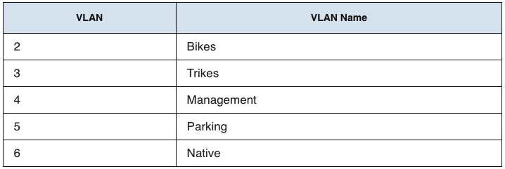
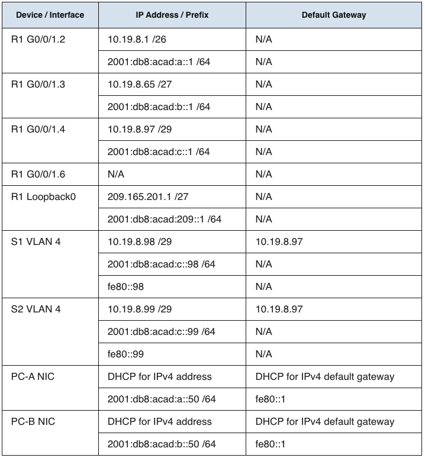

<!-- TOC ignore:true -->
<h1>Packet Tracer Practice</h1>

<!-- TOC -->

- [Scenario](#scenario)
  - [Required Resources](#required-resources)
  - [VLAN Table](#vlan-table)
- [Part 1: Initialize, Reload and Configure Basic Device Settings](#part-1-initialize-reload-and-configure-basic-device-settings)
  - [Intialize and Reload the router and Switch](#intialize-and-reload-the-router-and-switch)
    - [Router 1](#router-1)
    - [Switch 1 and 2](#switch-1-and-2)
  - [Configure R1](#configure-r1)
  - [Configure S1 and S2](#configure-s1-and-s2)
- [Part 2: Configure Network Infrastructure Settings (VLANs, Trunking, Etherchannel)](#part-2-configure-network-infrastructure-settings-vlans-trunking-etherchannel)
  - [Configure S1](#configure-s1)
  - [Configure S2](#configure-s2)
- [Part 3: Configure Host Support](#part-3-configure-host-support)
- [Part 4: Test and Verify IPv4 and IPv6 End-to-End Connectivity](#part-4-test-and-verify-ipv4-and-ipv6-end-to-end-connectivity)
- [Definition of terms](#definition-of-terms)
      - [Dual SDM Template](#dual-sdm-template)

<!-- /TOC -->

<br/><br/>

**Note** : 
1.  I found this posted in one of the forums and decided to recreate the scenario on my Packet Tracer, but its meant to be simulated on an actual hardware.
2.  Command here are direct copy-paste from my CLI but I removed some lines/results for easy comprehension

# Scenario

* In this Skills Assessment (SA) you will configure the devices in a small network. You must configure a router, switch and PCs to support both IPv4 and IPv6 connectivity for supported hosts. Your router and switch must also be managed securely. You will configure inter-VLAN routing, DHCP, Etherchannel, and port-security.

## Required Resources
* Router (Cisco 4221 with Cisco IOS XE Release 16.9.4 universal image or comparable)
* Switches (Cisco 2960 with Cisco IOS Release 15.2(2) lanbasek9 image or comparable)
* PCs (Windows with a terminal emulation program, such as Tera Term)
* Console cables to configure the Cisco IOS devices via the console ports
* Ethernet cables as shown in the topology

## VLAN Table
* Addressing Table <br/> <br/>


# Part 1: Initialize, Reload and Configure Basic Device Settings 

## Intialize and Reload the router and Switch

### Router 1
* Erase the startup configurations and VLANs from the router and switch and reload the devices.
    ```bash
    Router>
    Router>enable
    Router#erase startup-config 
    Router#reload
    ```


### Switch 1 and 2
* Erase the startup configurations and VLANs from the router and switch and reload the devices.
    ```bash
    Switch>enable
    Switch#erase startup-config 
    Switch#reload
    ```
* After the switch is reloaded, configure the SDM template to support IPv6 as needed, and reload the switch again.
    ```bash
    Switch>en
    Switch#config t
    Switch(config)#sdm prefer dual-ipv4-and-ipv6 default
    Switch(config)#exit
    Switch#reload
    ``` 

## Configure R1
* Disable DNS lookup
    ```bash
    Router>enable
    Router#configure terminal 
    Router(config)#no ip domain lookup 
    ```
* Router name
    ```bash
    Router(config)#hostname R1
    ```
* Domain name
    ```bash
    R1(config)#ip domain name ccna-lab.com
    ```
* Encrypted privileged EXEC password
    ```bash
    R1(config)#enable secret ciscoenpass
    ```
* Console access password
    ```bash
    R1(config)#line console 0
    R1(config-line)#password ciscoconpass
    R1(config-line)#login
    R1(config-line)#exit
    ```
* Set the minimum length for passwords
    ```bash
    R1(config)#security passwords min-length 10
    ```
* Create an administrative user in the local database
    ```bash
    R1(config)#username admin secret admin1pass
    ```
* Set login on VTY lines to use local database
    ```bash
    R1(config)#line vty 0 15
    R1(config-line)#login local
    ```
* Set VTY lines to accept SSH connections only
    ```bash
    R1(config-line)#transport input ssh
    R1(config-line)#exit
    ```

* Encrypt the clear text passwords
    ```bash
    R1(config)#service password-encryption 
    ```
* Configure an MOTD Banner
    ```bash
    R1(config)#banner motd #Authorized Access Only!#
    ```
* Enable IPv6 Routing
    ```bash
    R1(config)#ipv6 unicast-routing 
    ```
* Configure Interface G0/0/1 and sub interfaces
  - Set the description
  - Set the IPv4 address
  - Set the IPv6 Link Local Address as ```fe80::1```
  - Set the IPv6 address
  - Activate Interface
  <br><br>
  * R1 G0/0/1.2 
    ```bash
    R1(config)#interface g0/0/1.2
    R1(config-subif)#encapsulation dot1Q 2
    R1(config-subif)#description Bikes
    R1(config-subif)#ip address 10.19.8.1 255.255.255.192
    R1(config-subif)#ipv6 address 2001:db8:acad:a::1/64
    R1(config-subif)#ipv6 address fe80::1 link-local
    ```
  * R1 G0/0/1.3 
    ```bash
    R1(config-subif)#interface g0/0/1.3
    R1(config-subif)#encapsulation dot1Q 3
    R1(config-subif)#description Trikes
    R1(config-subif)#ip address 10.19.8.65 255.255.255.224
    R1(config-subif)#ipv6 address 2001:db8:acad:b::1/64
    R1(config-subif)#ipv6 address fe80::1 link-local
    ```
  * R1 G0/0/1.4 
    ```bash
    R1(config-subif)#interface g0/0/1.4
    R1(config-subif)#encapsulation dot1Q 4
    R1(config-subif)#description Management
    R1(config-subif)#ip address 10.19.8.97 255.255.255.248
    R1(config-subif)#ipv6 address 2001:db8:acad:c::1/64
    R1(config-subif)#ipv6 address fe80::1 link-local
    ```
  * R1 G0/0/1.6
    ```bash
    R1(config-subif)#interface g0/0/1.6
    R1(config-subif)#encapsulation dot1Q 6
    R1(config-subif)#description Native
    ```
* R1 G0/0/1
    ```bash
    R1(config-subif)#interface g0/0/1
    R1(config-if)#no shutdown
    ```
   
* Configure the Loopback0 interface
    ```bash
    R1(config)#interface loopback 0
    R1(config)#description Loopback/Native
    R1(config-if)#ip address 209.165.201.1 255.255.255.224
    R1(config-if)#ipv6 address 2001:db8:acad:209::1/64
    R1(config-if)#ipv6 address fe80::1 link-local
    R1(config-if)#exit
    ```
* Generate an RSA crypto key
    ```bash
    R1(config)#crypto key generate rsa
    The name for the keys will be: R1.ccna-lab.com
    Choose the size of the key modulus in the range of 360 to 2048 for your
    General Purpose Keys. Choosing a key modulus greater than 512 may take
    a few minutes.

    How many bits in the modulus [512]: 1024
    % Generating 1024 bit RSA keys, keys will be non-exportable...[OK]

    R1(config)#
    ```

## Configure S1 and S2
* Disable DNS lookup
  ```bash
  Switch>enable 
  Switch#configure terminal 
  Switch(config)#no ip domain lookup 
  ```
* Switch name
  * S1
    ```bash
    Switch(config)#hostname S1
    ```
  * S2
    ```bash
    Switch(config)#hostname S2
    ```
* Domain name
  ```bash
  S1(config)#ip domain name ccna-lab.com
  ```
* Encrypted privileged EXEC password
  ```bash
  S1(config)#enable secret ciscoenpass
  ```
* Console access password
  ```bash
  S1(config)#line console 0
  S1(config-line)#password ciscoconpass
  S1(config-line)#login
  S1(config-line)#exit
  ```
* Create an administrative user in the local database
  ```bash
  S1(config)#username admin secret admin1pass
  ```
* Set login on VTY lines to use local database
  ```bash
  S1(config)#line vty 0 15
  S1(config-line)#login local
  ```
* Set VTY lines to accept SSH connections only
  ```bash
  S1(config-line)#transport input ssh
  S1(config-line)#exit
  ```
* Encrypt the clear text passwords
  ```bash
  S1(config)#service password-encryption 
  ```
* Configure an MOTD Banner
  ```bash
  S1(config)#banner motd #Authorized Access Only!#
  ```
* Generate an RSA crypto key
  ```bash
  S1(config)#crypto key generate rsa
  The name for the keys will be: S1.ccna-lab.com
  Choose the size of the key modulus in the range of 360 to 2048 for your
  General Purpose Keys. Choosing a key modulus greater than 512 may take
  a few minutes.

  How many bits in the modulus [512]: 1024
  % Generating 1024 bit RSA keys, keys will be non-exportable...[OK]
  
  S1(config)#
  ```
* Configure Management Interface (SVI)
  ```bash
  S1(config)#interface vlan 4
  ```
  * S1
    ```bash
    S1(config-if)#ip address 10.19.8.98 255.255.255.248
    S1(config-if)#ipv6 address 2001:db8:acad:c::98/64
    S1(config-if)#ipv6 address fe80::98 link-local
    ```
  * S2
    ```bash
    S2(config-if)#ip address 10.19.8.99 255.255.255.248
    S2(config-if)#ipv6 address 2001:db8:acad:c::99/64
    S2(config-if)#ipv6 address fe80::99 link-local 
    ```
  ```bash
  S1(config-if)#description Management Interface
  S1(config-if)#no shutdown
  S1(config-if)#exit
  ```
* Configure Default Gateway
  ```bash
  S1(config)#ip default-gateway 10.19.8.97
  ```
<br/><br/>

# Part 2: Configure Network Infrastructure Settings (VLANs, Trunking, Etherchannel) 
## Configure S1
* Create VLANs
  ```bash
  S1(config)#vlan 2
  S1(config-vlan)#name Bikes
  S1(config-vlan)#vlan 3 
  S1(config-vlan)#name Trikes
  S1(config-vlan)#vlan 4
  S1(config-vlan)#vlan 5
  S1(config-vlan)#name Parking
  S1(config-vlan)#vlan 6
  S1(config-vlan)#name Native
  ```
* Create 802.1Q trunks that use the native VLAN 6 ???
  ```bash
    S1(config)#interface range f0/1-2
    S1(config-if-range)#switchport trunk encapsulation dot1q (#optional)
    S1(config-if-range)#switchport mode trunk 
    S1(config-if-range)#switchport trunk native vlan 6
    S1(config-if-range)#switchport trunk allowed vlan 2-6
    S1(config-if-range)#exit
  ```
* Create a Layer 2 EtherChannel port group that uses interfaces F0/1 and F0/2
  ```bash
  S1(config-if-range)#interface range f0/1-2
  S1(config-if-range)#channel-group 1 mode active
  S1(config-if-range)#exit  
  ```
* Configure host access port for VLAN 2
  ```bash
  S1(config)#interface f0/6
  S1(config-if)#switchport mode access 
  S1(config-if)#switchport access vlan 2
  ```
* Configure port-security on access ports
  ```bash
  S1(config-if)#switchport port-security maximum 3
  ```
* Secure all unused interfaces
  ```bash
  S1(config-if)#interface range f0/3-4, f0/7-24, g0/1-2
  S1(config-if-range)#switchport mode access 
  S1(config-if-range)#switchport access vlan 5
  S1(config-if-range)#description Unused Ports
  S1(config-if-range)#shutdown
  ```

## Configure S2
* Create VLANs
  ```bash
  S2(config)#vlan 2
  S2(config-vlan)#name Bikes
  S2(config-vlan)#vlan 3
  S2(config-vlan)#name Trikes
  S2(config-vlan)#vlan 4 
  S2(config-vlan)#vlan 5
  S2(config-vlan)#name Parking
  S2(config-vlan)#vlan 6 
  S2(config-vlan)#name Native
  ```
* Create 802.1Q trunks that use the native VLAN 6 ???
  ```bash
    S2(config)#interface range f0/1-2
    S2(config-if-range)#switchport trunk encapsulation dot1q (#optional)
    S2(config-if-range)#switchport mode trunk 
    S2(config-if-range)#switchport trunk native vlan 6
    S2(config-if-range)#switchport trunk allowed vlan 2-6
    S2(config-if-range)#exit
  ```
* Create a Layer 2 EtherChannel port group that uses interfaces F0/1 and F0/2
  ```bash
  S2(config-vlan)#interface range f0/1-2
  S2(config-if-range)#channel-group 1 mode active
  S2(config-if-range)#exit
  ```
* Configure host access port for VLAN 3
  ```bash
  S2(config)#interface f0/18
  S2(config-if)#switchport mode access 
  S2(config-if)#switchport access vlan 3
  ```
* Configure port-security on access ports
  ```bash
  S2(config-if)#switchport port-security maximum 3
  ```
* Secure all unused interfaces
  ```bash
  S2(config-if)#interface range f0/3-17, f0/19-24, g0/1-2
  S2(config-if-range)#switchport mode access 
  S2(config-if-range)#switchport access vlan 5
  S2(config-if-range)#description Unused ports
  S2(config-if-range)#shutdown
  ```
<br/><br/>

# Part 3: Configure Host Support 
* Configure Default Routing
  ```bash
  R1(config)#ip route 0.0.0.0 0.0.0.0 loopback 0
  R1(config)#ipv6 route ::0/0 loopback 0
  ```
* Configure IPv4 DHCP for VLAN 2 <br>
  Create a DHCP pool for **VLAN 2**, consisting of the **last 10 addresses** in the subnet only. Assign the domain name **ccna-a.net** and specify the **default gateway** address as the router interface address for the subnet involved
    ```bash
    R1(config)#ip dhcp excluded-address 10.19.8.1 10.19.8.52
    R1(config)#ip dhcp pool VLAN-Bikes
    R1(dhcp-config)#network 10.19.8.0 255.255.255.192
    R1(dhcp-config)#default-router 10.19.8.1
    R1(dhcp-config)#domain-name ccna-a.net
    R1(dhcp-config)#exit
    ```

* Configure IPv4 DHCP for VLAN 3 <br> 
  Create a DHCP pool for **VLAN 3**, consisting of the **last 10 addresses** in the subnet only. Assign the domain name **ccna-b.net** and specify the **default gateway** address as the router interface address for the subnet involved
    ```bash
    R1(config)#ip dhcp excluded-address 10.19.8.65 10.19.8.84
    R1(config)#ip dhcp pool VLAN3-Trikes
    R1(dhcp-config)#network 10.19.8.64 255.255.255.224
    R1(dhcp-config)#default-router 10.19.8.65
    R1(dhcp-config)#domain-name ccna-b.net
    ```


<br/><br/>

# Part 4: Test and Verify IPv4 and IPv6 End-to-End Connectivity 

```
PC-A --> 2001:db8:acad:a::50 /64
PC-B --> 2001:db8:acad:b::50 /64 

fe80::1
```

# Definition of terms
#### Dual SDM Template
* The dual IPv4 and IPv6 templates allow the switch to be used in dual stack environments, supporting both IPv4 and IPv6 traffic. 


