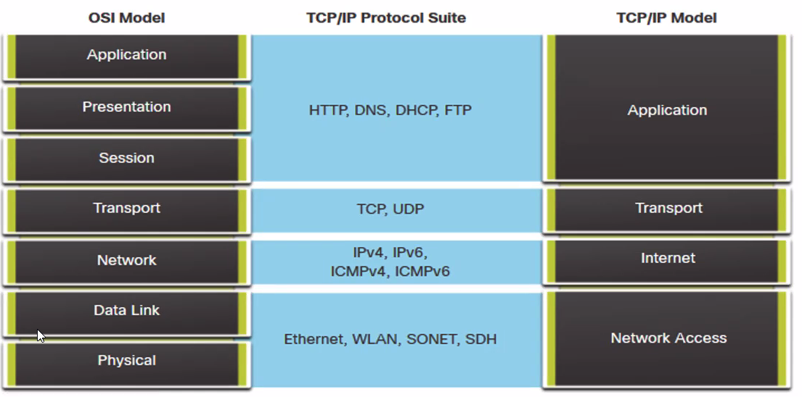
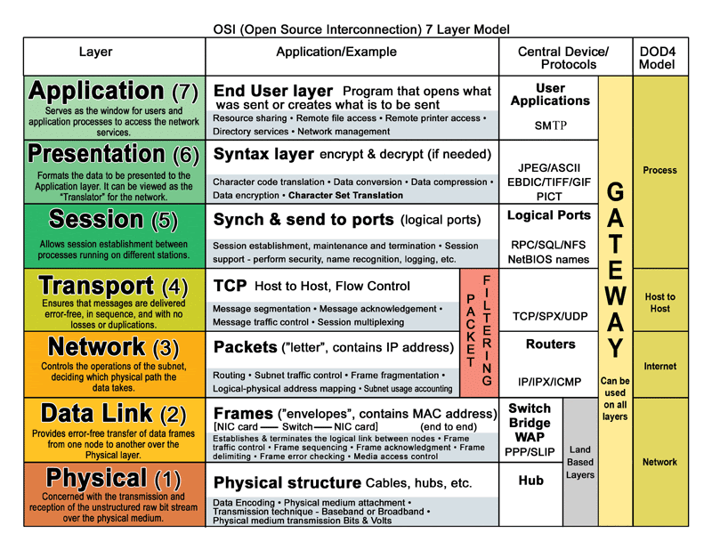
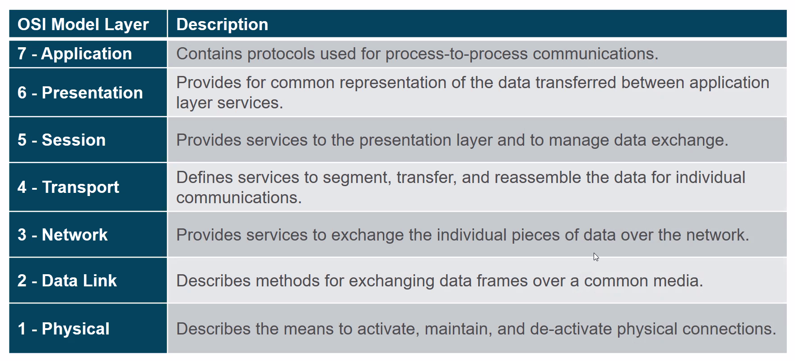
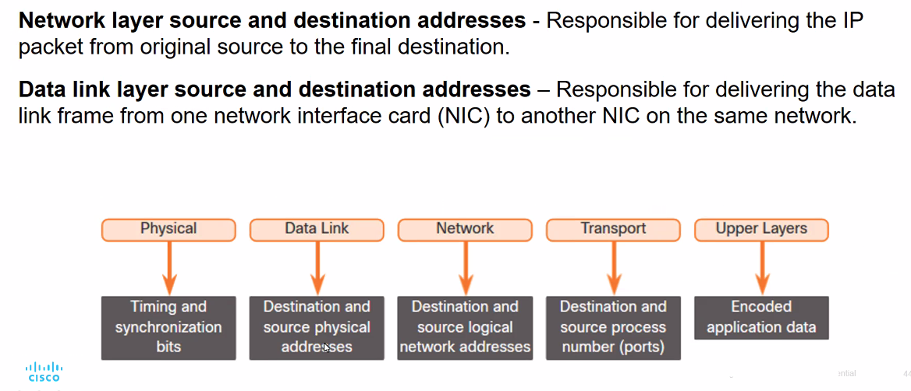
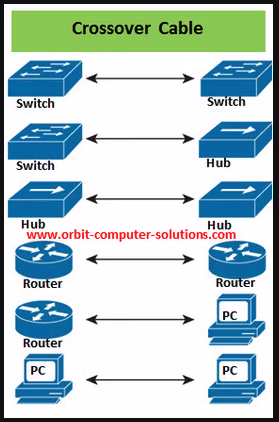
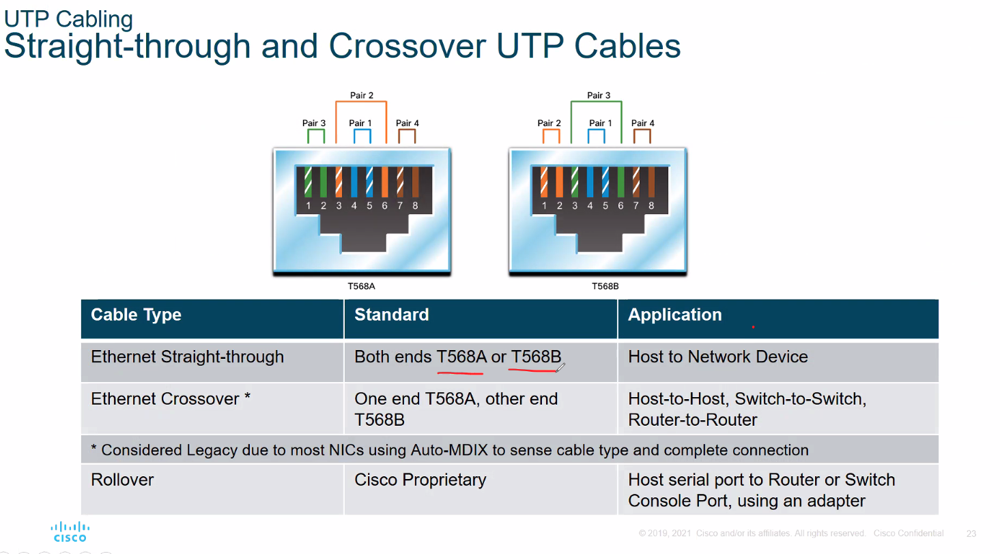

# Random Notes

* IPv4 CIDR Notation
    | Bit| 7| 6| 5| 4| 3| 2| 1| 0|
    | ---| ---| ---| ---| ---| ---| ---| ---| ---|
    | CIDR      | 25    | 26    | 27    | 28    | 29    | 30    | 31    | 32    |
    | .decimal  | 128   | 192   | 224   | 240   | 248   | 252   | 254   | 255|  |
    | No. host  | 128   | 64    | 32    | 16    | 8     | 4     | 2     | 1|

* OSI Layer
   
   
   
   

* Cabling
   
   
   