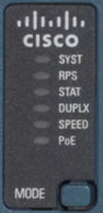

# Random Notes

<!-- TOC -->

- [Random Notes](#random-notes)
  - [CCNA I : CCNAv7: Introduction to Networks](#ccna-i--ccnav7-introduction-to-networks)
    - [IPv4 CIDR Notation](#ipv4-cidr-notation)
    - [OSI Layer](#osi-layer)
    - [Cabling](#cabling)
- [CCNA II : Switching, Routing, and Wireless Essentials](#ccna-ii--switching-routing-and-wireless-essentials)
  - [Switch Boot Sequence](#switch-boot-sequence)
  - [Switch LED Indicator](#switch-led-indicator)
  - [Recovering from System Crash](#recovering-from-system-crash)

<!-- /TOC -->

[Back to README](../README.md)

## CCNA I : CCNAv7: Introduction to Networks
### IPv4 CIDR Notation
* For subnet calculation and VLSM on /24
    | Bit       | 7     | 6     | 5     | 4     | 3     | 2     | 1     | 0     |
    | ---       | ---   | ---   | ---   | ---   | ---   | ---   | ---   | ---   |
    | CIDR      | 25    | 26    | 27    | 28    | 29    | 30    | 31    | 32    |
    | .decimal  | 128   | 192   | 224   | 240   | 248   | 252   | 254   | 255   |
    | No. host  | 128   | 64    | 32    | 16    | 8     | 4     | 2     | 1     |

[Back to Top](#random-notes)

### OSI Layer
   
   
   
   

[Back to Top](#random-notes)

### Cabling
   
   
   

[Back to Top](#random-notes)

  

# CCNA II : Switching, Routing, and Wireless Essentials
## Switch Boot Sequence
After a Cisco switch is powered on, it goes through the following five-step boot sequence:
* **Step 1**: First, the switch loads a power-on self-test (**POST**) program stored in ROM. POST checks the CPU subsystem. It tests the CPU, DRAM, and the portion of the flash device that makes up the flash file system.
* **Step 2**: Next, the switch **loads the boot loader software**. The boot loader is a small program **stored in ROM** that is run immediately after POST successfully completes.
* **Step 3**: The boot loader **performs low-level CPU initialization**. It initializes the CPU registers, which control where physical memory is mapped, the quantity of memory, and its speed.
* **Step 4**: The boot loader **initializes the flash file system** on the system board.
* **Step 5**: Finally, the **boot loader locates and loads a default IOS operating system software image** into memory and gives control of the switch over to the IOS.

## Switch LED Indicator 
* **System LED (SYST)**: Shows whether the system is receiving power and functioning properly. 
* **Redundant Power Supply LED (RPS)**: Shows the RPS status.
* **Port Status LED (STAT)**: When green, indicates port status mode is selected, which is the default. Port status can then be understood by the light associated with each port.
* **Port Duplex LED (DUPLX)**: When green, indicates port duplex mode is selected. Port duplex can then be understood by the light associated with each port.
* **Port Speed LED (SPEED)**: When green, indicates port speed mode is selected. Port speed can then be understood by the light associated with each port.
* **Power over Ethernet LED (PoE)**: Present if the switch supports PoE. Indicates the PoE status of ports on the switch.

The Mode button is used to move between the different modes – STAT, DUPLX, SPEED, and PoE

|         | Off | Green | Blinking Green | Amber | Blinking Amber | Alternating Green and Amber |
| ------- | ------- | ------- | ------- | ------- | ------- | ------- |
| RPS | Off/No RPS | RPS ready | RPS up but not available | RPS standby or fault | Internal PS failed, RPS providing power | N/A |
| PoE | Not selected, no issues | Selected | N/A | N/A | Not selected, port issues present | N/A |

*When the named mode is selected, the light associated with each physical port indicates:*

|         | Off | Green | Blinking Green | Amber | Blinking Amber | Alternating Green and Amber |
| ------- | ------- | ------- | ------- | ------- | ------- | ------- |
| STAT | No link or shutdown | Link Up | Activity | Port blocked preventing loop | Port blocked preventing loop | Link fault |
| DUPLEX | Half-duplex | Full-duplex | N/A | N/A | N/A | N/A |
| SPEED | 10Mbps | 100Mbps | 1000Mbps | N/A | N/A | N/A |
|PoE | PoE off | PoE on | N/A | PoE disabled | PoE off due to fault | PoE denied (over budget) |

## Recovering from System Crash
  The boot loader provides access into the switch if the operating system cannot be used because of missing or damaged system files. The boot loader has a command line that provides access to the files stored in flash memory. The boot loader can be accessed through a console connection following these steps:
  * Step 1. Connect a PC by console cable to the switch console port. Configure terminal emulation software to connect to the switch.
  * Step 2. Unplug the switch power cord.
  * Step 3. Reconnect the power cord to the switch and, within 15 seconds, press and hold down **the Mode button** while the System LED is still flashing green.
  * Step 4. Continue pressing **the Mode button** until the System LED turns briefly amber and then solid green; then release **the Mode button**.
  * Step 5. The boot loader switch: prompt appears in the terminal emulation software on the PC.

  The boot loader command line supports commands to format the flash file system, reinstall the operating system software, and recover a lost or forgotten password. For example, the dir command can be used to view a list of files within a specified directory.

[Back to Top](#random-notes)

[Back to README](../README.md)

