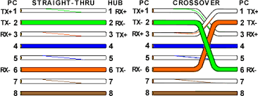

# Random Notes

<!-- TOC -->

- [Random Notes](#random-notes)
  - [CCNA I : CCNAv7: Introduction to Networks](#ccna-i--ccnav7-introduction-to-networks)
    - [IPv4 CIDR Notation](#ipv4-cidr-notation)
    - [OSI Layer](#osi-layer)
    - [Cabling](#cabling)
- [CCNA II : Switching, Routing, and Wireless Essentials](#ccna-ii--switching-routing-and-wireless-essentials)
  - [Switch Boot Sequence](#switch-boot-sequence)
  - [Switch LED Indicator](#switch-led-indicator)
  - [Recovering from System Crash](#recovering-from-system-crash)
  - [Routing](#routing)
    - [Router-on-a-Stick Scenario on a ***Router***](#router-on-a-stick-scenario-on-a-router)
    - [Inter-VLAN Routing on ***L3 Switch***](#inter-vlan-routing-on-l3-switch)
    - [STP](#stp)
    - [EtherChannel](#etherchannel)
    - [Configuration Guidelines and Restrictions for EtherChannel](#configuration-guidelines-and-restrictions-for-etherchannel)

<!-- /TOC -->

[Back to README](../README.md)

## CCNA I : CCNAv7: Introduction to Networks
### IPv4 CIDR Notation
* For subnet calculation and VLSM on /24
    | Bit       | 7     | 6     | 5     | 4     | 3     | 2     | 1     | 0     |
    | ---       | ---   | ---   | ---   | ---   | ---   | ---   | ---   | ---   |
    | CIDR      | 25    | 26    | 27    | 28    | 29    | 30    | 31    | 32    |
    | .decimal  | 128   | 192   | 224   | 240   | 248   | 252   | 254   | 255   |
    | No. host  | 128   | 64    | 32    | 16    | 8     | 4     | 2     | 1     |

[Back to Top](#random-notes)

### OSI Layer
  <br/>
  <br/>
  <br/>
  <br/>

[Back to Top](#random-notes)

### Cabling
  <br/>
  <br/>
  <br/>

[Back to Top](#random-notes)


<br/><br/>

# CCNA II : Switching, Routing, and Wireless Essentials
## Switch Boot Sequence
After a Cisco switch is powered on, it goes through the following five-step boot sequence:
* **Step 1**: First, the switch loads a power-on self-test (**POST**) program stored in ROM. POST checks the CPU subsystem. It tests the CPU, DRAM, and the portion of the flash device that makes up the flash file system.
* **Step 2**: Next, the switch **loads the boot loader software**. The boot loader is a small program **stored in ROM** that is run immediately after POST successfully completes.
* **Step 3**: The boot loader **performs low-level CPU initialization**. It initializes the CPU registers, which control where physical memory is mapped, the quantity of memory, and its speed.
* **Step 4**: The boot loader **initializes the flash file system** on the system board.
* **Step 5**: Finally, the **boot loader locates and loads a default IOS operating system software image** into memory and gives control of the switch over to the IOS.

## Switch LED Indicator 
* **System LED (SYST)**: Shows whether the system is receiving power and functioning properly. 
* **Redundant Power Supply LED (RPS)**: Shows the RPS status.
* **Port Status LED (STAT)**: When green, indicates port status mode is selected, which is the default. Port status can then be understood by the light associated with each port.
* **Port Duplex LED (DUPLX)**: When green, indicates port duplex mode is selected. Port duplex can then be understood by the light associated with each port.
* **Port Speed LED (SPEED)**: When green, indicates port speed mode is selected. Port speed can then be understood by the light associated with each port.
* **Power over Ethernet LED (PoE)**: Present if the switch supports PoE. Indicates the PoE status of ports on the switch.

The Mode button is used to move between the different modes – STAT, DUPLX, SPEED, and PoE


|         | Off | Green | Blinking Green | Amber | Blinking Amber | Alternating Green and Amber |
| ------- | ------- | ------- | ------- | ------- | ------- | ------- |
| RPS | Off/No RPS | RPS ready | RPS up but not available | RPS standby or fault | Internal PS failed, RPS providing power | N/A |
| PoE | Not selected, no issues | Selected | N/A | N/A | Not selected, port issues present | N/A |

*When the named mode is selected, the light associated with each physical port indicates:*

|         | Off | Green | Blinking Green | Amber | Blinking Amber | Alternating Green and Amber |
| ------- | ------- | ------- | ------- | ------- | ------- | ------- |
| STAT | No link or shutdown | Link Up | Activity | Port blocked preventing loop | Port blocked preventing loop | Link fault |
| DUPLEX | Half-duplex | Full-duplex | N/A | N/A | N/A | N/A |
| SPEED | 10Mbps | 100Mbps | 1000Mbps | N/A | N/A | N/A |
|PoE | PoE off | PoE on | N/A | PoE disabled | PoE off due to fault | PoE denied (over budget) |

## Recovering from System Crash
  The boot loader provides access into the switch if the operating system cannot be used because of missing or damaged system files. The boot loader has a command line that provides access to the files stored in flash memory. The boot loader can be accessed through a console connection following these steps:
  * Step 1. Connect a PC by console cable to the switch console port. Configure terminal emulation software to connect to the switch.
  * Step 2. Unplug the switch power cord.
  * Step 3. Reconnect the power cord to the switch and, within 15 seconds, press and hold down **the Mode button** while the System LED is still flashing green.
  * Step 4. Continue pressing **the Mode button** until the System LED turns briefly amber and then solid green; then release **the Mode button**.
  * Step 5. The boot loader switch: prompt appears in the terminal emulation software on the PC.

  The boot loader command line supports commands to format the flash file system, reinstall the operating system software, and recover a lost or forgotten password. For example, the dir command can be used to view a list of files within a specified directory.


## Routing
### Router-on-a-Stick Scenario on a ***Router***
  * Create subinterface on an interface using encapsulation dot1q
  * On a single router interface
  
### Inter-VLAN Routing on ***L3 Switch***
  * L3 must have SVI vlans of the connecting switches. With an IP of member of the connecting network vlan
  * Issue ```ip routing``` command
  * Physical connection must be trunking

### STP

### EtherChannel
* More than 1 cable going to same switch/router
* Act as 1 interface
* Max 8 interfaces per EtherChannel
* Load Balance : SHould have same configuaration for:
  * Duplex
  * Speed
  * Access/Trunk
  * Vlans
  * STP interface settings (port priority)
* State for each side of the cable
  * On / On                 - Static  
  * Desirable / Desirable   - PAgP
  * Desirable / Auto        - PAgP    - Passive
  * Active / Active         - LACP
  * Active / Passive        - LACP

### Configuration Guidelines and Restrictions for EtherChannel
EtherChannel has some specific guidelines that must be followed in order to avoid configuration problems.

1. All Ethernet interfaces support EtherChannel up to a maximum of eight interfaces with no requirement that the interfaces be on the same interface module.

1. All interfaces within an EtherChannel must operate at the same speed and duplex.

1. EtherChannel links can function as either single VLAN access ports or as trunk links between switches.

1. All interfaces in a Layer 2 EtherChannel must be members of the same VLAN or be configured as trunks.

1. If configured as trunk links, Layer 2 EtherChannel must have the same native VLAN and have the same VLANs allowed on both switches connected to the trunk.

1. When configuring EtherChannel links, all interfaces should be shutdown prior to beginning the EtherChannel configuration. When configuration is complete, the links can be re-enabled.

1. After configuring the EtherChannel, verify that all interfaces are in the up/up state.

1. It is possible to configure an EtherChannel as static, or for it to use either PAgP or LACP to negotiate the EtherChannel connection. The determination of how an EtherChannel is setup is the value of the channel-group number mode command. Valid values are:

    * **active** LACP is enabled unconditionally
    * **passive** LACP is enabled only if another LACP-capable device is connected.
    * **desirable** PAgP is enabled unconditionally
    * **auto** PAgP is enabled only if another PAgP-capable device is connected.
    * **on** EtherChannel is enabled, but without either LACP or PAgP.

1. LAN ports can form an EtherChannel using PAgP if the modes are compatible. Compatible PAgP modes are:
    * desirable => desirable
    * desirable => auto
     
    If both interfaces are in auto mode, an Etherchannel cannot form.

1.  LAN ports can form an EtherChannel using LACP if the modes are compatible. Compatible LACP modes are:
     * **active => active**
     * **active => passive**
  
    If both interfaces are in passive mode, an EtherChannel cannot form using LACP.

1. Channel-group numbers are local to the individual switch. Although this activity uses the same Channel-group number on either end of the EtherChannel connection, it is not a requirement. Channel-group 1 (interface po1) on one switch can form an EtherChannel with Channel-group 5 (interface po5) on another switch.

[Back to Top](#random-notes)

[Back to README](../README.md)

