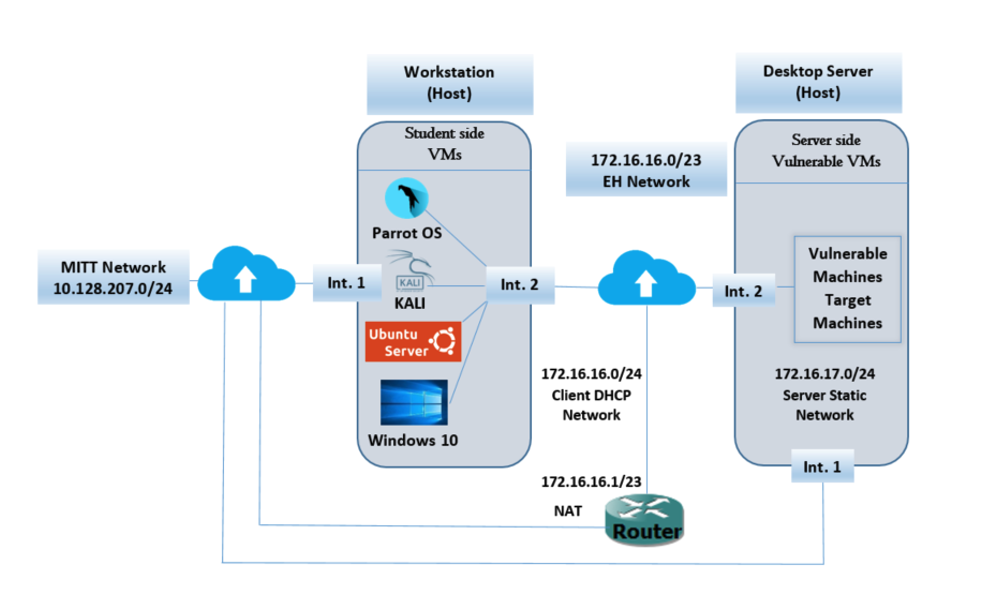

# NSD Case Study

* **Objective**: To follow the ethical hacking methodology; to exploit the discovered vulnerabilities (demonstrate at least two ways to break in – two different vulnerabilities); to gain root access of the **casestudy** machine and read the **flag.file** file in the root directory. 

    

# Footprinting – Reconnaissance and Scanning
## Found Devices
* Using Nmap 
    ```
    ron@rbkali:~$ sudo nmap -sn 172.16.17.0/24
    ```
    1. 172.16.17.50 - 00:0C:29:1F:D5:64 (VMware)
    2. 172.16.17.51 - 00:0C:29:F1:48:50 (VMware)
    3. 172.16.17.53 - 00:0C:29:1B:33:79 (VMware)
    4. 172.16.17.55 - 00:0C:29:81:43:2E (VMware)
    5. 172.16.17.67 - 00:0C:29:70:6D:2D (VMware)
    6. 172.16.17.96 - 00:0C:29:DE:61:DB (VMware)
    7. 172.16.17.231 - 00:0C:29:50:8F:1B (VMware)

## Footprinting – Reconnaissance and Scanning
* Using AutoRecon https://github.com/Tib3rius/AutoRecon
  ```
  # ron@rbkali:~/Desktop$ sudo nmap -p- -sC -sV -oA nmap50 172.16.17.50
  ```

## 172.16.17.50 - 00:0C:29:1F:D5:64 (VMware)
  * Open ports via [Nmap](scans/nmap50.nmap)
    ```bash
    PORT      STATE SERVICE VERSION
    22/tcp    open  ssh     OpenSSH 6.7p1 Debian 5+deb8u4 (protocol 2.0)
    80/tcp    open  http    Apache httpd 2.4.10 ((Debian))
    111/tcp   open  rpcbind 2-4 (RPC #100000)
    55241/tcp open  status  1 (RPC #100024)
    ```
  * OS : Debian

## 172.16.17.51 - 00:0C:29:F1:48:50 (VMware)
  * Open ports via [Nmap](scans/nmap51.nmap)
    ```bash
    PORT     STATE SERVICE VERSION
    22/tcp   open  ssh     OpenSSH 7.6p1 Ubuntu 4ubuntu0.3 (Ubuntu Linux; protocol 2.0)
    80/tcp   open  http    Apache httpd 2.4.7 ((Ubuntu))
    6661/tcp open  unknown
    6663/tcp open  http    Apache httpd 2.4.10 ((Debian))
    ```
  * OS : Ubuntu
  * Website
    * http://172.16.17.51
    * PhP 5.5.9
    * Knockout.js 2.2.1
    * 

## 172.16.17.53 - 00:0C:29:1B:33:79 (VMware)
## 172.16.17.55 - 00:0C:29:81:43:2E (VMware)
## 172.16.17.67 - 00:0C:29:70:6D:2D (VMware)
## 172.16.17.96 - 00:0C:29:DE:61:DB (VMware)
## 172.16.17.231 - 00:0C:29:50:8F:1B (VMware)
                          