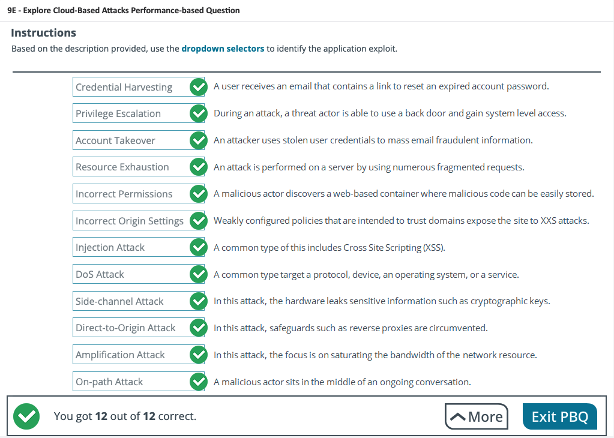
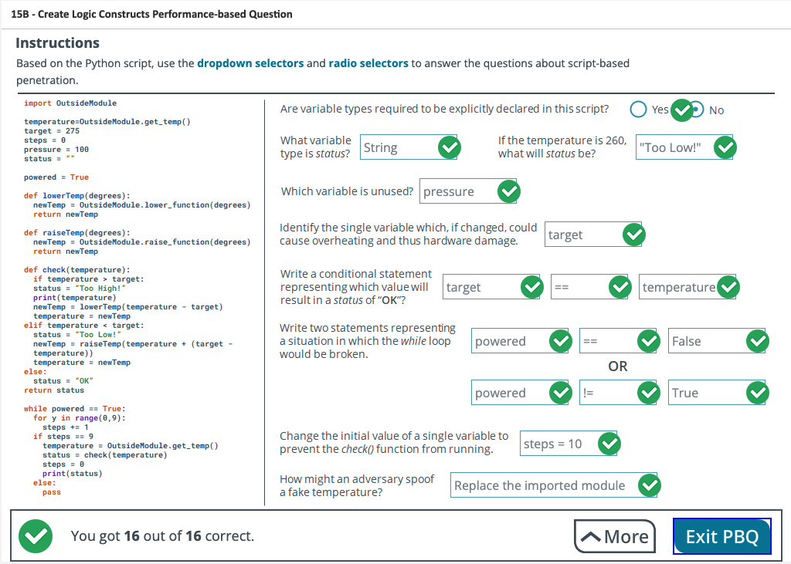

# Performance-Based Questions

<!-- TOC -->

- [Performance-Based Questions](#performance-based-questions)
  - [2A - Assess Environmental Considerations](#2a---assess-environmental-considerations)
  - [3A - Discover the Target](#3a---discover-the-target)
  - [4A - Exploit the Human Psyche](#4a---exploit-the-human-psyche)
  - [6A - Scan Identified Targets](#6a---scan-identified-targets)
  - [8C - Establish a Covert Channel](#8c---establish-a-covert-channel)
  - [9E - Explore Cloud-Based Attacks](#9e---explore-cloud-based-attacks)
  - [10B - Explore Wireless Tools](#10b---explore-wireless-tools)
  - [13C - Plan Injection Attacks](#13c---plan-injection-attacks)
  - [14C - Analyze Exploit Code and Logic Constructs](#14c---analyze-exploit-code-and-logic-constructs)
  - [15B - Create Logic Constructs](#15b---create-logic-constructs)
  - [16C - Maintain Persistence](#16c---maintain-persistence)
  - [17B - Communication Triggers](#17b---communication-triggers)
  - [19B - Administrative and Operational Controls](#19b---administrative-and-operational-controls)

<!-- /TOC -->

## 2A - Assess Environmental Considerations

   

## 3A - Discover the Target

   

## 4A - Exploit the Human Psyche

   

## 6A - Scan Identified Targets 

   

## 8C - Establish a Covert Channel

   

## 9E - Explore Cloud-Based Attacks

   

## 10B - Explore Wireless Tools

   

## 13C - Plan Injection Attacks

   

## 14C - Analyze Exploit Code and Logic Constructs

   

## 15B - Create Logic Constructs

   

## 16C - Maintain Persistence

   

## 17B - Communication Triggers

   

## 19B - Administrative and Operational Controls

