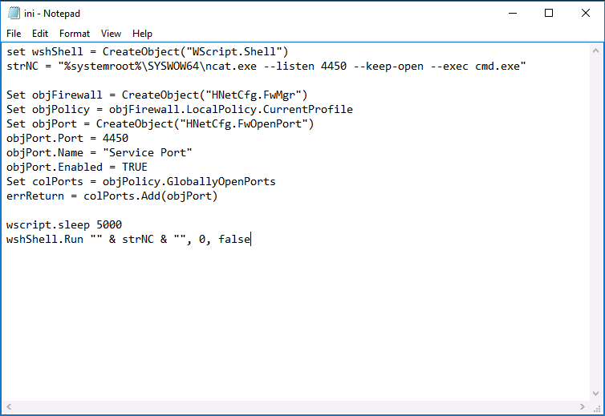

# CompTIA Security+

<h2>Table of Contents</h2>

<!-- TOC -->

- [CompTIA Security+](#comptia-security)
  - [Lesson Notes:](#lesson-notes)
    - [Topic 3A : Assess Organizational Security with Network Reconnaissance Tools](#topic-3a--assess-organizational-security-with-network-reconnaissance-tools)
      - [OTHER RECONNAISSANCE AND DISCOVERY TOOLS](#other-reconnaissance-and-discovery-tools)
  - [Commands and Configurations Journal Used in Labs](#commands-and-configurations-journal-used-in-labs)
    - [Assisted Lab 02: Scanning and Identifying Network Nodes](#assisted-lab-02-scanning-and-identifying-network-nodes)
      - [Kali](#kali)
        - [Nmap](#nmap)
        - [Banner Grab with curl and Firefox](#banner-grab-with-curl-and-firefox)
        - [DNS Query](#dns-query)
      - [Windows](#windows)
    - [Assisted Lab 03: Intercepting and Interpreting Network Traffic with Packet Sniffing Tools](#assisted-lab-03-intercepting-and-interpreting-network-traffic-with-packet-sniffing-tools)
      - [TCP Dump](#tcp-dump)
    - [Assisted Lab 04: Analyzing the Results of a Credentia](#assisted-lab-04-analyzing-the-results-of-a-credentia)
      - [Open VAS](#open-vas)
        - [Configure Scan Target](#configure-scan-target)
        - [Configure scan schedule](#configure-scan-schedule)
      - [Configure scan task](#configure-scan-task)
      - [Browse OpenVAS scan report](#browse-openvas-scan-report)
    - [Assisted Lab 05: Installing, Using, and Blocking a Malware-based Backdoor](#assisted-lab-05-installing-using-and-blocking-a-malware-based-backdoor)
    - [Assisted Lab 07: Managing the Life Cycle of a Certificate (Windows Server)](#assisted-lab-07-managing-the-life-cycle-of-a-certificate-windows-server)
      - [Browse Certificate Server properties](#browse-certificate-server-properties)
      - [Request a server certificate](#request-a-server-certificate)
      - [Bind certificate to HTTPS port](#bind-certificate-to-https-port)
      - [Revoke certificate](#revoke-certificate)
    - [Assisted Lab 08: Managing Certificates with OpenSSL (linux)](#assisted-lab-08-managing-certificates-with-openssl-linux)
      - [Use basic OpenSSL commands](#use-basic-openssl-commands)
      - [Generate a certificate signing request](#generate-a-certificate-signing-request)
      - [Convert certificate format](#convert-certificate-format)
      - [Merge the .key and .crt files (the non-Windows PEM format) into a .pfx file (the Windows PKCS#12 format)](#merge-the-key-and-crt-files-the-non-windows-pem-format-into-a-pfx-file-the-windows-pkcs12-format)
    - [Assisted Lab 09: Auditing Passwords with a Password Cracking Utility (kali)](#assisted-lab-09-auditing-passwords-with-a-password-cracking-utility-kali)
      - [Create User](#create-user)
      - [Add probable passwords to the word list file. Use ```rockyou.txt```.](#add-probable-passwords-to-the-word-list-file-use-rockyoutxt)
      - [Run John to crack passwords](#run-john-to-crack-passwords)
    - [Assisted Lab 10: Managing Centralized Authentication (Windows Server)](#assisted-lab-10-managing-centralized-authentication-windows-server)
      - [Register RADIUS client](#register-radius-client)
      - [Configure network policy](#configure-network-policy)
      - [Configure RADIUS client in PFsense](#configure-radius-client-in-pfsense)
      - [Configure role-based permissions in PFSense (cont)](#configure-role-based-permissions-in-pfsense-cont)
    - [Assisted Lab 11: Managing Access Controls in Windows Server](#assisted-lab-11-managing-access-controls-in-windows-server)
      - [Examine Administrator account properties](#examine-administrator-account-properties)
      - [Manage user, group, and computer objects](#manage-user-group-and-computer-objects)
      - [Modify an existing GPO to match password requirements](#modify-an-existing-gpo-to-match-password-requirements)
    - [Assisted Lab 12: Configuring a System for Auditing Policies](#assisted-lab-12-configuring-a-system-for-auditing-policies)
      - [Browse running processes](#browse-running-processes)
      - [Auditing effective permissions](#auditing-effective-permissions)
      - [Create file system audit policy](#create-file-system-audit-policy)
      - [GPO reporting](#gpo-reporting)
      - [Displaying audit policy results by using Event Viewer](#displaying-audit-policy-results-by-using-event-viewer)
    - [Assisted Lab 13: Managing Access Controls in Linux](#assisted-lab-13-managing-access-controls-in-linux)
      - [Create users and groups](#create-users-and-groups)
      - [Create directories and files](#create-directories-and-files)
      - [Create files](#create-files)
      - [Configure ownership](#configure-ownership)
      - [Configure permissions](#configure-permissions)
    - [APPLIED LAB 14: Configuring Identity and Access Management Controls](#applied-lab-14-configuring-identity-and-access-management-controls)
      - [Default Domain Policy for password and account lockout requirements](#default-domain-policy-for-password-and-account-lockout-requirements)
      - [Change the guest account, logon message, and last user name requirements](#change-the-guest-account-logon-message-and-last-user-name-requirements)
      - [For Policy Update](#for-policy-update)
    - [Assisted Lab 16: Configuring a Firewall (Linux)](#assisted-lab-16-configuring-a-firewall-linux)
      - [IPTables](#iptables)
    - [17: Assisted Lab: Configuring an Intrusion Detection System](#17-assisted-lab-configuring-an-intrusion-detection-system)
    - [Assisted Lab 18: Implementing Secure Network Addressing Services](#assisted-lab-18-implementing-secure-network-addressing-services)
      - [Determine the Primary Domain Controller](#determine-the-primary-domain-controller)
      - [DHCP Configuration](#dhcp-configuration)
      - [DNS](#dns)
    - [Assisted Lab 19: Implementing a Virtual Private Network](#assisted-lab-19-implementing-a-virtual-private-network)
      - [Configure the VPN server](#configure-the-vpn-server)
      - [Connect a Windows Client](#connect-a-windows-client)
    - [Assisted Lab 20: Implementing a Secure SSH Server](#assisted-lab-20-implementing-a-secure-ssh-server)
      - [Configure the CentOS SSH server](#configure-the-centos-ssh-server)
      - [SSH key-based authentication](#ssh-key-based-authentication)
      - [Review the SSH log file](#review-the-ssh-log-file)
      - [Prevent root from authenticating over SSH](#prevent-root-from-authenticating-over-ssh)
    - [Assisted Lab 23: Identifying Application Attack Indicators (windows)](#assisted-lab-23-identifying-application-attack-indicators-windows)
      - [Display Process Explorer and Performance Monitor](#display-process-explorer-and-performance-monitor)
        - [Create a custom Data Collector Set in Performance Monitor](#create-a-custom-data-collector-set-in-performance-monitor)
        - [Usage](#usage)
        - [Configure Data collector for Memory](#configure-data-collector-for-memory)
    - [Assisted Lab 25: Implementing PowerShell Security](#assisted-lab-25-implementing-powershell-security)
      - [Configure a GPO for PS Logging](#configure-a-gpo-for-ps-logging)
      - [Review PowerShell logging](#review-powershell-logging)
      - [Manage PowerShell execution control](#manage-powershell-execution-control)
      - [Create a code signing certificate](#create-a-code-signing-certificate)
      - [Configure a GPO that enforces the execution policy](#configure-a-gpo-that-enforces-the-execution-policy)
      - [Disable Remote PowerShell](#disable-remote-powershell)
    - [Assisted Lab 28: Managing Data Sources for Incident](#assisted-lab-28-managing-data-sources-for-incident)
      - [Configure a server for centalized log files (centos)](#configure-a-server-for-centalized-log-files-centos)
      - [Forward Log from Kali](#forward-log-from-kali)
      - [Display the default dump file location on a Linux server](#display-the-default-dump-file-location-on-a-linux-server)
    - [Assisted Lab 29: Configuring Mitigation Controls](#assisted-lab-29-configuring-mitigation-controls)
      - [Create a GPO to enforce the software installation policy](#create-a-gpo-to-enforce-the-software-installation-policy)
    - [Assisted Lab 30: Acquiring Digital Forensics Evidence](#assisted-lab-30-acquiring-digital-forensics-evidence)
      - [Use Linux to create a disk image](#use-linux-to-create-a-disk-image)
      - [Browse forensics case file](#browse-forensics-case-file)
    - [Assisted Lab 31: Backing Up and Restoring Data in Windows and Linux](#assisted-lab-31-backing-up-and-restoring-data-in-windows-and-linux)
      - [Backup files on Windows](#backup-files-on-windows)
      - [Restore files on Windows](#restore-files-on-windows)
      - [Backup files on Linux](#backup-files-on-linux)
      - [Restore files on Linux](#restore-files-on-linux)

<!-- /TOC -->

## Lesson Notes:
### Topic 3A : Assess Organizational Security with Network Reconnaissance Tools
  * Shodan.io - search engine for IoT
  * Metagoofil - Kali Tool. Harvest files, emails and other interesting information.
  * nmap
    * Domain information / Ping Scan
      ```bash
      # sudo nmap --script whois* comptia.org
      # nmap -sn 192.168.56.1-254
      ```
  * nmapfe - GUI ping scan
  * other commands 
    * ```ipconfig```
    * ```ping```
    * ```arp```
    * ```route -n```
    * ```tracert``` / ```traceroute```
    * ```pathping```
    * ```netstat -ano``` / ```netstat -tulpn```
    * ```nslookup / dig```
    * 
  
#### OTHER RECONNAISSANCE AND DISCOVERY TOOLS
  * dnsenum
  * theHarvester
  * scanless
  * curl
  * Nessus


[Back to Top](#comptia-security)
<br/><br/>


[Back to Top](#comptia-security)
<br/><br/>


[Back to Top](#comptia-security)
<br/><br/>


[Back to Top](#comptia-security)
<br/><br/>


## Commands and Configurations Journal Used in Labs
### Assisted Lab 02: Scanning and Identifying Network Nodes 
#### Kali
* Check IP
  ```bash
  # ifconfig
  # ip a
  ```
* Check default gateway
  ```bash
  # ip route show
  ```
* Check other host in the subnet
  ```bash
  # arp -a
  # ip neighbor
  # netdiscover -i eth0 -r 10.1.0.0/24
  ```
##### Nmap
  * Basic scan
    ```bash
    # nmap localhost
    # nmap 10.1.0.0/24
    ```
  * Check services
    ```bash
    # nmap -sS 10.1.0.254
    ```
  * Scan Services and OS 
    ```bash
    # nmap -A 10.1.0.254
    ```
  * Scan for the twenty most common ports:
    ```bash
    # nmap --top-ports 20 10.1.0.0/24
    ```
  * Scan for open ports 20-200 on the network:
    ```bash
    # nmap -p 20-200 10.1.0.0/24
    ```
  * Scan the network for hosts that are up or down on the network:
    ```bash
    # nmap -sn 10.1.0.0/24
    ```

##### Banner Grab with curl and Firefox
* Grab Banner
  ```bash
  # curl -s -I 10.1.0.1
  ```

##### DNS Query
* Perform a reverse lookup on the default gateway
  ```bash
  # dig -x 10.1.0.254
  ```
* Display the authoritative DNS server for the namespace:
  ```bash
  # dig soa corp.515support.com
  ```

#### Windows
* Test the reliability (packet loss) and latency (delay) 
  ```bash
  c:\>pathping 10.1.0.192
  ```

[Back to Top](#comptia-security)
<br/><br/>

### Assisted Lab 03: Intercepting and Interpreting Network Traffic with Packet Sniffing Tools

#### TCP Dump
* Intercepting HTTP network traffic by using tcpdump:
    ```bash
    # tcpdump -vv dst 10.1.0.2 and port www -w www.pcap
    ```
    Note : Checkout **Hypertext Transfer Protocol**, and then expand **Authorization** there might passwords.

* Intercepting SSH network traffic by using tcpdump:
    ```bash
    # tcpdump -vv dst 10.1.0.10 and port ssh -w ssh.pcap
    ```

[Back to Top](#comptia-security)
<br/><br/>

### Assisted Lab 04: Analyzing the Results of a Credentia
#### Open VAS
* Start Open VAS
  ```bash
  # openvas-start
  ```
* Scan types : **Non-credentialed** scans collect publicly-available information. Because **credentialed** scans rely on administrative access to resources, they can probe deeper to detect vulnerabilities.

##### Configure Scan Target
  1. Configuration > Targets 
  2. Select the blue star icon on the left to open the New Target web dialog box.
  3. Complete the dialog box as needed.
     * Name
     * Host
     * Credentials (if needed)

##### Configure scan schedule
  1. Configuration > Schedules
  2. Select the blue star icon on the left to open the New Schedule web dialog box.
  3. Complete the dialog box with the following information:
     * Name
     * First Time
     * Period
     * Duration
   4. Select Create

#### Configure scan task
  1. Scans > Tasks
  2. Select the blue star icon on the left to open the New Task web dialog box.
  3. Complete the dialog box with the following information:
     * Name
     * Scan Targets
     * Schedule
     * Scan Config
  4. Select Create
  5. Under Name at the bottom of the screen, select the name you created in step above.
  6. Select Start (play icon)

#### Browse OpenVAS scan report
1. From the No auto-refresh box in the green header bar, select Refresh every 30 seconds. 
2. Select the Dashboard
3. Scans > Reports

[Back to Top](#comptia-security)
<br/><br/>

### Assisted Lab 05: Installing, Using, and Blocking a Malware-based Backdoor
* Disable Windows Defender
  ```bash
  # Set-MpPreference -DisableRealTimeMonitoring $True
  ```
* Create a user account named ```mal``` on the remote server:
  ```bash
  C:\> net user /add mal Pa$$w0rd
  ```
* Add the ```mal``` user to the local administrators group:
  ```bash
  C:\> net localgroup administrators mal /add
  ```
* The backdoor:ini.vbs
  

[Back to Top](#comptia-security)
<br/><br/>

### Assisted Lab 07: Managing the Life Cycle of a Certificate (Windows Server)
#### Browse Certificate Server properties 
  1. In Server Manager, select Tools→Certification Authority. 
     * **Issued Certificates** - The domain controller certificates issued to the host server are displayed.
     * **Certificate Templates** - This snap-in shows the various kinds of certificates that can be issued, such as for server authentication, user authentication, and other specialist uses. As well as different usage profiles, certificate templates can represent different ways of allowing subjects to be enrolled with that type of certificate.
  2. Right-click the server and select Properties.
  3. On the General tab, note the root certificate.
  4. Note down **Cryptographic Settings** information
  5. Click **View Certificate** to see **Certificate Information**
      
#### Request a server certificate
  1. In Server Manager, select Tools→Internet Information Services (IIS) Manager.
  2. In the Connections pane, select the MS1 server icon. In the Home pane, open the Server Certificates applet.
  3. In the Actions pane, select Create Domain Certificate. Fill in details

#### Bind certificate to HTTPS port
  1. In IIS Manager, expand the server, then Sites to show the Default Web Site node. Right-click Default Web Site and select Edit Bindings.
  2. Select the Add button.
  3. In the Add Site Binding dialog box, from the Type box, select https.
  4. In the Host name box, type the hostname FQDN
  5. From the SSL certificate box, select certificate
  6. Select OK

#### Revoke certificate
  1. Issued Certificates folder. Right-click the certificate and select All Tasks→Revoke Certificate.

[Back to Top](#comptia-security)
<br/><br/>

### Assisted Lab 08: Managing Certificates with OpenSSL (linux)
#### Use basic OpenSSL commands
* Check OpenSSL version
  ```bash
  # openssl version
  ```
* Generate an asymmetric encryption RSA key pair and extract the public portion to prepare to create a certificate signing request.
  ```bash
  # mkdir keys
  # cd keys
  # openssl genrsa -out corp.515support.com.key 2048
  # cat corp.515support.com.key
  ```
* Extract the public key file to a file for export with a CSR.
  ```bash
  # openssl rsa -in corp.515support.com.key -pubout -out corp.515support.com_public.key
  # cat corp.515support.com_public.key
  ```

#### Generate a certificate signing request
* Generate a certificate signing request.
  ```bash
  # openssl req -new -key corp.515support.com.key -out corp.515support.com.csr
  ```
* Verify the certificate request.
  ```bash
  # openssl req -text -in corp.515support.com.csr -noout -verify
  ```
* The certificate signing request must be sent to the certificate authority using the PEM format. Run the following command to display the CSR file in this format:
  ```bash
  # cat corp.515support.com.csr
  ```

#### Convert certificate format
* Generate a self-signed certificate
  ```bash
  # openssl req -newkey rsa:2048 -nodes -keyout corp.515support.com.key -x509 -days 365 -out corp.515support.com.crt
  ```

#### Merge the .key and .crt files (the non-Windows PEM format) into a .pfx file (the Windows PKCS#12 format)
* Convert the files
  ```bash
  # openssl pkcs12 -export -name "corp.515support.com" -out corp.515support.com.pfx -inkey corp.515support.com.key -in corp.515support.com.crt
  ```

[Back to Top](#comptia-security)
<br/><br/>

### Assisted Lab 09: Auditing Passwords with a Password Cracking Utility (kali)
#### Create User
  ```bash
  # adduser --gecos "" user01
  ```
#### Add probable passwords to the word list file. Use ```rockyou.txt```.
  ```bash
  # gunzip /usr/share/wordlists/rockyou.txt.gz
  ```
  Note : YOu can edit the rockyou.txt and add in your own wordlist. Or use another wordlist/dictionary of your choice.
  
#### Run John to crack passwords
* Combine the /etc/passwd and /etc/shadow files, and then use John the Ripper to audit the passwords.
  ```bash
  # unshadow /etc/passwd /etc/shadow > crack-this-file
  # cat crack-this-file
  ```
* Crack the passwords
  ```bash
  # john --wordlist=/usr/share/wordlists/rockyou.txt crack-this-file
  ```
  on another console, check the status
  ```bash
  # john --show crack-this-file
  # john --show crack-this-file > results.txt
  ```

[Back to Top](#comptia-security)
<br/><br/>

### Assisted Lab 10: Managing Centralized Authentication (Windows Server)
#### Register RADIUS client 
  1. In Server Manager, select Tools > Network Policy Server.
  2. Expand RADIUS Clients and Servers to select RADIUS Clients. Right-click RADIUS Clients and select New.
     * Friendly name
     * IP Address
  3. Under Shared Secret, select the Generate radio button, then select the Generate button.

#### Configure network policy
  1. In the Network Policy Server console, expand Policies to select Network Policies. Right-click Network Policies and select New.
  2. Supply Policy Name 
  3. Select Next. On the Specify conditions page, select the Add button.
  4. Select Windows Groups and select Add.
  5. Select the Add Groups button then type localadmin and select Check Names.
  6. Select OK then select OK again to confirm the Windows Groups dialog box.
  7. Select Next.
  8. On the Specify Access Permission page, leave Access granted selected and select Next.
  9. On the Configure Authentication Methods page, leave the existing MS-CHAPv2 and MS-CHAP boxes selected.
  10. Select Next.
  11. On the Configure Constraints page, select Next.
  12. On the Configure Settings page, with Standard selected, select the Add button.
  13. In the Add Standard RADIUS Attribute dialog box, from the Attributes box, select Class. Select the Add button.
  14. Type LocalAdmin in the box and select OK. Select Close. pfSense uses the Class attribute to communicate group membership.
  15. Select Next then Finish.

#### Configure RADIUS client in PFsense
  1. Sign in to PFSense
  2. Maximize the browser window. Select System > User Manager. Select the Authentication Servers tab, then select the Add button.
  3. In the Descriptive name box
  4. From the Type list, select RADIUS. 
  5. Under RADIUS Server Settings, note that the Protocol is set to MS-CHAPv2 by default. This is the authentication protocol that determines the format for the user credential. The RADIUS server and client must be able to match at least one authentication method.
  6. In the Hostname or IP address box
  7. In the Shared Secret box, paste the Clipboard contents.
  8. Select Save button

#### Configure role-based permissions in PFSense (cont)
  1. Select the Groups tab, then select the Add button.
  2. In the Group name box, type as group name
  3. Select the Save button.
  4. In the Actions column, select the Edit group pen icon to edit the LocalAdmin group.
  5. Under Assigned Privileges, select the Add button.
  6. SHIFT-click to select from WebCfg—Dashboard (all) down to the last WebCfg—Status: UPnP Status item.
  7. This is a very long list of privilege names!
  8. Locate the item WebCfg—pfSense wizard subsystem and CTRL+click to de-select it.
  9. Select the Save button.
  10. Select the Settings tab then from the Authentication Server box, select 515support AD. Select the Save button.
  11. From the upper right corner of the page, select the Logout button.

[Back to Top](#comptia-security)
<br/><br/>

### Assisted Lab 11: Managing Access Controls in Windows Server
#### Examine Administrator account properties
* Check current user
  ```bash
  C:\> whoami
  C:\> whoami /user
  ```
* Display Account Information
  ```bash
  C:\> get-aduser -identity administrator -properties *
  ```
#### Manage user, group, and computer objects
  1. In Server Manager, from the Tools menu, open the Active Directory Users and Computers console.
  2. Expand the domain node.
  3. Right-click the domain node, select New, and then select Organizational Unit. Put in name for the new OU.
  4. Right-click the ITAdmins OU, select New, and select User. Create a new user.
  5. Generate a report of all computer objects in the domain.
        ```bash
        C:\> get-adcomputer -filter * | out-file C:\computers.txt
        ```

#### Modify an existing GPO to match password requirements
  1. In Server Manager, select Tools > Group Policy Management.
  2. In the Group Policy Management console, expand Forest > Domains > <domainName> and select the Default Domain Policy.
  3. Right-click the Default Domain Policy, and then select Edit.
  4. Browse to the Password Policy node by following this path: Computer Configuration > Policies > Windows Settings > Security Settings > Account Policies.
  5. Configure the Default Domain Policy to match the your requirements. Double-click each Policy value to edit the settings.

[Back to Top](#comptia-security)
<br/><br/>

### Assisted Lab 12: Configuring a System for Auditing Policies
#### Browse running processes
* Using procexp64.exe
  1. Download Sysnternals
  2. Right-click procexp64.exe and select Run as administrator. Select Yes at the UAC prompt
* From PowerShell
  1. From the Start menu, right-click Windows PowerShell, and then select Run as Administrator. Select Yes to confirm the UAC prompt.
    ```bash
    C:\> tasklist
    ```
  2. Run the tasklist command again, and this time filter for **running services. Redirect the output** of the command to a text file named C:\services-running.txt.
    ```bash
    C:\> tasklist /SVC /FI "STATUS eq RUNNING" > C:\services-running.txt
    ``` 
#### Auditing effective permissions
  1. In Server Manager, select Tools, and then select Active Directory Users and Computers.
  2. Select the Users container, right-click the Bobby account, and select Add to a group.
  3. Enter Sales and then select Check Names.
  4. Select OK to confirm both dialog boxes.
  5. Run the following PowerShell cmdlet to display permissions information for fileA.txt 
    ```bash
    C:\> get-acl C:\data1\fileA.txt | format-list | out-file C:\permissions.txt
    ``` 

#### Create file system audit policy
  1. In Server Manager, select Tools, and then select the Group Policy Management console.
  2. In the Group Policy Management console, select the Domain Controllers organizational unit. Right-click it and select Create a GPO in this domain, and Link it here.
  3. In the Name box, enter Audit Policy and select OK.
  4. Right-click Audit Policy and select Edit.
  5. In the Group Policy Management Editor console, expand Computer Configuration > Policies > Windows Settings > Security Settings > Local Policies > Security Options.
  6. Select Audit: Force audit policy subcategory settings. Check the Define this policy setting check box and select the Enabled option button. Select OK.
  7. In the Group Policy Management Editor console, expand Computer Configuration > Policies > Windows Settings > Security Settings > Advanced Audit Policy Configuration > Audit Policies > Object Access.
  8. Double-click Audit File System. Check the Configure the following audit events check box, and then check the boxes for both Success and Failure.
  9. Select OK to close the interface.
  10. In the elevated PowerShell console, run the following command to immediately apply the new GPO to the Domain Controllers Organizational Unit: 
    ```bash
    C:\> gpupdate /force
    ``` 

#### GPO reporting
  1. Run the following command to create an HTML file containing the applied Group Policy settings:
    ```bash
    C:\> gpresult /H C:\audit.html
    ```

#### Displaying audit policy results by using Event Viewer
  1. In File Explorer, right-click the C:\data1 folder and select Properties.
  2. In the data1 Properties dialog box, select the Security tab, and then select the Advanced button.
  3. On the Auditing tab, select Continue, and then select Add.
  4. Select the Select a principal link, and then in the dialog box, type Authenticated Users and select OK.
  5. Set the Type of audit at All from the pull-down menu.
  6. Select all six available check boxes under Basic permissions.
  7. Select OK to confirm each dialog box.
  8. Open C:\data1\fileA.txt, add today's date to the file, and then save and close it.
  9. From Server Manager, select Tools, and then select Event Viewer.
  10. Expand the Windows Logs node, and then select the Security log.
  11. Select the event at the top of the list.
  12. The event should read "An attempt was made to access an object."

[Back to Top](#comptia-security)
<br/><br/>

### Assisted Lab 13: Managing Access Controls in Linux
#### Create users and groups
* Create new user
  ```bash
  # useradd user01
  # passwd user01
  ```
* Create new group
  ```bash
  # groupadd admins
  ```
* Add ```user01``` to ```admins``` group
  ```bash
  # usermod -aG admins user01
  ```
* Verify user group membership
  ```bash
  # id user01
  # tail /etc/group
  ```
#### Create directories and files
* Create three directories:
  ```bash
  # mkdir /projects
  # mkdir /projects/ITprojects
  # mkdir /projects/devprojects
  ```
#### Create files
* Create two file using touch
  ```bash
  # touch /projects/ITprojects/servers.txt
  # touch /projects/devprojects/programming.txt
  ```

#### Configure ownership
* Display permision
  ```bash
  # ls -ld /projects
  ```
* Change ownership from root to the specified users and groups:
  ```bash
  # chown -R user01:admins /projects/ITprojects
  # chown -R user02:devs /projects/devprojects
  ```

#### Configure permissions
* Change permision accordingly
  ```bash
  # chmod -R 775 /projects/ITprojects/
  # chmod -R 775 /projects/devprojects/
  ```

[Back to Top](#comptia-security)
<br/><br/>

### APPLIED LAB 14: Configuring Identity and Access Management Controls
#### Default Domain Policy for password and account lockout requirements
  * Computer Configuration > Policies > Windows Settings > Security Settings > Account Policies Password Policy:
    * Password history
    * Max password age
    * Min password age
    * Min password length
    * Password must meet complexity requirements

  * Account Lockout Policy:
    * Account lockout duration
    * Account lockout threshold
  
#### Change the guest account, logon message, and last user name requirements 
  * Computer Configuration > Policies > Windows Settings > Security Settings > Local Policies > Security Options
    * Accounts: Guest account status - disabled
    * Interactive logon: Do not display last user name
    * Interactive logon: Message text for users attempting to log on
    * Interactive logon: Message title for users attempting to log on.

#### For Policy Update
```
C:\> gpupdate /force
C:\> gpresult /H C:\Users\Administrator\Desktop\GPreport.htm
```

[Back to Top](#comptia-security)
<br/><br/>
  
### Assisted Lab 16: Configuring a Firewall (Linux)
#### IPTables
  * Configure the iptables service to **DROP** inbound HTTP connections by port number 80
    ```bash
    # iptables -I INPUT 1 -p tcp --destination-port 80 -j DROP
    ```
  * Display the iptables rules and observe that the HTTP service is specified by port number 80.
    ```bash
    # iptables -S
    ```
  * **Accept** connections for port 80
    ```bash
    # iptables -I INPUT 1 -p tcp --destination-port 80 -j ACCEPT
    ```
  * Enable iptables **logging**
    ```bash
    # iptables -I INPUT 1 -j LOG
    ```
  * Check logs
    ```bash
    # tail /var/log/kern.log | grep "80"
    ```
    
[Back to Top](#comptia-security)
<br/><br/>

### 17: Assisted Lab: Configuring an Intrusion Detection System
* HPING 
  ```bash
  # hping3 -c 1000 -d 120 -S -w 64 -p 80 --flood --rand-source 10.1.0.2
  ```

[Back to Top](#comptia-security)
<br/><br/>

### Assisted Lab 18: Implementing Secure Network Addressing Services
#### Determine the Primary Domain Controller 
* One Domain Controller (directory services server) per Active Directory domain holds the role of PDC Emulator. 
  ```bash
  C:/> netdom query fsmo
  ```
* Display the time server used to get receive the accurate domain time
  ```bash
  C:/> w32tm /monitor
  ```
* Scan server for NTP port used.
  ```bash
  # nmap -p 123 10.1.0.1
  ```

#### DHCP Configuration
  1. From Server Manager, select Add roles and features.
  2. Complete the wizard to add the DHCP Server role, using the defaults.
  3. From Server Manager, select Tools > DHCP menu.

#### DNS
* Request a zone transfer from the DC1 DNS server
    ```bash
    # dig axfr @dc1.corp.515support.com corp.515support.com
    ```

[Back to Top](#comptia-security)
<br/><br/>

### Assisted Lab 19: Implementing a Virtual Private Network
#### Configure the VPN server
  1. From Server Manager, select Tools > Active Directory Users and Computers from Server Manager. Browse to the Users container.
  2. Create a new global security group e.g. "VPN Users"
  3. Open a user's account, select the Member Of tab, and then add Bobby to the Sales VPN group.
  4. Click OK
  5. From Server Manager, select Tools > Routing and Remote Access.
  6. Right-click domain (local) and then select Configure and Enable Routing and Remote Access. Select Next to start the wizard.
  7. Select Remote access (dial-up or VPN), and then select Next.
  8. Check the box for VPN, and select Next,
  9. When prompted select the INTERNET interface as the Internet connection.
  10. Accept all remaining defaults, and then select Finish.
  11. Acknowledge the policy message, and accept the DHCP message when prompted.
  12. When the RRAS service has started, right-click the domain (local) node, select Properties. Select the Logging tab.
  13. Select the radio button for Log all events, and then select OK to close the properties box.
  14. Select the Remote Access Logging & Policies node, and then right-click it and select Launch NPS.
        * **Default rules** -> To match all connection attempts, and then deny them.
  15. Right-click the Network Policies node, and then select New. Use the following settings (unless otherwise stated, accept the defaults):
      * Policy name: "VPN Users"
      * Type of network access server: Select Remote Access Server(VPN-Dial up)
      * Conditions: Select User Groups and then add the Sales VPN group
      * Specify Access Permission: Select Access Granted
      * Configure Authentication Methods: Check the box for Encrypted authentication (CHAP) and leave the MS-CHAP and MS-CHAPv2 boxes at their default (checked)
      * Select Next multiple times until the Finish button is available, and then select Finish.
  16. Observe the new policy in the Network Policies console.
  17. In the NPS console, select Accounting, and then select Configure Accounting.
  18. Select Log to a text file on the local computer, accept the rest of the defaults, and then complete the configuration.
  19. Note down the log file path.

#### Connect a Windows Client
  1. From the Settings page, select VPN, and then select Add a VPN connection. Configure the following values:
     * VPN provider: Select Windows (built-in)
     * Connection name: Enter Sales VPN
     * Server name or address: Enter 10.1.0.1
     * VPN type: Select Automatic
     * Type of sign-in info: Select User name and password
     * User name (optional): Enter domain credentials
     * Password (optional): Enter domain credentials
     * When all values are configured, select Save.
  2. In the Settings window, select the link for Change adapter options
  3. Right-click the Sales VPN, select Properties, and then select Security tab.
  4. Select the radio button for Allow these protocols, and then check the boxes for the following:
     * Microsoft CHAP Version 2 (MS-CHAP v2).
     * Automatically use my Windows logon name and password (and domain, if any).
  5. Select OK to close the Sales VPN Properties.
  6. On the network settings page, select the Sales VPN icon, and then select Connect
    * The authentication process begins. The connection should display as Connected.
    * Switch to domain controller/vpn server. In the Routing and Remote Access console, select the Remote Access Clients node.

[Back to Top](#comptia-security)
<br/><br/>

### Assisted Lab 20: Implementing a Secure SSH Server
#### Configure the CentOS SSH server
  1. Switch to root and add users
      ```bash
      # su - root
      # useradd user01
      # passwd user01
      ```
  2. Configuration
      ```bash
      # cp /etc/ssh/sshd_config ~/sshd_config_old
      # vi /etc/ssh/sshd_config
      ```
      Update the following:
      ```txt
      PermitEmptyPassword yes
      PasswordAuthentication yes
      ClientAliveInterval 300
      ClientAliveCountMax 2
      Banner /etc/issue.net
      ```
  3. Update ```/etc/issue.net``` contents
      ```bash
      # echo "Authorized use only!" > /etc/issue.net
      ```
  4. Restart SSH Daemon
      ```bash
      # systemctl restart sshd
      ```
    00155d01ca55
#### SSH key-based authentication
  1. Create a user to use for connection
      ```bash
      # adduser user01
      # su - user01
      ```
  2. generate key for the new user
      ```bash
      # ssh-keygen  
      ```
  3. copy the key to the remote server
      ```bash
      # ssh-copy-id -i ~/.ssh/id_rsa.pub user01@10.1.0.10  
      ```
  4. Connect and test that no password has been required
      ```bash
      # ssh user01@10.1.0.10    
      ```
#### Review the SSH log file
* Test logging and check the two logs files
    ```bash
    # logger "test message"
    # tail /var/log/messages
    # tail /var/log/secure | grep -i ssh
    ```    

#### Prevent root from authenticating over SSH
* Update sshd config 
    ```bash
    # vi /etc/sshd/sshd-config
    ```
    ```text
    PermitRootLogin no
    PasswordAuthentication no
    ```
* Restart Daemon
    ```bash
    #systemctl restart sshd
    ```

[Back to Top](#comptia-security)
<br/><br/>

### Assisted Lab 23: Identifying Application Attack Indicators (windows)
#### Display Process Explorer and Performance Monitor
##### Create a custom Data Collector Set in Performance Monitor
  1. In Server Manager, select Tools > Performance Monitor.
  2. Expand the Data Collector Sets > User Defined node. Right-click the User Defined node and then select New > Data Collector Set.
  3. Use CPU baseline as the Name, select the radio button for Create manually (advanced), and then select Next.
  4. With Create data logs selected, check the box for Performance Counter, and then select Next.
  5. On the Which performance counters would you like to log? page, select Add.
  6. On the Available counters page, expand the Processor node (it is already highlighted for you). Select the following three counters, and Add them to the Added Counters column:
     * % Processor Time (this counter is a good general indicator of the processor's overall activity level)
     * % User Time (this counter provides data on time spent by the processor managing user applications)
     * Interrupts/sec (this counter measures interrupts that the processor must handle immediately)
  7. Select OK to complete the Available counters dialog box.
  8. Select Next.
  9. Select Finish to complete the Data Collector Set configuration.
  10. Also take note **procxp from sysinternals and taskmanager**.

##### Usage   
  11. Select Performance Monitor. Under Data Collector Sets > User Defined, right-click the CPU baseline set, and then select Start.
  12. Perform the operation to be observed
  13. Switch to Performance Monitor, right-click the CPU baseline data collector set, and select Stop.
  14. Right-click CPU baseline and select Latest Report. 

##### Configure Data collector for Memory
  1. Select Performance Monitor, and then create a new Data Collector Set named Memory baseline with the following counters from the Memory category:
     * % Committed Bytes In Use (this counter compares committed memory bytes to the byte commit level, indicating paging utilization that may be due to memory leaks or too many open applications)
     * Available MBytes (this counter reports the quantity of memory available for new applications to startup)
     * Pages/sec (this counter reports the rate at which memory pages are written to or from the pagefile on the hard disk drive)

[Back to Top](#comptia-security)
<br/><br/>

### Assisted Lab 25: Implementing PowerShell Security
#### Configure a GPO for PS Logging
  1. From Server Manager, select Tools > Group Policy Management.
  2. Right-click the corp.515support.com domain object and select Create a GPO in this domain, and Link it here
  3. Name the new GPO PowerShell Security GPO, and then select OK.
  4. Right-click the PowerShell Security GPO, and then select Edit.
  5. In the GPO editor, select Computer Configuration > Policies > Administrative Templates > Windows Components > Windows PowerShell.
  6. Right-click the Turn on PowerShell Script Block Logging setting, and then select Edit.
  7. Select the Enabled radio button, and then select OK.
  8. Close the Group Policy Management Editor.
  9. Select the Group Policy Objects folder. Right-click the PowerShell Security GPO, and select Save Report.
  10. Select the Desktop folder, and then select the Save button.
  11. Minimize the Group Policy Management console.
  12. Select the Start menu, right-click Windows PowerShell, and then select Run as Administrator. Select Yes to confirm the UAC prompt.
  13. Run the following cmdlet twice:
        ```bash
        C:/> gpupdate /force
        ```

#### Review PowerShell logging
  1. In Server Manager, select Tools > Event Viewer.
  2. Browse to Applications and Services > Microsoft > Windows > PowerShell, and then select the Operational log.
  3. From the Actions menu on the right, select Filter Current Log.
  4. Replace the All Event IDs field with Event ID 4100, and then select OK.

#### Manage PowerShell execution control
* The PowerShell execution policy will be set as AllSigned. Then verify.
  ```bash
  C:\> Set-ExecutionPolicy -ExecutionPolicy AllSigned -Scope LocalMachine
  C:\> Get-ExecutionPolicy
  ```
* Get status of the PS file
  ```bash
  Get-AuthenticodeSignature -FilePath C:\Users\Administrator\Desktop\PSversion.ps1
  ```

####  Create a code signing certificate
  1. Generate a new self-signed certificate.
        ```bash
        C:\> New-SelfSignedCertificate -DnsName administrator@corp.515support.com -CertStoreLocation Cert:\CurrentUser\My\ -Type Codesigning
        ```
  2. Open the Certificates MMC by running the certmgr.msc command.
  3. Expand the Personal node, and then select the Certificates node.
  4. Two certificates are displayed, including the new Code Signing certificate.
  5. Double-click the new Code Signing certificate, select the Details tab, and then select Copy to File.
  6. Complete the Certificate Export Wizard by making the following selections:
     * Select No, do not export the private key
     * Select DER encode binary X.509 (.CER) format
     * Browse to the Desktop and save the file with the name code-cert
  7. A message indicates the export was successful. Select OK.
  8. Close the certificate properties dialog box.
  9. In the certmgr console, right-click Trusted Root Certification Authorities, and then select All Tasks > Import.
  10. In the Certificate Import Wizard, specify the code-cert.cer file from the Desktop, accept all other defaults, and then select Finish.
  11. Select Yes and then OK when prompted to install the certificate.
  12. In the certmgr console, right-click Trusted Publishers, and then repeat the process above to import the code-cert.cer certificate.
  13. Confirm the prompts to install the certificate.
  14. Close the cermgr console.
  15. Digitally sign the PSversion.ps1 
    ```bash
    C:\> Set-AuthenticodeSignature -FilePath C:\Users\Administrator\Desktop\PSversion.ps1 -Certificate (Get-ChildItem -Path Cert:\CurrentUser\My\ -CodeSigningCert)
    ```
  16. cmdlet again to confirm the status of the script.
    ```bash
    C:\> Get-AuthenticodeSignature -FilePath C:\Users\Administrator\Desktop\PSversion.ps1
    ```

#### Configure a GPO that enforces the execution policy
  1. In the Group Policy Management console, expand the corp.515support.com domain object.
  2. Right-click the PowerShell Security GPO GPO, and then select Edit.
  3. In the GPO editor, select Computer Configuration > Policies > Administrative Templates > Windows Components > Windows PowerShell.
  4. Right-click Turn on script execution, and then select Edit.
  5. Select the Enabled radio button.
  6. In the Execution Policy drop-down menu, select Allow only signed scripts, and then select OK.
  7. Close the Group Policy Management Editor.
  8. Close the Group Policy Management console.

#### Disable Remote PowerShell
1. Configure the PowerShell cmdlet that disables PowerShell Remoting:
    ```bash
    C:\> Disable-Psremoting -Force
    ```
2. Verify the status of PowerShell Remoting:
    ```bash
    C:\> Get-Pssessionconfiguration | Format-Table -Property Name, Permission
    ```

[Back to Top](#comptia-security)
<br/><br/>

### Assisted Lab 28: Managing Data Sources for Incident
#### Configure a server for centalized log files (centos)
   1. Open to edit /etc/rsyslog.conf configuration file.
   2. Uncomment the following two lines
        ```bash
        $ModLoad imudp    
        $UDPServerRun 514
        ```
   3. Use the DOWN ARROW key to navigate to the empty line just before ```#### GLOBAL DIRECTIVES ####```
        ```bash
        $template DynamicFile,"/var/log/%HOSTNAME%.log"
        *.* ?DynamicFile
        & ~
        ```
         * The line ```$template DynamicFile,"/var/log/%HOSTNAME%.log"``` defines a template format named DynamicFile that creates a log named for the server's hostname. In this scenario, it will generate a log file named KALI.log that originates from the KALI Linux server.
         * The line ```*.* ?DynamicFile``` states that all Rsyslog facilities (services and applications) of all severities (alert levels) will be sent via the template.
         * The line ```& ~``` stops any process matching after this point.

   4. Restart the rsyslog service
        ```bash
        # systemctl restart rsyslog
        ```
   5. Open firewall ports
        ```bash
        # firewall-cmd --add-port=514/udp --permanent  
        # firewall-cmd --reload 
        # firewall-cmd --list-all
        ```
#### Forward Log from Kali
   1. Open to edit /etc/rsyslog.conf configuration file.
   2. Use the DOWN ARROW key to find the first uncommented line in the ```#### RULES ####``` section. 
   3. Add the following line before any other lines to forward all messages
        ```bash
        *.* @10.1.0.10:514 
        ```
   4. Restart the rsyslog service
        ```bash
        # systemctl restart rsyslog
        ```
    5. Test logging
        ```bash
        # logger "Test from Kali"
        ```
        * From local the log should reflect on ```/var/log/messages```.
          ```bash
          # cat /var/log/messages | grep -i test
          ```
        * From remote server (10.1.0.10) log should reflect on ```KALI.log```
          ```bash
          # cat /var/log/KALI.log | grep -i "test"
          ```
    
#### Display the default dump file location on a Linux server
* The system dump file contains information that is useful when troubleshooting system crashes. 
    ```bash
    # cat /etc/kdump.conf | grep -i "path" 
    ```
    Many results will be displayed. The one you need has no hash # character at the start of the line.

[Back to Top](#comptia-security)
<br/><br/>

### Assisted Lab 29: Configuring Mitigation Controls
#### Create a GPO to enforce the software installation policy
  1. From Server Manager, select Tools > Group Policy Management.
  2. Select the corp.515support.com domain object, right-click the DevDept OU, and select Create a GPO in this domain, and Link it here. Name the new GPO DevSettings.
  3. Select the DevDept OU to display the DevSettings GPO, and then right-click DevSettings and select Edit.
  4. Browse to the Computer Configuration > Policies > Windows Settings > Security Settings > Application Control Policies > AppLocker node.
  5. Expand AppLocker, select Windows Installer Rules. Right-click Windows Installer Rules, and then select Create default rules.
  6. Right-click the Windows Installer Rules again, and then select Create New Rule.
  7. Fill in the following values for the new AppLocker rule (select Next to navigate the screens and accept the defaults for any values not specified below):
     * Action: Deny
     * User or group: Everyone
     * Conditions: Path
     * Path: C:\LABFILES*
     * Exceptions: none
  8. AppLocker does not uninstall existing software. It blocks the execution of specified software.
  9. Select Executable Rules. Right-click Executable Rules, and then select Create default rules.
  10. Right-click the Executable Rules again, and then select Create New Rule.
     * Fill in the following values for the new AppLocker rule:
     * Action: Deny
     * User or group: Everyone
     * Path: C:\LABFILES*
     * Exceptions: none
  11. Right-click the AppLocker node, select Properties, and then check the Configured boxes to enforce Executable and Windows Installer rules. Select OK.
  12. Browse to System Services node (also under Security Settings).
  13. Configure the Application Identity service to the Automatic startup mode.
      * The Application Identity service must be running for AppLocker policies to function.
  14. Close the Group Policy Management Editor.
  15. In Group Policy Management, right-click the DevDept OU and select Link an Existing GPO.
  16. Select 515 Support Local Admin Policy and select OK.
  17. Select the 515 Support Local Admin Policy. In the main pane, select the Settings tab. Select Show all and inspect the policy settings.
      * This policy configures the domain-scope LocalAdmin security group as a member of the built-in administrators group (local machine scope) for each host that the policy applies to. The user account Bobby is a member of the LocalAdmin security group, so the effect of applying this policy to DevDept is to make Bobby a local administrator on MS1. Despite this privilege, Bobby should not be able to install or run software in C:\LABFILES.


[Back to Top](#comptia-security)
<br/><br/>

### Assisted Lab 30: Acquiring Digital Forensics Evidence
#### Use Linux to create a disk image
  1. Check list disk paritions
     ```bash
     # lsblk
     ```
  2. display disk information
     ```bash
     # car /proc/partitions
     # df -h /dev/sdb
     ```
  3. create a copy of the suspect disk
     ```bash
     # dd if=/dev/sdb of=/root/suspect.img
     ```
  4. Run the md5sum command to generate a checksum and redirect it into a file named suspect.img-hash.
     ```bash
     # md5sum suspect.img > suspect.img-hash
     # cat suspect.img-hash
     ```
  5. To mark the image with today's date
     ```bash
     # echo "Today is $(date)" > suspect.img
     ```
  6. Use the md5sum command from the previous steps to hash the suspect.img file again, but this time, append the hash results to the existing suspect.img-hash file.
     ```bash
     # md5sum suspect.img >> suspect.img-hash
     ```

#### Browse forensics case file
  1. Use the desktop shortcut to start Autopsy. The program takes 1-2 minutes to open.
  2. From the Welcome dialog box, select the Open Case icon.
  3. In the Open dialog box, browse to the Forensics - Marketing folder on the Desktop, select Forensics - Marketing.aut and select Open.
  4. Autopsy identifies many critical portions of the storage media for you. You may briefly examine the following components:
     * Expand the Data Sources node then select the marketing.vhd disk in the main pane. In the lower pane, select the Hex tab.
     * This is the Master Boot Record, residing in the first 512-byte sector on the disk.
     * Expand the marketing.vhd, and then select vol2. This is the system volume and is normally hidden from view.
     * Observe that the initial string of hex characters identifies the partition type as NTFS.
  5. Select vol3. This is the boot volume, hosting the OS files and applications plus user data. Expand the folders to Users > Viral > Downloads. Observe what is shown.

  You can see the symbolic links for the current directory and parent directory, plus the default view settings configuration file, but there are no download files present.
  6. Autopsy also displays drive contents. You may briefly examine the following results:
     * Under the Results node, select the EXIF Metadata node. Criminal investigations might need to locate images of illegal activity. This search has only located the default Windows backgrounds, though.
     * Under the Encryption Detected and the Encryption Suspected nodes. The presence of encrypted files in suspect locations could be a red flag.
     * Under the Installed Programs node. Sort by the Date/Time column to display what has been installed recently.
     * Under the Operating System Information and Operating System User Account nodes. Select Viral's user account for more information on a per-user basis.
  7. Continue examining the results from automated analysis of the drive:
      * Under the Web History node. You could display information about web browsing habits in this node.
      * Under E-Mail Messages. You might find some valuable information here.
      * Under Interesting Items. There are numerous references to an "atypical" compression file format (not native to Windows, that is) within the carved files area (that is, typically files that have been deleted).

### Assisted Lab 31: Backing Up and Restoring Data in Windows and Linux
#### Backup files on Windows
  1. From Server Manager, select Tools > Windows Server Backup. Most backup operations would run to a schedule, but for this activity you will configure a manual backup on the MS1 server. 
  2. From the wbadmin console, select the Local Backup node. It takes about one minute for the backup program to check the server's configuration.
  3. From the Actions pane, select Backup Once, then select Next.
  4. Select Custom, then select Next.
  5. Select Add Items and browse to drive C: > LABFILES, and then check the box next to Sysinternals to back up the entire folder. Select OK, and then select Next.
  6. Select Remote Shared Folder, and then Next.
  7. Enter \\DC1\Backups, select Next, and then select Backup.
  8. In the Backup Once Wizard, select Close. Leave the wbadmin console open.
  9. Delete the Sysinternals folder from the MS1 server to simulate the loss or corruption of data.

#### Restore files on Windows
  1. On the MS1 VM, in the wbadmin console, select Recover from the Actions menu to begin the restore process.
  2. Select A backup stored on another location, and then select Next.
  3. Select Remote shared folder and then select Next.
  4. Enter \\DC1\Backups, and then select Next.
  5. Ensure the current date is selected, and then select Next.
  6. Choose to restore Files and folders, and then select Next.
  7. In the Select Items to Recover window, browse to MS1 > Local disk (C:) > LABFILES > Sysinternals, and then select Next.
    * You will recover the entire folder, but you can also restore individual files.
  8. In the Specify Recovery Options window, select the Browse button, and then select This PC > Local Disk (C:), and select Make New Folder.
  9. Name the new folder RecoveredData and then select OK.
  10. In the Specify Recovery Options window, select Next.
  11. Select Recover.
       * The recovery process takes about two minutes. You may proceed to the next step, however.
  12. Close the Windows Server Backup utility.
  13. Browse to C:\RecoveredData and display the restored files to confirm the recovery process worked correctly.

#### Backup files on Linux
  1. Create a directory and several files
     ```bash
     # mkdir /inventory
     # touch /inventory/hardware.txt /inventory/software.txt
     # ls /inventory
     ```
  2. Create a backup job named inventory.tar
     ```bash
     # cd /inventory
     # tar -cf inventory.tar /inventory
     # tar -tf inventory.tar
     ```
  3.  Append the new devices.txt file to the existing inventory.tar tarball
     ```bash
     # touch /inventory/devices.txt
     # tar -rf inventory.tar /inventory/devices.txt
     ```
  4. Generate a hash of the inventory.tar backup job
     ```bash
     # md5sum inventory > /root/backuphash
     ```
  5. Copy the backup job to the LX1 VM by using scp
     ```bash
     # scp inventory.tar root@10.1.0.10:/root/inventory.tar
     ```
  6. Run the following commands to delete the /inventory directory to simulate a mistake or corrupted files.
     ```bash
     # rm -fR /inventory
     ```
#### Restore files on Linux
  1. Copy Backup  
     ```bash
     # scp root@10.1.0.10:/root/inventory.tar /root
     ```
  2. Get hash and compare for any changes
     ```bash
     # md5sum inventory.tar >> backuphash
     # cat backuphash
     ```
  3. Restore
     ```bash
     # mkdir /Inventory
     # tar -xf inventory.tar -C /Inventory
     ```
  4. Check files
   
